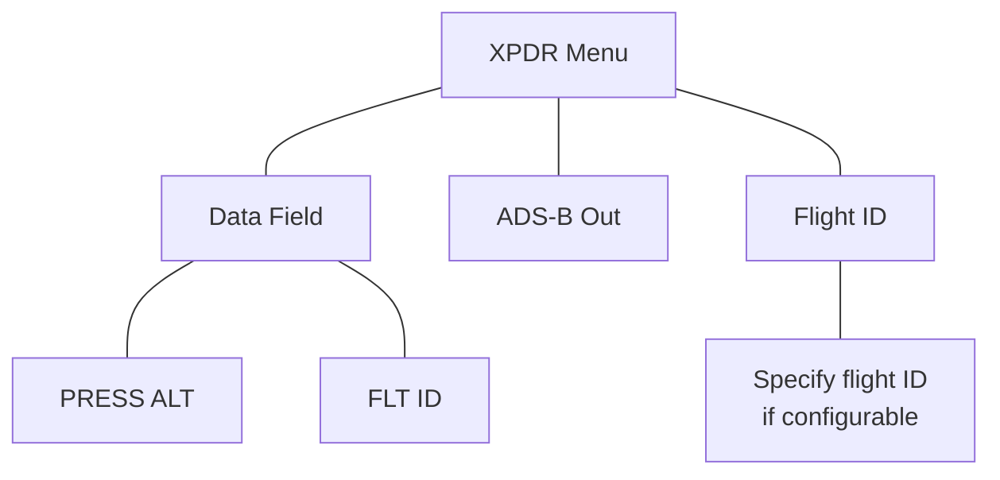
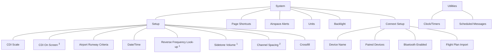
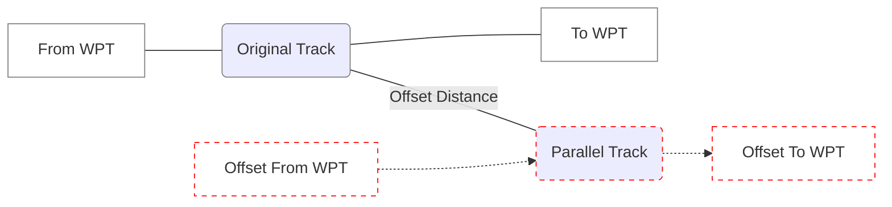
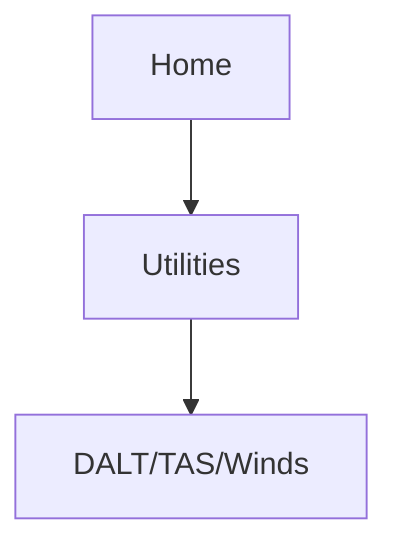
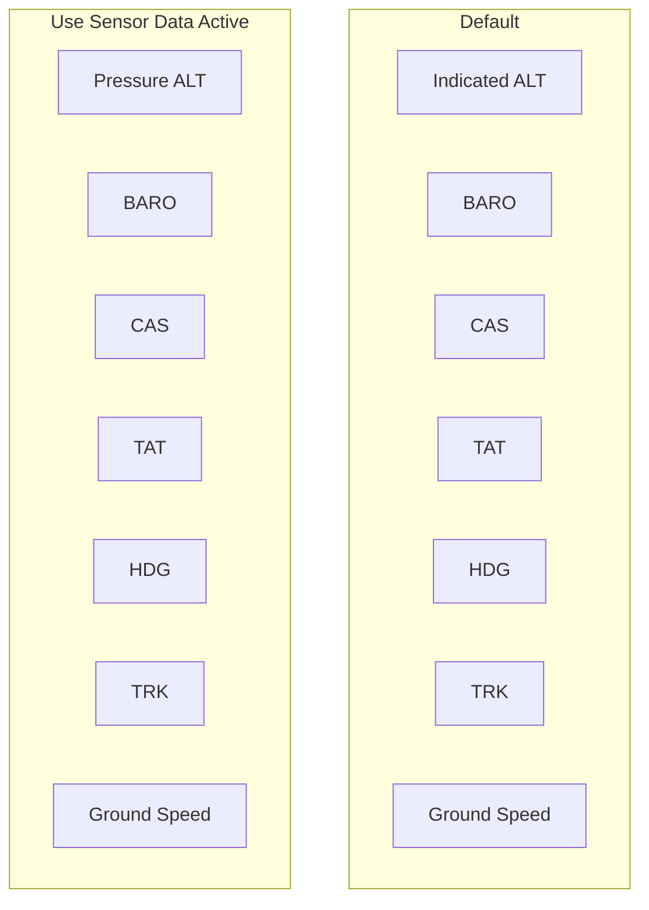
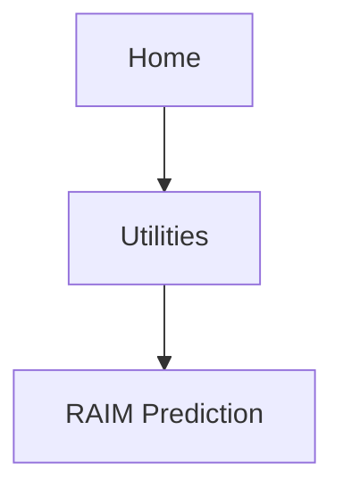
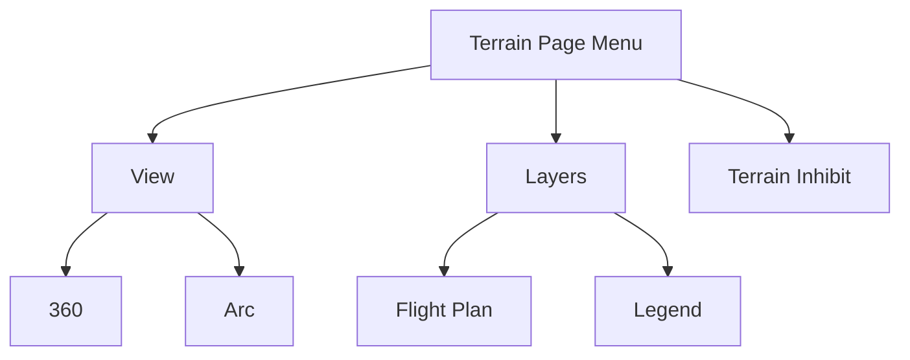

```mermaid
graph TD
    A[FIS-B Weather] --> A1[Orientation]
    A --> A2[Legend]
    A --> A3[FIS-B Status]
    A --> A4[NEXRAD]
    A --> A5[Cloud Tops]
    A --> A6[Lightning]
    A --> A7[Icing]
    A --> A8[Winds/Temps Aloft]
    A --> A9[PIREP]
    A --> A10[Turbulence]
    A --> A11[METAR]
    A --> A12[SIGMET]
    A --> A13[Center WX Advisory]
    A --> A14[G-AIRMETS]
    A --> A15[TFR]

    B[Traffic] --> B1[ADS-B Display]
    B --> B2[Test]
    B --> B3[Motion Vector]
    B --> B4[Vector Duration]
    B --> B5[Altitude Filter]
    B --> B6[Traffic Grouping]

    C[Terrain] --> C1[Terrain Inhibit]
    C --> C2[View]
    C --> C3[Flight Plan]
    C --> C4[Legend]

    style A fill:none,stroke:none
    style B fill:none,stroke:none
    style C fill:none,stroke:none
```

<!-- page 1 -->
# GARMIN®

# GPS 175
# GNC 355
# GNX 375

## Pilot's Guide

---

<!-- page 2 -->
# COPYRIGHT & TRADEMARKS

© 2019-2023 Garmin International, Inc., or its subsidiaries. All rights reserved.

Except as expressly provided herein, no part of this manual may be reproduced, copied, transmitted, disseminated, downloaded or stored in any storage medium, for any purpose without the express prior written consent of Garmin. Garmin hereby grants permission to download a single copy of this manual and of any revision to this manual onto a hard drive or other electronic storage medium to be viewed and to print one copy of this manual or of any revision hereto, provided that such electronic or printed copy of this manual or revision must contain the complete text of this copyright notice and provided further that any unauthorized commercial distribution of this manual or any revision hereto is strictly prohibited.

Garmin®, flyGarmin.com®, GDL®, GNC®, and SafeTaxi® are registered trademarks of Garmin International or its subsidiaries. Connext™, Garmin Pilot™, Garmin Txi™, GDU™, GNS™, GNX™, GPS™, GTN™, GTX™, G3X Touch™, and Smart Airspace™ are trademarks of Garmin International or its subsidiaries. These trademarks may not be used without the express permission of Garmin.

The Bluetooth® word mark and logos are registered trademarks owned by Bluetooth SIG, Inc. and any use of such marks by Garmin is under license. Other trademarks and trade names are those of their respective owners.

© 2023 SD® is a registered trademark of SD-3C, LLC. All rights reserved.

The term Wi-Fi® is a registered trademark of Wi-Fi Alliance®.

All other marks and logos are property of their respective owners. All rights reserved.

# SOFTWARE VERSION

This manual reflects the operation of system software v3.20. Some differences in operation may be observed when comparing the information in this manual to later software versions.

# INFORMATION & SUPPORT

For information regarding the Aviation Limited Warranty, refer to Garmin’s website.

For aviation product support, visit flyGarmin.com.

---

<!-- page 3 -->

# WARNING
**Do not use terrain avoidance displays as the sole source of information for maintaining separation from terrain and obstacles. Garmin obtains terrain and obstacle data from third party sources and cannot independently verify the accuracy of the information.**

# WARNING
**Do not rely solely upon Terrain Proximity data for terrain avoidance. Terrain Proximity is not a certified terrain awareness system. It is an aid to situational awareness only. Using Terrain Proximity data does not under any circumstances or conditions relieve the pilot’s responsibility to see and avoid terrain or obstacles.**

# WARNING
**Always refer to current aeronautical charts and NOTAMs for verification of displayed aeronautical information. Displayed aeronautical data may not incorporate the latest NOTAM information.**

# WARNING
**Never use GPS altitude for vertical navigation. The altitude calculated by GPS receivers is geometric height above Mean Sea Level and could vary significantly from the altitude displayed by pressure altimeters (e.g., the output from the GDC 74A/B air data computer) or other altimeters in the aircraft. Always refer to the pressure altimeters in the aircraft for current pressure altitude.**

# WARNING
**Never use expired databases. Update databases regularly to ensure currency. Use out of date database information at your own risk.**

# WARNING
**Never use basemap information (land and water data) as the sole means of navigation. Basemap data is intended only to supplement other approved navigation data sources and should be considered only an aid to enhance situational awareness.**

# WARNING
**Do not rely solely upon the display of traffic information to accurately depict all of the traffic within range of the aircraft. Due to lack of equipment, poor signal reception, and/or inaccurate information from aircraft or ground stations, traffic may be present that is not represented on the display.**

---

<!-- page 4 -->

# WARNING
*Never use datalink weather information for maneuvering in, near, or around areas of hazardous weather. Information contained within datalink weather products may not accurately depict current weather conditions.*

# WARNING
*Do not use the indicated datalink weather product age to determine the age of the weather information shown by the datalink weather product. Due to time delays inherent in gathering and processing weather data for datalink transmission, the weather information shown by the datalink weather product may be older than the indicated weather product age.*

# WARNING
*Do not rely solely upon Datalink services to provide TFR information. Always confirm TFR information through official sources such as flight service stations or air traffic control.*

# WARNING
*Always refer to current aeronautical charts for appropriate minimum clearance altitudes. The displayed MSAs are only advisory in nature and should not be relied upon as the sole source of obstacle and terrain avoidance information.*

# WARNING
*Do not use GPS to navigate to any active waypoint identified as a “NON WGS84 WPT” by a system message. “NON WGS84 WPT” waypoints are derived from an unknown map reference datum that may be incompatible with the map reference datum used by GPS (known as WGS84) and may be positioned in error as displayed.*

# WARNING
*Do not rely solely upon the display of traffic information for collision avoidance maneuvering. The traffic display does not provide collision avoidance resolution advisories and does not under any circumstances or conditions relieve the pilot’s responsibility to see and avoid other aircraft.*

# WARNING
*Do not rely on the accuracy of attitude and heading indications in geographic areas where variation in the earth’s magnetic field exists. This includes: North of 72° North latitude at all longitudes; South of 70° South latitude at all longitudes; North of 65° North latitude between longitude 75° W. and 120° W. (Northern Canada); North of 70° North latitude between longitude 70° W. and 128° W. (Northern Canada); North of 70° North latitude between longitude 85° E. and 114° E. (Northern Russia); South of 55° South latitude between longitude 120° E. and 165° E. (Region south of Australia and New Zealand).*

---

<!-- page 5 -->

# WARNING
***Do not learn operational procedures in the air. For safety reasons, thoroughly practice basic operation on the ground before actual use.***

# WARNING
***Review and understand all aspects of this pilot’s guide. Doing so reduces the risk of unsafe operation.***

# WARNING
***Always resolve any discrepancies between the display and other navigation sources when they occur. During flight operations, compare display indications to information from other NAVAIDs, visual sightings, charts, and other available sources before continuing navigation.***

# CAUTION
*Do not clean display surfaces with abrasive cloths or cleaners containing ammonia. They will harm the anti-reflective coating.*

# CAUTION
*Ensure that any unit Repairs are made by an authorized Garmin service center. Unauthorized repairs or modifications could void both the warranty and affect the airworthiness of the aircraft.*

# NOTE
*The application supports channel tuning for both 8.33 kHz and 25 kHz channels within radio-frequency range. If flying in a region where 8.33 kHz channel spacing is available, set the COM radio to 8.33 kHz to prevent the loss of any stored or recently used frequencies.*

# NOTE
*All visual depictions contained within this document, including screen images of the system panel and displays, are subject to change and may not reflect the most current system and aviation databases. Depictions of equipment may differ slightly from the actual equipment.*

# NOTE
*The United States government operates the Global Positioning System and is solely responsible for its accuracy and maintenance. The GPS system is subject to changes which could affect the accuracy and performance of all GPS equipment. Portions of the system utilize GPS as a precision electronic NAVAID. Therefore, as with all NAVAIDs, information presented by the system can be misused or misinterpreted and, therefore, become unsafe.*

---

<!-- page 6 -->

## NOTE
*This device complies with part 15 of the FCC Rules. Operation is subject to the following two conditions: (1) this device may not cause harmful interference, and (2) this device must accept any interference received, including interference that may cause undesired operation.*

## NOTE
*Interference from GPS repeaters operating inside nearby hangars can cause an intermittent loss of attitude and heading displays while the aircraft is on the ground. Moving the aircraft more than 100 yards away from the source of the interference should alleviate the condition.*

## NOTE
*Use of polarized eye wear may cause the flight displays to appear dim or blank.*

## NOTE
*This product, its packaging, and its components contain chemicals known to the State of California to cause cancer, birth defects, or reproductive harm. This notice is being provided in accordance with California’s Proposition 65. If you have any questions or would like additional information, please refer to our website at [www.garmin.com/prop65](www.garmin.com/prop65).*

## NOTE
*Operating the system in the vicinity of metal buildings, metal structures, or electromagnetic fields can cause sensor differences that may result in nuisance miscompare annunciations during start up, shut down, or while taxiing. If one or more of the sensed values are unavailable, the annunciation indicates no comparison is possible.*

## NOTE
*The system responds to a terminal procedure based on data coded within that procedure in the Navigation Database. Differences in system operation may be observed among similar types of procedures due to differences in the Navigation Database coding specific to each procedure.*

## NOTE
*Do not use SafeTaxi functions as the basis for ground maneuvering. SafeTaxi functions do not comply with the requirements of AC 120-76C and are not qualified for use as an airport moving map display. SafeTaxi is to be used for orientation purposes only.*

---

<!-- page 7 -->

## NOTE
The FAA has asked Garmin to remind pilots who fly with Garmin database-dependent avionics of the following:

* It is the pilot’s responsibility to remain familiar with all FAA regulatory and advisory guidance and information related to the use of databases in the National Airspace System.

* Garmin equipment will only recognize and use databases that are obtained from Garmin or Jeppesen. Databases obtained from Garmin or Jeppesen that have a Type 2 LOA from the FAA are assured compliance with all data quality requirements (DQRs). A copy of the Type 2 LOA is available for each applicable database and can be viewed at <u>flyGarmin.com</u> by selecting “Aviation Database Declarations.”

* Use of a current Garmin or Jeppesen database in your Garmin equipment is required for compliance with established FAA regulatory guidance, but does not constitute authorization to fly any and all terminal procedures that may be presented by the system. It is the pilot’s responsibility to operate in accordance with established AFM(S) and regulatory guidance or limitations as applicable to the pilot, the aircraft, and installed equipment.

## NOTE
The pilot/operator must review and be familiar with Garmin’s database exclusion list as discussed in SAIB CE-14-04 to determine what data may be incomplete. The database exclusion list can be viewed at <u>flyGarmin.com</u> by selecting “Aviation Database Declarations.”

## NOTE
The pilot/operator must have access to Garmin and Jeppesen database alerts and consider their impact on the intended aircraft operation. The database alerts can be viewed at <u>flyGarmin.com</u> by selecting “Aviation Database Alerts.”

## NOTE
If the pilot/operator wants or needs to adjust the database, contact Garmin Product Support.

## NOTE
Garmin requests the flight crew report any observed discrepancies related to database information. These discrepancies could come in the form of an incorrect procedure; incorrectly identified terrain, obstacles and fixes; or any other displayed item used for navigation or communication in the air or on the ground. Visit <u>flyGarmin.com</u> and select “Aviation Data Error Report.”

## NOTE
The navigation databases used in Garmin navigation systems contain Special Procedures. Prior to flying these procedures, pilots must have specific FAA authorization, training, and possession of the corresponding current, and legitimately-sourced chart (approach plate, etc.). Inclusion of the Special Procedure in the navigation database DOES NOT imply specific FAA authorization to fly the procedure.

---

<!-- page 8 -->
# About This Guide

## Record of Revision

<table>
  <thead>
    <tr>
        <th>REVISION</th>
        <th>DATE</th>
        <th>CHANGE DESCRIPTION</th>
    </tr>
  </thead>
  <tbody>
    <tr>
        <td>1</td>
        <td>06.05.19</td>
        <td>Experimental Release.</td>
    </tr>
    <tr>
        <td>A</td>
        <td>07.03.19</td>
        <td>Production Release.</td>
    </tr>
    <tr>
        <td>B</td>
        <td>02.10.20</td>
        <td>Updates for software v3.10.</td>
    </tr>
    <tr>
        <td>C</td>
        <td>01.24.23</td>
        <td>Updates for software v3.20.</td>
    </tr>
  </tbody>
</table>

## Available for Download

**Electronic Pilot’s Guide**

A version of this guide saved in Adobe Acrobat. Available for viewing on your computer or portable device.

**Upgrade Supplement**

Details document changes for software enhancements.

Go to <u>garmin.com/manuals</u>.

---

<!-- page 9 -->
## Layout

<table>
  <thead>
    <tr>
        <th>SECTION</th>
        <th>TITLE</th>
    </tr>
  </thead>
  <tbody>
    <tr>
        <td>1</td>
        <td>System at a Glance</td>
    </tr>
    <tr>
        <td>2</td>
        <td>Get Started</td>
    </tr>
    <tr>
        <td>3</td>
        <td>Navigation</td>
    </tr>
    <tr>
        <td>4</td>
        <td>Planning</td>
    </tr>
    <tr>
        <td>5</td>
        <td>Hazard Awareness</td>
    </tr>
    <tr>
        <td>6</td>
        <td>Messages</td>
    </tr>
    <tr>
        <td>7</td>
        <td>Qualification</td>
    </tr>
    <tr>
        <td>8</td>
        <td>Glossary</td>
    </tr>
    <tr>
        <td>9</td>
        <td>Regulatory Information</td>
    </tr>
  </tbody>
</table>

The design and layout of this guide is intended to provide clear, concise sections written in the logical order of a pilot’s flight instrument and systems scan.

## Product Descriptions

This guide covers the operation of the following Garmin products.

* GPS 175
* GNC 355
* GNC 355A
* GNX 375

When you see product names separated by a forward slash (e.g., GNC 355/355A or GPS 175/GNX 375), it means that the information pertains to both products. When you see a product name in bold (e.g., **GNC 355A**), it means that the information pertains to that specific model only.

> Unless otherwise stated, information pertaining to GNC 355 is also applicable to GNC 355A.

---

<!-- page 10 -->
# Reference Documentation

## Reference Manuals

<table>
  <thead>
    <tr>
        <th>DOCUMENT</th>
        <th>P/N</th>
    </tr>
  </thead>
  <tbody>
    <tr>
        <td>*GDL 88 ADS-B Transceiver Pilot’s Guide*</td>
        <td>190-01122-03</td>
    </tr>
    <tr>
        <td>*GTX 335/345 All-In-One ADS-B Transponder Pilot’s Guide*</td>
        <td>190-01499-00</td>
    </tr>
  </tbody>
</table>

## Reference Websites

<table>
  <thead>
    <tr>
        <th>WEBSITE</th>
        <th>ADDRESS</th>
    </tr>
  </thead>
  <tbody>
    <tr>
        <td>ADS-B Academy</td>
        <td><u>https://www.garmin.com/en-US/aviation/adsb/</u></td>
    </tr>
    <tr>
        <td>Aviation Limited Warranty</td>
        <td><u>https://www.garmin.com/en-US/legal/aviation-limited-warranty</u></td>
    </tr>
    <tr>
        <td>Connext</td>
        <td><u>http://www.garmin.com/connext</u></td>
    </tr>
    <tr>
        <td>Database Concierge</td>
        <td>Go to <u>http://www.flygarmin.com/support</u> and select Database Management.</td>
    </tr>
    <tr>
        <td>FAA Dynamic Regulatory System</td>
        <td><u>https://drs.faa.gov</u></td>
    </tr>
  </tbody>
</table>

---

<!-- page 11 -->
# **1 SYSTEM AT A GLANCE** **1-1**
**Overview** **1-2**
Unit Configurations 1-3
Apps & Features 1-4
**Pilot Interface** **1-5**
Bezel 1-5
SD Card Slot 1-6
Touchscreen 1-7
Keys 1-8
Menus 1-9
Tabs 1-10
Keypads 1-10
Control Knobs 1-11
Knob Functions 1-11
Page Navigation Labels 1-12
Knob Function Indicators 1-12
Knob Shortcuts 1-13
Screenshots 1-15
Color Conventions 1-16
**Compatible Equipment** **1-17**
Line Replaceable Units 1-17
ADC & AHRS 1-18
Altitude Encoder 1-18
ADS-B In Data 1-19
# **2 GET STARTED** **2-1**
**Power Up** **2-2**
Instrument Panel Self-Test 2-2
Preset Fuel Quantities 2-3
Power Off 2-3
**Databases** **2-4**
Database Effective Cycles 2-5
Active and Standby Databases 2-7
Manual Updates 2-8
Database Updates Page 2-8
Automatic Updates 2-11
Database Concierge 2-12
Wi-Fi Setup 2-14
Database SYNC 2-15
**Connectivity** **2-17**
Connext Setup 2-17
Bluetooth Setup 2-18
Enabling Bluetooth Functionality 2-18
Managing Paired Devices 2-19
Importing a Flight Plan 2-20
**COM** **2-21**
COM Standby Control Panel 2-21
COM Volume Controls 2-22
COM Radio Setup 2-24
Channel Spacing Option 2-25

---

<!-- page 12 -->
# Table of Contents

* Reverse Frequency Look-up 2-26
* Sidetone Volume Offset 2-27
* Tuning & Monitoring 2-28
    - Direct Tuning 2-29
    - Transfer Frequency to Active (Flip-Flop) 2-31
    - Monitor Mode 2-32
* Frequency Selection 2-33
    - Search Tabs 2-33
    - Remote Frequency Selection 2-35
    - Emergency Frequency 2-35
* Create User Frequencies 2-36
* COM Alert 2-38
    - Stuck Microphone 2-38
* **XPDR** **2-39**
    - XPDR Control Panel 2-39
    - XPDR Setup 2-40
        - Displaying Data 2-40
        - Enabling Extended Squitter Transmissions 2-41
        - Assigning a Flight ID 2-41
    - XPDR Modes 2-42
    - Squawk Code Keys 2-43
        - VFR 2-44
        - XPDR Key 2-44
    - Remote Control 2-46
    - XPDR Alert 2-46
* **ADS-B Altitude Reporting** **2-47**
    - ADS-B Control Panel 2-47
        - ADS-B Key 2-48
        - Enabling Anonymous Mode 2-48
        - Assigning a Flight ID 2-49
    - GDL 88 Alert 2-49
* **Pilot Settings** **2-50**
    - CDI Scale 2-51
        - Horizontal Alarm Limits 2-52
        - CDI On Screen 2-53
    - Airport Runway Criteria 2-54
        - Runway Surface 2-54
        - Minimum Runway Length 2-54
    - Clocks & Timers 2-55
        - Timers 2-55
        - Clock 2-55
    - Page Shortcuts 2-56
    - Alerts Settings 2-57
    - Unit Selections 2-58
    - Display Brightness Control 2-59
        - Automatic Brightness Control 2-59
        - Manual Brightness Control 2-59
    - Scheduled Messages 2-60
        - Message Types 2-60

---

<!-- page 13 -->
Modifying Scheduled Messages 2-60
Crossfill 2-61
    Crossfill Data 2-61
**Status Indications 2-62**
Alert Types 2-62
    Alert Annunciations 2-63
    Pop-up Alerts 2-64
    Aural Alerts 2-65
System Status 2-66
GPS Status 2-66
    Circle of Uncertainty 2-68
    SBAS Providers 2-69
    GPS Status Annunciations 2-69
    GPS Alerts 2-70
ADS-B Status 2-71
**Logs 2-73**
    Export to SD Card 2-73
# 3 NAVIGATION 3-1
**Map 3-3**
    Map Setup 3-6
        Configure User Fields 3-7
        Map Orientation 3-10
        North Up Above 3-10
        Visual Approach 3-10
        TOPO Scale 3-11
        Range Ring 3-11
        Track Vector 3-11
        Ahead View 3-12
        Map Detail 3-13
    Map Interactions 3-16
        Basic Interactions 3-16
        Graphical Flight Plan Editing 3-19
    Map Overlays 3-23
        Overlay Controls 3-23
        Overlay Status Icons 3-26
        Smart Airspace 3-27
        SafeTaxi 3-28
**Active Flight Plan 3-30**
    Collapse All Airways 3-34
    OBS 3-35
    Dead Reckoning 3-36
    Parallel Track 3-37
    Edit Data Fields 3-39
    Flight Plan Catalog 3-39
        Catalog Route Options 3-40
    Create a Flight Plan 3-42
        Flight Plan Waypoint Options 3-43
    Flight Plan Map Overlays 3-44
        Leg Status Indications 3-44

---

<!-- page 14 -->
# Table of Contents

Flight Plan User Field 3-45
User Airport Symbol 3-46
Fly-over Waypoint Symbol 3-47
GPS NAV Status Key 3-48
**Direct To** **3-49**
Direct To Basics 3-49
- Direct To Search Tabs 3-49
- Direct To Activation 3-51
- Navigating Direct To 3-52
- Removing a Direct-to Course 3-53
- User Holds 3-54
**Waypoints** **3-55**
Waypoint Information 3-55
Waypoint Selection 3-59
- FastFind Predictive Waypoint Entry 3-59
- Search Tabs 3-60
Create User Waypoints 3-62
- Define Waypoint Criteria 3-64
- Edit an Existing User Waypoint 3-66
- Import User Waypoints 3-67
Nearest 3-69
**Procedures** **3-71**
Flight Procedure Basics 3-72
- GPS Flight Phase Annunciations 3-74
Departures 3-76
- Flight Plan Departure Options 3-77
Arrivals 3-78
- Flight Plan Arrival Options 3-79
Approaches 3-80
- Flight Plan Approach Options 3-82
- Missed Approach 3-83
- Approach Hold 3-84
- DME Arc 3-86
- RF Legs 3-87
- Vectors to Final 3-87
- ILS Approach 3-88
- RNAV Approaches 3-89
- Visual Approach 3-95
- Autopilot Outputs 3-97
**4 PLANNING** **4-1**
**Vertical Calculator** **4-3**
VCALC Page 4-3
VCALC Setup 4-4
**Fuel Planning** **4-5**
Fuel Planning Page 4-5
- Fuel Planning Modes 4-5
- Computing Fuel Statistics 4-8
**DALT/TAS/Wind Calculator** **4-9**
DALT/TAS/Wind Page 4-9

---

<!-- page 15 -->
Editing Input Data 4-9
Computing DALT/TAS/Wind Statistics 4-11
**RAIM Prediction** **4-12**
RAIM Prediction Page 4-12
Calculating RAIM Status 4-13
RAIM Status Indications 4-13
# **5 HAZARD AWARENESS** **5-1**
**Weather Awareness** **5-3**
Data Transmission Limitations 5-3
Line of Sight Reception 5-3
Per FAA TSO-C157b 5-4
NOTAM 30-Day Limitation 5-4
FIS-B Weather Display 5-5
FIS-B Weather Setup 5-7
FIS-B Weather Products 5-8
Product Status 5-9
Product Legends 5-9
Product Age 5-10
FIS-B NEXRAD 5-11
METARs and TAFs 5-13
Graphical AIRMETs 5-14
SIGMETs 5-16
PIREPs 5-16
Cloud Tops 5-17
Lightning 5-17
Center Weather Advisory 5-17
Winds/Temps Aloft 5-18
Icing 5-18
Turbulence 5-19
TFRs 5-19
Raw Text Reports 5-20
FIS-B Ground Reception Status 5-22
**Traffic Awareness** **5-23**
Traffic Applications 5-23
Traffic Application Failures 5-24
Traffic Display 5-25
Traffic Setup 5-29
Motion Vectors 5-30
Altitude Filtering 5-30
Traffic Interactions 5-31
Traffic Annunciations 5-32
Traffic Alerting 5-33
**Terrain Awareness** **5-35**
Terrain Configurations 5-35
GPS Altitude for Terrain 5-36
Database Limitations 5-37
Terrain Display 5-38
Terrain Setup 5-39
Terrain Proximity 5-40

---

<!-- page 16 -->
# Table of Contents

Terrain Elevation Depictions 5-40
Obstacle Elevation Depictions 5-41
Terrain Alerting 5-43
* Alert Types 5-43
* Alerting Thresholds 5-44
* Inhibiting FLTA & PDA Alerts 5-45
* FLTA & PDA Alerts 5-46
**6 MESSAGES 6-1**
**Advisory Messages 6-2**
* Message Key 6-2
* Airspace Advisories 6-3
* Database Advisories 6-4
* Flight Plan Advisories 6-5
* GPS/WAAS Advisories 6-7
* Navigation Advisories 6-9
* Pilot Specified Advisories 6-10
* System Hardware Advisories 6-11
    * COM Radio Advisories, GNC 355 6-16
* Terrain Advisories 6-17
* Traffic System Advisories 6-18
    * Traffic Advisories, GPS 175 & GNC 355 6-18
    * Traffic Advisories, GNX 375 6-20
* VCALC Advisories 6-21
* Waypoint Advisories 6-21
**7 QUALIFICATION 7-1**
**Glove Qualification 7-2**
**8 GLOSSARY 8-1**
**9 REGULATORY INFORMATION 9-1**
**Compliance 9-2**
* AC 90-100A Statement of Compliance 9-2
**Software License Agreement 9-3**

---

<!-- page 17 -->
# 1 System at a Glance

OVERVIEW 1-2
PILOT INTERFACE 1-5
COMPATIBLE EQUIPMENT 1-17

---

<!-- page 18 -->
# Overview

GPS 175, GNC 355/355A, and GNX 375 are the first 2” by 6.25” panel mount navigators to employ full color capacitive touchscreen technology.

*GNC 355 shown as typical.*

6.25"

GPS 175 is a TSO-C146e compliant GPS/WAAS navigator with en route, terminal, and precision/non-precision approach capabilities.

GNC 355/355A combines the functionality of GPS 175 with a TSO-C169a compliant VHF radio communications transceiver. GNC 355 supports 25 kHz channel spacing, while GNC 355A provides tuning for both 25 kHz and 8.33 khz channels.

Both GPS 175 and GNC 355 can receive ADS-B In weather and traffic when interfaced to either GNX 375, GTX 345, or GDL 88.

GNX 375 combines the functionality of GPS 175 with a TSO-C112e (Level 2els, Class 1) compliant mode S transponder that meets ADS-B Out requirements. A dual-link ADS-B In receiver provides the display of traffic and subscription-free weather.

Each unit is compatible with Bluetooth wireless technology, providing flight plan, traffic, weather, and position data to an available portable electronic device.

---

<!-- page 19 -->
# Unit Configurations

GPS 175

GPS/MFD

GNC 355

GPS/MFD/COM

GNX 375

GPS/MFD/XPDR

## COMPARISON TABLE

<table>
  <thead>
    <tr>
        <th>Unit</th>
        <th>GPS/MFD</th>
        <th>COM Radio</th>
        <th>Mode S XPDR</th>
        <th>Dual-link ADS-B In</th>
        <th>1090 ES ADS-B Out</th>
    </tr>
  </thead>
  <tbody>
    <tr>
        <td>GPS 175</td>
        <td>•</td>
        <td> </td>
        <td> </td>
        <td> </td>
        <td> </td>
    </tr>
    <tr>
        <td>GNC 355</td>
        <td>•</td>
        <td>•</td>
        <td> </td>
        <td> </td>
        <td> </td>
    </tr>
    <tr>
        <td>GNX 375</td>
        <td>•</td>
        <td> </td>
        <td>•</td>
        <td>•</td>
        <td>•</td>
    </tr>
  </tbody>
</table>

---

<!-- page 20 -->
# Apps & Features

<table>
  <thead>
    <tr>
        <th>GPS 175 NAVIGATOR</th>
        <th>GNC 355/355A NAVIGATOR W/VHF COM TRANSCEIVER</th>
        <th>GNX 375 NAVIGATOR W/TRANSPONDER</th>
    </tr>
  </thead>
  <tbody>
    <tr>
        <td>* Moving Map * Terrain * Flight Plan * Graphical Flight Planning * Waypoint Information * Nearest * FastFind Predictive Waypoint Entry * FIS-B Weather Display 1, 2 * ADS-B In Traffic Display 1, 2 * Terrain Avoidance * System Advisories * Scheduled Messages * Clock * CDI * Internal GPS Receiver * Built-in Bluetooth Antenna * Database Concierge Access 4</td>
        <td>* Moving Map * Terrain * Flight Plan * Graphical Flight Planning * Waypoint Information * Nearest * FastFind Predictive Waypoint Entry * FIS-B Weather Display 1, 2 * ADS-B In Traffic Display 1, 2 * VHF Radio Transceiver * Terrain Avoidance * System Advisories * Scheduled Messages * Clock * CDI * Internal GPS Receiver * Built-in Bluetooth Antenna * 8.33 kHz channel spacing 3 * Database Concierge Access 4</td>
        <td>* Moving Map * Terrain * Flight Plan * Graphical Flight Planning * Waypoint Information * Nearest * FastFind Predictive Waypoint Entry * FIS-B Weather Receiver &amp; Display 2 * ADS-B In Traffic Receiver &amp; Display 2 * ADS-B Out on 1090 MHz Extended Squitter * Terrain Avoidance * System Advisories * Scheduled Messages * Clock * CDI * Internal GPS Receiver * Built-in Bluetooth Antenna * Mode S Transponder * Database Concierge Access 4</td>
    </tr>
  </tbody>
</table>

1 Requires external ADS-B In product.

2 ADS-B In via 1090 MHz (traffic) and 978 MHz UAT (traffic and weather).

3 For use during European operations. Available with GNC 355A only.

4 Requires Wi-Fi connection via Flight Stream 510.

---

<!-- page 21 -->
# Pilot Interface

## Bezel

<table>
  <tbody>
    <tr>
        <td>1</td>
        <td>**Bezel** Includes the power key, mechanical knobs, photocell, and SD card slot. Ledges provide hand stability when performing data entry and making selections.</td>
    </tr>
    <tr>
        <td>2</td>
        <td>**Touchscreen** Multi-touch color display provides controls for unit operation.</td>
    </tr>
    <tr>
        <td>3</td>
        <td>**Photocell** Measures cockpit ambient light level to automatically adjust display brightness for day and night.</td>
    </tr>
    <tr>
        <td>4</td>
        <td>**SD Card Slot** Interface for loading database, exporting log files, and updating software. Compatibility with Flight Stream 510 allows wireless database transfer from the Garmin Pilot app via Database Concierge.</td>
    </tr>
    <tr>
        <td>5</td>
        <td>**Power/Home Key** Powers the unit on or off and provides direct access to the Home page.</td>
    </tr>
    <tr>
        <td>6</td>
        <td>**Inner &amp; Outer Knobs** Multipurpose dual concentric knob allows data entry, list scrolling, map range control, page navigation, and COM volume and frequency tuning.¹</td>
    </tr>
  </tbody>
</table>

¹ COM is a function of GNC 355/355A only.

---

<!-- page 22 -->
# SD Card Slot

 **NOTE**

> *Do not remove or insert an SD card while in flight. Always verify the system is powered off before inserting or removing an SD card.*

### FEATURE REQUIREMENTS

* SD card in the FAT32 format, with memory capacity between 8 GB and 32 GB

The navigator requires an SD card for the following tasks.

* Exporting data logs
* Saving system configurations
* Capturing screen images
* Enabling Flight Stream connectivity
* Upgrading software
* Updating databases

### INSERT AN SD CARD

When inserting an SD card:

1. Verify unit power is off and the slot is empty.
2. Hold card such that label faces left edge of display screen.
3. Ensure back edge of card is flush with display bezel after insertion.

### EJECT AN SD CARD

1. Power off the unit.
2. Release the spring latch by pressing lightly on exposed edge of card.

### For Mac Users

Do not use macOS to format an SD card or the Flight Stream 510 wireless transceiver if you plan to use either as a media storage device for updating databases.

In the event there is a file corruption problem with the SD card (including the wireless transceiver when used as a database storage device), it may be necessary to reformat the card. This can cause an issue when formatting the SD card using macOS, where the newly formatted card will not be recognized by the avionics system. When using a Macintosh computer to format the SD card, or the wireless transceiver, Garmin recommends using the SD Memory Card Formatter application available as a download from <u>SDcard.org</u>. When running the application, use the Quick Format option.

---

<!-- page 23 -->
# Touchscreen

## GESTURES

Touching the screen briefly with a single finger.

Use this gesture for:

* Opening a page or menu
* Activating a command key or data entry field
* Displaying map feature information
* Selecting an option within an application

**TAP AND HOLD**

Certain momentary controls (e.g., directional arrow keys) provide a secondary tap and hold function. Tap the key and hold your finger in place until the desired action occurs.

Use this gesture for:

* Scrolling with arrow keys
* Increasing/decreasing values continuously

**SWIPE**

A smooth motion that involves touching an object, then sliding your finger across the screen and lifting up.

Use this gesture for:

* Accessing multiple panes (right or left swipes)
* Viewing and scrolling lists
* Panning across a map display

**FLICK**

Swiping the screen in a quick upward or downward motion. Information moves at a fast speed (faster than if holding the arrow key), then slows to a stop.

Use this gesture for:

* Scrolling an item list

**PINCH & STRETCH**

Touch any map with two fingers at the same time, then bring the fingers close together (pinch) or spread them apart (stretch). Just remember: stretch to zoom in and pinch to zoom out.

Use this gesture for:

* Magnifying map features

---

<!-- page 24 -->
# Keys

## COMMON COMMANDS

Open the system messages list. A flashing icon indicates unread messages.

Cancel an active function without inputting data.

Open a context menu.

Input a specified value.

Return to the previous page.

Select the corresponding item (e.g., database update). A checkmark confirms selection.

## FUNCTION KEYS

Toggle keys turn a specific function on or off. The current state of the function is indicated below the key label.

## APP ICONS

Tapping one of these icons opens the corresponding application. Some apps provide additional icons for accessing functions on subpages (e.g., Utilities, System).

---

<!-- page 25 -->
# Menus

Menus group related controls into an expandable pane, allowing access to multiple functions on a single page. Depending on the number of available functions, a menu may comprise more than one pane.

Multiple panes are accessible by way of a left/right swipe or inner knob turn.

Toggle keys either enable or disable list items. In some cases, **Settings** or **Range** keys provide access to selectable setting options.

An indicator at the bottom of the menu shows which pane is active.

## POP-UP MENUS

Pop-up menus open to the default or previously selected value.

## LISTS

Scrollable lists group control keys related to a single function (e.g., FIS-B Weather). When scrolling, all keys in the list are inactive.

---

<!-- page 26 -->
# Tabs

Tabs group information into individual panes. Content includes scrolling lists, data fields, function keys, or a combination of controls.

Tabs are located along the left and right sides of a pane.

# Keypads

The navigator employs multiple keypad types to serve specific settings and functions.

## NUMERIC

Numeric keypads open on a single pane. **Backspace** and **Enter** keys always appear at the right of the screen.

## ALPHANUMERIC

Alphanumeric keypads comprise multiple keysets that are accessible by way of swipe or key selection.

An indicator shows which keyset is active. Keys **a** through **m** are active by default.

Active Keyset

---

<!-- page 27 -->
# Control Knobs

Inner and outer control knobs offer an alternative method for selecting and modifying data without the use of touch keys.

## Knob Functions

<table>
  <thead>
    <tr>
        <th colspan="2">GPS 175 &amp; GNX 375</th>
    </tr>
  </thead>
  <tbody>
    <tr>
        <td>Outer Knob</td>
        <td>* Selecting a page shortcut * Cursor placement and initial field/page selections * Moving cursor forward or backward within data field</td>
    </tr>
    <tr>
        <td>Inner Knob (Turn)</td>
        <td>* Zooming, scrolling lists, and inputting data * Modifying individual characters in data entry field</td>
    </tr>
    <tr>
        <td>Inner Knob (Push)</td>
        <td>* Entering current or specified numerical value * Toggling Map user fields on or off * Accessing the Direct To function from the Home page</td>
    </tr>
    <tr>
        <th colspan="2">GNC 355/355A</th>
    </tr>
    <tr>
        <td>Outer Knob</td>
        <td>* Selecting a page shortcut * Cursor placement and initial field/page selections * Moving cursor forward or backward within data field * Tuning major frequency digits * Adjusting COM radio volume (coarse)</td>
    </tr>
    <tr>
        <td>Inner Knob (Turn)</td>
        <td>* Zooming, scrolling lists, and inputting data * Modifying individual characters in data entry field * Tuning minor frequency digits * Adjusting COM radio volume (fine)</td>
    </tr>
    <tr>
        <td>Inner Knob (Push)</td>
        <td>* Entering current or specified numerical value * Enabling standby frequency tuning mode from most pages * Enabling COM radio volume control (push twice)</td>
    </tr>
  </tbody>
</table>

---

<!-- page 28 -->
# Page Navigation Labels

A locater bar works in conjunction with the outer knob, providing quick access to the indicated page. Turning the outer knob clockwise or counter-clockwise moves the locater through the available shortcut options.

Slot 1 is a dedicated Map shortcut. Slots 2 and 3 are customizable. Selectable page options are dependent upon configuration.

A cyan background and border indicate active page and available shortcuts.

# Knob Function Indicators

Icons to the right of the bar indicate available knob functions. Indications include, but are not limited to, the following.

## GPS 175 & GNX 375

### Map Active

Available functions:

* Map zoom

* Toggle user fields on or off

### Flight Plan Active

Available functions:

* Flight plan scrolling

### Home Page Active

Available functions:

* Page shortcut navigation

* Access Direct To window

### Direct To Window Active

Available functions:

* Direct-to waypoint editing

* Activate direct-to course

---

<!-- page 29 -->
## GNC 355/GNC355A

Knob focus defaults to page navigation when not in use.

### Map Active

Available functions:

* Map zoom

* Set knob focus to standby frequency

### Flight Plan Active

Available functions:

* Flight plan scrolling

* Set knob focus to standby frequency

### STBY Frequency Tuning Active (via Knob Push)

**Tune Freq-Push VOL**

Available functions:

* Frequency tuning

* Activate volume control

### COM Volume Page Active (via VOL Key)

**Adjust Volume**

Available functions:

* Volume adjustment

## Knob Shortcuts

For convenience, the unit allows you to access certain controls quickly via knob push.

### GPS 175/GNX 375

From the Home page:

Pushing once opens the Direct To window. After a waypoint/fix is selected, pushing the knob again activates the direct-to fix.

---

<!-- page 30 -->
## GNC 355/355A

**From most pages:**

Pushing once enables standby frequency tuning mode and opens the COM volume controls. Turn the inner and outer knobs to tune the standby frequency.

Pushing twice sets the knob focus to the volume slider. Turn the inner and outer knobs to adjust the volume percentage.

Pushing again closes the menu and returns to the previous view.

<mark>A cyan border indicates changes in knob focus. This is useful when transitioning through the different control modes: page navigation > STBY frequency tuning > COM radio volume adjustment > page navigation.</mark>

---

<!-- page 31 -->
# Screenshots

**FEATURE REQUIREMENTS**

* SD card in the FAT32 format, with memory capacity between 8 GB and 32 GB

**FEATURE LIMITATIONS**

* Not available with Flight Stream 510

Save images to an SD card at any time using Screenshot. Images automatically save to the "print" folder in the SD card root directory.

1. Insert an SD card into the card slot.
2. Push and hold the control knob.
3. With knob depressed, push and release the **Home/Power** key.

A camera icon momentarily shows in the annunciator bar indicating the image is captured. To view saved images, remove the SD card and open the "print" folder on a computer.

---

<!-- page 32 -->
# Color Conventions

<table>
  <tbody>
    <tr>
        <td></td>
        <td>**Red** • Warning conditions</td>
    </tr>
    <tr>
        <td></td>
        <td>**Yellow** • Cautionary conditions</td>
    </tr>
    <tr>
        <td></td>
        <td>**Green** • Safe operating conditions • Engaged modes • Active COM frequency</td>
    </tr>
    <tr>
        <td></td>
        <td>**White** • Scales and markings • Current data and values • Heading legs</td>
    </tr>
    <tr>
        <td></td>
        <td>**Magenta** • GPS data • Active flight plan legs • Parallel track</td>
    </tr>
    <tr>
        <td></td>
        <td>**Cyan** • Pilot-selectable references • Standby COM frequency</td>
    </tr>
    <tr>
        <td></td>
        <td>**Gray** • Missing or expired data • Product unavailable</td>
    </tr>
    <tr>
        <td></td>
        <td>**Blue** • Water</td>
    </tr>
  </tbody>
</table>

---

<!-- page 33 -->
# Compatible Equipment

## Line Replaceable Units

The system consists of multiple LRUs, which are installed behind the instrument panel or in a separate avionics bay. Their modular design aids system maintenance and unit replacement.

Optional LRUs may include compatible equipment from either Garmin or a third party manufacturer.

<table>
  <thead>
    <tr>
        <th>SYSTEM REQUIRED LRUs</th>
    </tr>
  </thead>
  <tbody>
    <tr>
        <td>GPS antenna</td>
    </tr>
    <tr>
        <th>SYSTEM OPTIONAL LRUs</th>
    </tr>
    <tr>
        <td>ADAHRS or ADC with AHRS</td>
    </tr>
    <tr>
        <td>Audio panel</td>
    </tr>
    <tr>
        <td>GAD 29 adapter</td>
    </tr>
    <tr>
        <td>GAE 12 altitude encoder (GNX 375 only)</td>
    </tr>
    <tr>
        <td>G3X Touch</td>
    </tr>
    <tr>
        <td>G500/G600</td>
    </tr>
    <tr>
        <td>G500/G600 TXi</td>
    </tr>
    <tr>
        <td>GMX 200</td>
    </tr>
    <tr>
        <td>MX 20</td>
    </tr>
    <tr>
        <th>OPTIONAL INTERFACES</th>
    </tr>
    <tr>
        <td>GDL 88/GTX 345/GNX 375 ADS-B transceiver (GPS 175 and GNC 355 only)</td>
    </tr>
  </tbody>
</table>

---

<!-- page 34 -->
## ADC & AHRS

AHRS units have a magnetometer interface for determining magnetic heading. ADC units have a Pitot-static interface for measuring pressure altitude.

<table>
  <thead>
    <tr>
        <th>LRU</th>
        <th>DISPLAY</th>
        <th>FUNCTION</th>
    </tr>
  </thead>
  <tbody>
    <tr>
        <td>GDC 74 ADC</td>
        <td>GNX</td>
        <td>* Air temperature * Pressure altitude</td>
    </tr>
    <tr>
        <td>G3X G500/G600</td>
        <td>GPS GNC GNX</td>
        <td>**ADC** * Air temperature * Pressure altitude</td>
    </tr>
    <tr>
        <td>GSU 25/73 Integrated ADAHRS</td>
        <td>GNX</td>
        <td>**AHRS** * Heading</td>
    </tr>
    <tr>
        <td>GRS 77 AHRS</td>
        <td>GNX</td>
        <td>* Heading</td>
    </tr>
    <tr>
        <td>G5/GAD 29D</td>
        <td>GPS GNC GNX</td>
        <td>* Heading * Pressure altitude * Air temperature</td>
    </tr>
  </tbody>
</table>

## Altitude Encoder

<table>
  <thead>
    <tr>
        <th>LRU</th>
        <th>DISPLAY</th>
        <th>FUNCTION</th>
    </tr>
  </thead>
  <tbody>
    <tr>
        <td>GAE 12 Provides pressure altitude information to the transponder.</td>
        <td>GNX</td>
        <td>Aircraft static pressure</td>
    </tr>
  </tbody>
</table>

---

<!-- page 35 -->
# ADS-B In Data

<table>
  <thead>
    <tr>
        <th>LRU</th>
        <th>DISPLAY</th>
        <th>FUNCTION</th>
    </tr>
  </thead>
  <tbody>
    <tr>
        <td>GDL 88 GTX 345 GNX 375 Provides datalink traffic and weather.</td>
        <td>GPS GNC</td>
        <td>**Traffic Services** * ADS-B * TIS-B **Weather Services** * FIS-B **Weather Products** Map &amp; FIS-B Weather: * Precip (NEXRAD) * METARs * TFRs * Lightning  FIS-B Weather only: * Center Weather Advisory * Cloud Tops * G-AIRMET * Icing Potential * PIREP * SIGMET * TAF * Turbulence * Winds/Temps Aloft</td>
    </tr>
  </tbody>
</table>

---

<!-- page 36 -->
INTENTIONALLY LEFT BLANK

---

<!-- page 37 -->
# 2 Get Started

POWER UP 2-2
DATABASES 2-4
CONNECTIVITY 2-17
COM 2-21
XPDR 2-39
ADS-B ALTITUDE REPORTING 2-47
PILOT SETTINGS 2-50
STATUS INDICATIONS 2-62
LOGS 2-73

---

<!-- page 38 -->
# Power Up

The unit receives power directly from the aircraft’s electrical system. Upon power-up, the bezel key backlight momentarily illuminates. System failure annunciations typically disappear within the first 30 seconds after power-up.

The start-up screen presents the unit software versions, the name and status of all installed databases, and the Database Updates page access key. These features are available only at power up.

Tapping **Continue** advances to the Instrument Panel Self-Test page.

> If an instrument remains flagged after one minute, check the status of the associated LRU, then contact a Garmin dealer for support.

## Instrument Panel Self-Test

To ensure safe operation, continuous built-in test features exercise the unit’s processor, memory, external inputs, and outputs. The Instrument Panel Self-Test page displays the expected results of all external equipment checks performed by the unit.

Review this list to ensure that all CDI outputs and other displayed data are correct for the connected equipment.

Instrument Panel Self-Test Page

---

<!-- page 39 -->
# Preset Fuel Quantities

###  CAUTION
Ensure that estimated fuel quantity values are accurate before flight.

**FEATURE LIMITATIONS**
*For the operating limitations of a specific aircraft, consult the POH.*

The unit stores preset fuel amounts for estimated full and tab amounts. These settings may not be editable if the unit is interfaced with a digital fuel computer. Fuel setup keys reside on the start-up page or the Instrument Panel Self-Test page depending on unit configuration.

**Fuel on Board**
Specify the current fuel quantity.
Tapping this key opens a keypad. Preset keys for "full" and "tabs" aid in fuel data entry.
Initial value automatically reduces based on current fuel flow.

**Fuel Flow**
Set fuel flow amount.
Tapping this key opens a keypad.

# Power Off

###  WARNING
**Never attempt to power off the unit while airborne unless operational procedures dictate.**

Pushing and holding the Power key for 0.5 seconds initiates the power off sequence. Shutdown occurs once the timer reaches zero.

Power off annunciation temporarily replaces the knob function indicator.

---

<!-- page 40 -->
# Databases

>  **NOTE**
> *The navigator supports SD cards in the FAT32 format only, with capacities ranging between 8 GB and 32 GB.*

Databases are stored in the unit’s internal memory. To view update cycles, or to purchase individual databases or database packages, go to flyGarmin.com.

There are two methods for loading and updating databases. Do not attempt either of these while in flight (on ground only).

*   **Load databases via SD card.** Once loading completes, you may power off the unit and remove the card.
*   **Transfer databases from a Flight Stream 510 wireless transceiver.** This method requires the Garmin Pilot app on a portable electronic device.

<table>
  <thead>
    <tr>
        <th colspan="2">SUPPORTED DATABASES</th>
    </tr>
  </thead>
  <tbody>
    <tr>
        <td>**Basemap**</td>
        <td>Bodies of water, geopolitical boundary, and road information</td>
    </tr>
    <tr>
        <td>**Navigation**</td>
        <td>Airport, NAVAID, waypoint, and airspace information (Garmin or Jeppesen)</td>
    </tr>
    <tr>
        <td>**Obstacles**</td>
        <td>Obstacle and wire data</td>
    </tr>
    <tr>
        <td>**SafeTaxi**</td>
        <td>Airport surface diagrams</td>
    </tr>
    <tr>
        <td>**Terrain**</td>
        <td>Terrain elevation data</td>
    </tr>
  </tbody>
</table>

## Aviation Database Errors

<mark>Visit flyGarmin.com to report any discrepancies in database information. These may include incorrect procedures, inaccurate depictions of terrain, obstacles and fixes, or errors with any other screen element used for navigation or communication purposes.</mark>

<mark>For information regarding third party navigation databases, go to jeppesen.com.</mark>

---

<!-- page 41 -->
# Database Effective Cycles

Most databases expire at regular intervals. Exceptions include Basemap and Terrain, which neither expire nor update on a regular schedule.

The start-up page lists all currently installed databases. Review this list for current database types, cycle numbers, and expiration dates.

Yellow text denotes when a database is:

* Not available
* Installed before its effective date
* Missing date information
* Past its expiration date

### DATABASE EFFECTIVE STATUS

**Databases with no effective date**

* Effective upon release
* Transfer occurs prior to database verification at system start-up
* No automatic transfer if Flight Stream 510 is present
* Includes Basemap and Terrain
* No pilot confirmation or restart required

**Databases with specified effective dates**

* Effective during a specific period
* Unit determines database status using the current date and time from GPS
* Automatic activation occurs on the effective date

### Overwriting SD card database files

When database files are loaded to the SD card, any previously loaded database files of the same type residing on the SD card will be overwritten. This includes loading a database of a different coverage area or data cycle than that currently residing on the SD card.

---

<!-- page 42 -->
## DATABASE NOT FOUND

Notifications for databases not present or available also display in the form of system messages.

Tapping **Database Info** opens the Active Database Information page.

Review this list to determine the status of the indicated database.

Database Not Present

---

<!-- page 43 -->
# Active and Standby Databases

The navigator uses two types of databases: active and standby. Active databases are in use by the system. Standby databases have not reached the effective date.

During normal operation, information about all active and standby databases are viewable on the associated info page.

From the Home page, tap **System** > **System Status** > Select **Active** or **Standby**.

<table>
  <thead>
    <tr>
        <th>DB INFO PAGE</th>
        <th>DISPLAYS</th>
    </tr>
  </thead>
  <tbody>
    <tr>
        <td>Active</td>
        <td>* Information about databases currently in use * **View Copyrights** key</td>
    </tr>
    <tr>
        <td>Standby</td>
        <td>* Information about databases that are not yet effective</td>
    </tr>
  </tbody>
</table>

The Standby DB Info page notifies when no standby databases are available.

## VIEW COPYRIGHTS

Tapping this key displays copyright information for all installed databases.

---

<!-- page 44 -->
# Manual Updates

## FEATURE LIMITATIONS

The Database Updates page is available only when:

* The aircraft is on ground

* The start-up page is active (i.e., during power up)

## Database Updates Page

This page presents a list of all available databases. To open, tap the **Databases** key on the start-up page.

## DATABASE SOURCE INDICATION

A Connext icon indicates when a database is from Garmin Pilot via wireless transfer.

No indication means the database is either from an SD card or the unit’s internal standby queue.

---

<!-- page 45 -->
## SELECT ALL DATABASES

Select individual databases for transfer, or choose **Select All** if all listed databases require updating.

After all selections are made, initiate the update process by tapping **Start**.

By default, this page displays only the databases recommended for update.

Basemap and Terrain update automatically and require no action.

A message notifies when no such databases are available.

The unit automatically restarts once all updates are complete.

## SHOW ALL DATABASES

Tapping **Show All** displays a complete list of all databases.

This list may include databases that are:

* Not yet effective

* Older than the currently active database(s)

* Unable to update due to an error

---

<!-- page 46 -->
## ERROR INFORMATION

To determine the cause of a database error, tap **Error Info**.

An information window provides details regarding the state of the database.

## SELECT REGION

This key appears when two databases are of the same type and cycle, but pertain to different regions.

To specify a database region, tap **Select Region**, then select the appropriate menu option.

---

<!-- page 47 -->
# Automatic Updates

## Automatic updates occur when:

* A newer database is detected on the SD card or in the internal standby queue
* A newer database is within its effective dates
* The aircraft is on ground

When a newer database is available, follow the on-screen prompts to complete the update process.

A status page displays a progress bar and the name of each database as it uploads to the unit. Terrain databases may require up to 5 minutes for transfer. Total transfer time depends on the SD card type.

The unit automatically restarts once the update is complete. The update is indicated in the list of currently installed databases.

## INSTALL OR UPDATE A DATABASE USING AN SD CARD

1. Download a database onto an SD card.
2. Insert the SD card with the most recent database(s) into the card slot.
3. Power on the unit.

Selecting **Update** opens the DB Updates page, where a list of the newest databases is available for review.

All newer databases (effective and expired) transfer from the SD card to the internal standby queue.

## BASEMAP AND TERRAIN UPDATES

These databases automatically transfer from an SD card without any prompting or progress indications. They do not require pilot confirmation or a unit restart.

---

<!-- page 48 -->
# Database Concierge

## FEATURE REQUIREMENTS

* Flight Stream 510 wireless transceiver
* Garmin Pilot app on a mobile device
* The aircraft is on ground

Database Concierge allows wireless transfer of databases from a mobile device while the aircraft is on ground.

A pilot selects and downloads databases inside the Garmin Pilot app. Transfers occur once Flight Stream 510 establishes a wireless connection inside the aircraft.

## Database Concierge Transfer Function

* Provides automatic updates for databases with effective dates
* Preloads databases that are not yet effective by placing them in the internal standby queue
* Displays database type, cycle, effective date, and transfer progress
* Allows manual operation via **Start** key
* Requires pilot confirmation

## TRANSFER A DATABASE USING DATABASE CONCIERGE

1. Purchase database(s) from <u>flyGarmin.com</u>.
2. Open Garmin Pilot and follow the download instructions.
3. Install Flight Stream 510 and then power on unit.
4. Connect to Wi-Fi.
5. Follow the on screen prompts.

---

<!-- page 49 -->

**Database Transfer Status**

Database Concierge transfers databases from the app to Flight Stream 510.

A progress bar shows when this process is complete.

**Database Update Status**

The unit either updates or preloads databases based on their effective date. A second progress bar indicates upload status. The unit automatically restarts upon database activation.

Tapping **Skip** cancels any unfinished wireless transfers and initiates the update process.

The unit activates any databases that completed transfer before the interruption. Previously selected databases on an SD card or in the internal standby update as well.

The message "Transfers interrupted" displays if no databases are available.

---

<!-- page 50 -->
# Wi-Fi Setup

Tapping **WiFi Info** opens an information page. This page is accessible from the Database Update and start-up pages.

Information includes:

* Database Concierge connection status
* Connected device name
* Database update availability and instructions
* Wi-Fi SSID and password

## WI-FI INFO KEY STATUS ANNUNCIATIONS

Wi-Fi connection status annunciates on the key label when the information page is not active.

Flight Stream 510 requires power up.

Wi-Fi is active, but the unit is waiting to connect with a device.

Connection complete. Flight Stream 510 requires Garmin Pilot to be opened in order for database transfer to commence.

Garmin Pilot opened and streaming to unit.

## CONNECT TO WI-FI

Follow the onscreen prompts when connecting to the Wi-Fi network.

1. Install Flight Stream 510 and then power on unit. Observe Wi-Fi status changes from "Offline" to "Ready."
2. Tap **WiFi Info**.
3. Enter the required SSID and password using the provided keypads.
4. Enable Wi-Fi setting on the portable device. Wi-Fi status changes to "Open App" once pairing is complete.

---

<!-- page 51 -->
# Database SYNC

Database SYNC minimizes database maintenance by synchronizing active and standby databases across all configured LRUs. Once a standby database becomes effective, each LRU automatically generates an update prompt.

## FEATURE LIMITATIONS

* Not applicable to Terrain database
* Database SYNC does not support Chart Streaming

## To toggle the feature on and off:

Home > **System** > **System Status** > **Menu** > **DB SYNC**

### Database SYNC Compatibility

The Database SYNC function enables automatic database synchronization across all capable Garmin avionics:

* GPS 175
* GI 275
* GNC 355
* GNX 375
* GDU TXi running software version 3.10 and later (GDU 700( ), GDU 1060) 1
* GTN v6.72
* GTN Xi v20.20 and later

1 Receive only. Airport directory and chart databases are not transmitted from GPS 175, GNX 375, or GNC 355.

<mark>For information regarding database packages, and individual database purchases, visit flyGarmin.com.</mark>

## DUAL GPS 175, GNC 355, GNX 375 OR GTN INSTALLATIONS

To prevent crossfill errors after installing new databases, be sure to install matching databases on both navigation units and allow database synchronization to complete before departure.

---

<!-- page 52 -->
# ACTIVE AND STANDBY DATABASES

The Database SYNC transfer function includes active and standby databases.

The function prompts a unit restart if a new database is effective and the aircraft is on ground.

**To view active or standby databases:**

Home > **System** > **System Status** > select **Active** or **Standby**

---

<!-- page 53 -->
# Connectivity

Connext works via the Bluetooth data link to provide up-to-date, wireless information throughout the cockpit.

**FEATURE LIMITATIONS**

* Unit allows pairing of up to 13 Bluetooth enabled devices, with two simultaneous device connections
* Auto reconnect function is not available for Android devices

## Connext Setup

The Connext interface allows communication with Garmin Pilot from a portable electronic device.

### Connext Features

The following features are available on your portable electronic device.

* GPS position and velocity information
* Uncorrected barometric pressure altitude used by transponder and ADS-B 1
* ADS-B In traffic data 2
* FIS-B weather and flight information 2
* AHRS data from built-in sensor 3, 4

1 GNX 375 only. 2 GNX 375, or GPS 175 and GNC 355 with external ADS-B In source.
3 Attitude data does not output to other installed avionics.
4 The internal AHRS sensor is only for use with a portable electronic device. All internal AHRS functions are automatic and do not require pilot action.

---

<!-- page 54 -->
# Bluetooth Setup

## Bluetooth Wireless Features

* FIS-B weather 1
* ADS-B traffic 1
* GPS/WAAS position, velocity, and time
* Pressure altitude
* AHRS
* Magnetic heading
* Flight plan transfer

1 GNX 375, or GPS 175/GNC 355 with external ADS-B In source.

The unit supports wireless pairing with up to 13 portable electronic devices via the Garmin Pilot app.

Bluetooth device management options reside on the Devices page. Opening this page automatically initiates device pairing.

Device information and pairing mode status display on the Connext page.

## Enabling Bluetooth Functionality

Tapping **Bluetooth Enabled** toggles Bluetooth wireless functionality on or off.

All associated setting controls and features are unavailable when this function is inactive.

## DEVICE NAME

This key allows you to enter the name of the Bluetooth enabled device. Use the keypad or control knobs to enter the device name.

---

<!-- page 55 -->
# Managing Paired Devices

To view a list of all paired devices and their connection status, tap **Paired Devices**.

To enable automatic connection between the unit and a paired device at power up, tap **Auto Reconnect**.

## AUTO RECONNECT

Enables automatic connection between the unit and the paired device when the two are within range.

## REMOVE

Removing a device from the list means it is no longer paired with the unit. This action requires pilot confirmation.

Be sure to remove pairing on both devices before attempting to pair them again.

## CONNECTION STATUS

The device is configured and communicating properly.

The device is not available and is not configured or it is not communicating properly.

---

<!-- page 56 -->
# Importing a Flight Plan

This feature allows the automatic import of flight plans via Bluetooth wireless technology.

It may be necessary to turn this function off if a portable device application makes repeated erroneous attempts to send flight plans to the unit.

Once transfer is complete, an advisory message informs that a new flight plan is available for preview.

To view the flight plan, acknowledge the advisory and tap **Preview**.

---

<!-- page 57 -->
# COM

**AVAILABLE WITH:**
**GNC 355/355A**

## COM Standby Control Panel

VHF COM transceiver controls are accessible via the selectable standby (STBY) frequency window.

This control resides in the upper right corner of the display.

<table>
  <thead>
    <tr>
        <th>1</th>
        <th>Active Frequency Window</th>
        <th>5</th>
        <th>Transfer (Flip-Flop) Key</th>
    </tr>
  </thead>
  <tbody>
    <tr>
        <td>2</td>
        <td>Standby Frequency Window</td>
        <td>6</td>
        <td>COM Volume Access Key</td>
    </tr>
    <tr>
        <td>3</td>
        <td>Frequency Entry Field</td>
        <td>7</td>
        <td>Data Entry Keys</td>
    </tr>
    <tr>
        <td>4</td>
        <td>Monitor Key</td>
        <td> </td>
        <td> </td>
    </tr>
  </tbody>
</table>

### From the COM Standby control panel you can:

* Specify a standby frequency
* Swap active and standby frequency values
* Enable monitor mode
* Access radio volume controls

---

<!-- page 58 -->
# COM Volume Controls

Adjust radio volume according to your preference. Directional keys allow volume adjustments.

A cyan border indicates current knob focus.

The unit retains volume settings over power cycles.

Access volume controls by tapping the **VOL** indicator key on the COM Standby control panel, or using the control knob as described below.

For convenience, COM volume functions are accessible from most pages via inner knob push.

* Pushing once opens the COM Volume controls menu.

* Pushing twice sets the knob focus to the volume slider. Turn the inner and outer knobs to adjust the volume percentage.

* Pushing again closes the menu and returns to the previous view.

---

<!-- page 59 -->
# OPEN SQUELCH

Tap once to override the automatic squelch function. Tap again to return the squelch to automatic operation.

“SQ” annunciates in the COM active frequency window to show when the squelch is overridden (i.e., when the squelch is open).

The Open Squelch function is accessible from the COM Volume page and slide-out menu.

<mark>The automatic squelch function rejects many localized noise sources. Overriding this function may be helpful when listening to a distant station or setting the volume level.</mark>

---

<!-- page 60 -->
# COM Radio Setup

COM radio customization options reside in the System Setup app.

*Setup options for GNC 355A shown as typical.*

For COM radio selections, swipe to the end of the menu.

From here you can:

* Set transceiver channel spacing1

* Enable reverse frequency look-up functionality

* Adjust sidetone volume offset

1 GNC 355A only.

---

<!-- page 61 -->
# Channel Spacing Option

**AVAILABLE WITH: GNC 355A**

The GNC 355A supports channel tuning for both 8.33 kHz and 25 kHz channels within radio-frequency range. The GNC 355 supports frequency-channel pairings for 25 kHz channels only.

Tapping this key toggles the transceiver channel spacing between 8.33 kHz and 25.0 kHz.

### 8.33 kHz

### 25.0 kHz

8.33 kHz step configuration is available for European operations.

COM radio operates in the aviation voice band, between 118.000 and 136.975 MHz, in 25.0 kHz steps.

On GNC 355A, channel spacing is set to 8.33 kHz by default.

<mark>If flying in a region where 8.33 kHz channel spacing is available, set the COM radio to 8.33 kHz to prevent the loss of any stored or recently used frequencies.</mark>

---

<!-- page 62 -->
# Reverse Frequency Look-up

## FEATURE REQUIREMENTS
* Valid position data
* Active navigation database

## FEATURE LIMITATIONS
* Available only for the nearest stations in the database

Display the facility identifier and frequency type for active and standby frequencies.

The unit verifies the displayed frequency against the database at least once per minute.

"+" denotes more than one type associated with the frequency.

### When frequency look-up is active, COM displays:
* Nearest facility identifier (if available)
* Multiple facility indication (if more than one)
* Frequency type
* Approach or Departure indications (if applicable)

> When flying between airports that use the same frequency, it may take up to 2 minutes for look-up information to change after crossing the half way point.

---

<!-- page 63 -->
# Sidetone Volume Offset

**FEATURE LIMITATIONS**

* Availability dependent upon configuration
* Offset range: +/-10% of total COM audio volume range

If the unit is wired for audio output, set the sidetone volume offset to the preferred level. By default, the offset value is set to zero.

The unit retains manual offset settings over power cycles.

<mark>COM sidetone is audio spoken into the microphone that is played back in real time over the headset. The offset setting determines sidetone volume for the COM during radio transmission. Adjustments determine the amount that the sidetone volume level is offset from the COM receiver volume or the configured sidetone volume.</mark>

## LINK TO COM VOLUME

Enabling this function allows you to adjust the amount that the sidetone volume level is offset from the COM receiver volume. These adjustments are dynamic in that they vary with the COM receiver volume level.

To adjust the offset from the COM receiver volume:

1. Enable **Link to COM VOL**.
2. Tap **Offset** and adjust as necessary.

To adjust the offset from the configured sidetone volume, disable **Link to COM VOL** and then adjust the offset as necessary. These adjustments are fixed as they are relative to the configured sidetone volume.

---

<!-- page 64 -->
# Tuning & Monitoring

Communication frequencies are split between two selectable windows:

The upper window presents the active COM radio frequency. This is the frequency currently in use for transmit and receive operations.

The lower window presents the standby radio frequency. This frequency may be set and activated at any time.

## COM STATUS INDICATIONS

Status annunciations denote active functions, modes, and frequency types.

<table>
    <tr>
        <td>**TX**</td>
        <td>Transmitting</td>
    </tr>
    <tr>
        <td>**RX**</td>
        <td>Receiving transmission</td>
    </tr>
    <tr>
        <td>**MON**</td>
        <td>Monitor mode active</td>
    </tr>
    <tr>
        <td>**SQ**</td>
        <td>Automatic squelch is overridden (i.e., squelch is open)</td>
    </tr>
    <tr>
        <td>**KSLE TWR**</td>
        <td>Reverse frequency information (sample text)</td>
    </tr>
</table>

---

<!-- page 65 -->
# Direct Tuning

You may enter a standby frequency using the data entry keys on the COM Standby control panel or by pressing and turning the control knob.

Tapping **STBY** opens the control panel. From here you may specify a frequency or select one using the provided search options.

The current standby frequency value displays in the direct tuning field.

## DATA ENTRY KEYS

Enter a new standby frequency using the provided data entry keys or by turning and pushing the control knob.

To cancel the entry and exit the control panel, tap **Back**.

Entering the new frequency value places it in standby.

## FREQUENCY AUTOFILL

Numeric characters autofill the first valid frequency value based on each selected digit.

Autofill characters are muted and display from the cursor position to the right of the field.

Selecting a digit that is not valid for the cursor location results in no entry.

Invalid Selection

---

<!-- page 66 -->

Attempting to enter a frequency value after selecting an invalid digit generates a pop-up message.

Confirm the request by selecting **OK**.

## Simplified Frequency Entry

The direct tuning field allows you the option of entering frequencies without typing the leading and/or trailing digits. For example: To enter frequency 121.50, you need only tap **2**, **1**, and **5**. The field autofills the leading "1" and trailing "0."

## KNOB TUNING

The control knob allows you to enter a standby frequency without opening the control panel.

Pushing the control knob once activates frequency entry mode. The STBY window turns cyan to show it is active.

If no action occurs after 3 seconds, a cyan border appears around the window. This indicates that the function will be deselected in 10 seconds.

After 10 seconds, the window returns to an inactive state.

---

<!-- page 67 -->
# Transfer Frequency to Active (Flip-Flop)

The transfer (or *flip-flop*) function allows you to swap the active and standby frequency values. This function is accessible multiple ways.

## COM ACTIVE FREQUENCY WINDOW

Tapping this window swaps the active frequency value with the standby frequency displayed in the lower window. Tap once to swap the displayed frequency values. Tap again to swap them back.

A transfer icon indicates that flip-flop functionality is available.

## XFER KEY

Tapping this key on the COM Standby control panel performs the same function as tapping the COM active frequency window.

## CONTROL KNOB

Pushing and holding the control knob for 0.5 seconds automatically flip-flops the active and standby frequency values.

* “Hold for flip-flop” control label appears in the annunciator bar
* Standby and active COM frequency values swap

---

<!-- page 68 -->
## Frequency Autofill & Transfer

If you initiate a transfer before completing frequency entry, the direct tuning field autofills the remaining characters, enters the frequency into the standby field, and then swaps it with the active frequency.

## Monitor Mode

Enabling monitor mode allows you to listen to the standby frequency while the unit continues monitoring the active COM channel.

When the COM active frequency receives a signal, the unit automatically switches back to the active frequency. Once activity on the COM active channel ceases, the unit returns to listening to the standby frequency.

Monitor mode is useful when you want to listen to a recorded broadcast (e.g., ATIS) on the standby channel, but still receive control tower transmissions on the active channel.

---

<!-- page 69 -->
# Frequency Selection

The unit provides multiple options for finding and selecting a standby frequency from the available database frequencies.

## Search Tabs

The **Find** key provides access to multiple search tabs. Each tab displays a list of selectable identifiers based on specific criteria.

<table>
  <tbody>
    <tr>
        <td>Nearest Airports</td>
        <td>• Lists up to 25 airports within a 200 nm radius.</td>
    </tr>
    <tr>
        <td>Nearest FSS &amp; ARTCC</td>
        <td>• List the distance, bearing, and frequency associated with the specified facility name.</td>
    </tr>
    <tr>
        <td>Recent</td>
        <td>• Lists up to 20 of the most recently tuned frequencies.</td>
    </tr>
    <tr>
        <td>Flight Plan</td>
        <td>• Lists all frequencies contained in the active flight plan.</td>
    </tr>
    <tr>
        <td>User</td>
        <td>• Lists up to 15 user-defined frequencies.</td>
    </tr>
  </tbody>
</table>

---

<!-- page 70 -->
## TAB ENTRIES

Each entry includes general information about the associated waypoint.

## MULTIPLE FREQUENCIES

This key appears when more than one frequency is available at the indicated identifier.

Applicable to functions displaying information only (Nearest Airports, FSS, and ARTCC).

Tap **Multiple FREQ** and select a frequency from associated pop-up.

---

<!-- page 71 -->
# Remote Frequency Selection

## FEATURE LIMITATIONS

* Availability dependent upon configuration

On units configured for remote frequency recall, user frequencies are selectable via a remote switch.

* Pressing the switch once loads the next user frequency into the STBY window
* Pressing the switch repeatedly scrolls through the list of presets
* Some installations may have two dedicated recall switches: one to scroll up, one to scroll down
* Selections do not activate until transfered to active

# Emergency Frequency

This function provides a quick method for remotely tuning the emergency frequency (121.50 MHz). This feature is available any time the unit is on, regardless of GPS or display status.

### Remote COM Lock

If configured, pressing and holding the remote COM transfer key for two seconds locks the COM at 121.50 MHz, preventing further changes in frequency. A message informs of the change in status. To unlock, press and hold the remote key again.

> If the radio loses communication with the system, the unit automatically tunes to 121.50 MHz for transmit and receive operations, regardless of the displayed frequency.

---

<!-- page 72 -->
# Create User Frequencies

**FEATURE LIMITATIONS**

* Names may be up to seven characters in length
* Maximum number of 15 user frequencies

Create or edit user frequencies from the Edit Frequency pop-up menu.

<table>
  <tbody>
    <tr>
        <td>**Name**</td>
        <td>* Assign the frequency a unique identifier.</td>
    </tr>
    <tr>
        <td>**Frequency**</td>
        <td>* Specify a frequency value.</td>
    </tr>
    <tr>
        <td>**Save**</td>
        <td>* Add the frequency to the user frequency list.</td>
    </tr>
    <tr>
        <td>**Delete**</td>
        <td>* Remove the selected user frequency from the list. * Appears only for existing entries.</td>
    </tr>
  </tbody>
</table>

---

<!-- page 73 -->
# ADD A USER FREQUENCY

From the COM Standby page:

1. Tap **Find** > Select the **User** tab.
2. Tap **Add User Frequency**.
3. Specify the frequency name and value.
4. Tap **Save**.

A pop-up message informs when the user frequency list is full.

# EDIT USER FREQUENCY

Tapping the **Edit** key for an existing entry opens the same pop-up. From here you may modify the user frequency name and value.

Tapping **Save** stores all changes.

Tapping **Delete** removes the selected user frequency from the list. A pop-up message requests confirmation.

---

<!-- page 74 -->
# COM Alert

If the radio fails:

* Red “X” displays over the COM key
* Advisory message alerts
* COM control page is not available

COM radio fail annunciations are designed to be immediately recognizable. If a failure occurs while the control page is active, the display automatically returns to the previous page.

<table>
  <thead>
    <tr>
        <th>UNIT</th>
        <th>CONDITION</th>
    </tr>
  </thead>
  <tbody>
    <tr>
        <td>GNC 355</td>
        <td rowspan="2">Invalid COM radio data.</td>
    </tr>
    <tr>
        <td>GNC 355A</td>
    </tr>
  </tbody>
</table>

<mark>For information regarding pilot response to a COM radio failure, consult the AFMS.</mark>

## Stuck Microphone

The COM transmitter automatically times out after 30 seconds of continuous broadcasting. This may occur when:

* Push-to-talk key on the microphone is stuck or accidentally left in the keyed position
* Push-to-talk function continues to transmit after releasing the key

The advisory message “COM push-to-talk is stuck” alerts for as long as the condition exists.

---

<!-- page 75 -->
# XPDR

<mark>**AVAILABLE WITH: GNX 375**</mark>

## XPDR Control Panel

Transponder controls are accessible via the **XPDR** key. This key is unavailable when the control panel is active.

<table>
  <tbody>
    <tr>
        <td>1</td>
        <td>Squawk Code Entry Field</td>
        <td>4</td>
        <td>Squawk Code Entry Keys</td>
    </tr>
    <tr>
        <td>2</td>
        <td>VFR Key</td>
        <td>5</td>
        <td>Data Field</td>
    </tr>
    <tr>
        <td>3</td>
        <td>XPDR Mode Key</td>
        <td> </td>
        <td> </td>
    </tr>
  </tbody>
</table>

<mark>**The XPDR key becomes available when you:**</mark>

* Enter a squawk code
* Open the XPDR menu
* View a message
* Select the **Mode** key
* Leave the control panel

---

<!-- page 76 -->
# XPDR Setup

Tap **Menu** to access the transponder setup options. From here you can:

* Change the display of data
* Enable 1090 ES ADS-B Out functionality (if configured)
* Assign a unique flight ID

## Displaying Data

Toggles the data field between pressure altitude and flight ID.

### Pressure Altitude

Displays the current pressure altitude.

### Flight ID

Displays the active Flight ID. Unless configured, the Flight ID is not editable.

---

<!-- page 77 -->
## Enabling Extended Squitter Transmissions

Tapping **ADS-B Out** allows the transmission of ADS-B Out messages and position information.

The ON state indicates that ADS-B Out messages and position information are being transmitted.

## Assigning a Flight ID

**FEATURE LIMITATIONS**

* *Availability dependent on configuration*

If the flight ID is editable, tap **Flight ID** and assign a unique identifier.

Flight IDs are alphanumeric (upper-case only) and have an eight character limit. The active flight ID displays by default.

---

<!-- page 78 -->
# XPDR Modes

Tapping **Mode** opens a menu of the available transponder modes. Options include Standby, On, and Altitude Reporting.

<table>
  <thead>
    <tr>
        <th>MODE</th>
        <th>FUNCTION</th>
    </tr>
  </thead>
  <tbody>
    <tr>
        <td>Standby</td>
        <td>* Transponder does not reply to interrogations or transmit ADS-B Out * Bluetooth wireless functions remain operational * Unit continues to receive ADS-B In information, but is not a TIS-B participant</td>
    </tr>
    <tr>
        <td>On</td>
        <td>* Transponder replies to interrogations. Replies do not include pressure altitude * Reply (R) symbol on the display indicates the transponder is responding * Transmitted ADS-B Out does not include pressure altitude</td>
    </tr>
    <tr>
        <td>Altitude Reporting</td>
        <td>* Transponder replies to identification and altitude interrogations * Reply (R) symbol indicates the transponder is responding * Transmitted ADS-B Out includes pressure altitude</td>
    </tr>
  </tbody>
</table>

<mark>During Altitude Reporting mode, all aircraft air/ground state transmissions are handled via the transponder and require no pilot action. Always use this mode while in the air and on the ground, unless otherwise requested by ATC.</mark>

---

<!-- page 79 -->
# Squawk Code Keys

Eight squawk code entry keys (0 – 7) provide access to all ATCRBS codes. Tapping one of these keys begins the code selection sequence.

Use the **Backspace** key or outer control knob to move the cursor.

<table>
  <thead>
    <tr>
        <th colspan="2">SPECIAL SQUAWK CODES</th>
    </tr>
  </thead>
  <tbody>
    <tr>
        <td>1200</td>
        <td>Default VFR code (USA)</td>
    </tr>
    <tr>
        <td>7500</td>
        <td>Hijacking</td>
    </tr>
    <tr>
        <td>7600</td>
        <td>Loss of communications</td>
    </tr>
    <tr>
        <td>7700</td>
        <td>Emergency</td>
    </tr>
  </tbody>
</table>

Digits that are not yet entered appear as underscores.

Activate the new code by tapping **Enter**.

To cancel the code entry and exit the page, tap **Cancel**.

Active squawk codes remain in use until a new code is entered.

---

<!-- page 80 -->
# Get Started

## VFR

Tapping this key once sets the squawk code to the preprogrammed VFR code.

This code is factory set to 1200, but may be changed during configuration.

## XPDR Key

Tapping the **XPDR** key activates the IDENT function for 18 seconds. This signal distinguishes the transponder from others on the air traffic controller’s screen.

Tapping this key when another page is active immediately opens the control panel.

---

<!-- page 81 -->
# TRANSPONDER STATUS INDICATIONS

## IDENT

* Reply active
* IDENT function active
* No change to transponder code

## Standby Mode

* Standby mode
* Current squawk code (inactive)

## IDENT with New Squawk Code

* Reply active
* Transponder code modified

## Altitude Reporting Mode

* Altitude reporting mode
* Reply active
* Identify function active
* VFR squawk code (active)

<table>
  <tbody>
    <tr>
        <td></td>
        <td>Reply active</td>
    </tr>
    <tr>
        <td></td>
        <td>IDENT function active</td>
    </tr>
    <tr>
        <td></td>
        <td>Transponder in operation</td>
    </tr>
    <tr>
        <td></td>
        <td>Altitude Reporting</td>
    </tr>
    <tr>
        <td></td>
        <td>Standby</td>
    </tr>
    <tr>
        <td></td>
        <td>Tap to initiate the IDENT function (code unmodified)</td>
    </tr>
    <tr>
        <td></td>
        <td>Tap to accept modified code and initiate IDENT function</td>
    </tr>
  </tbody>
</table>

---

<!-- page 82 -->
# Remote Control

Transponder functions are controllable from a connected G3X Touch display.

Control features include:

* Squawk code
* Transponder mode
* IDENT
* ADS-B transmission
* Flight ID

For transponder control operation, consult the G3X Touch Pilot’s Guide.

# XPDR Alert

If the transponder fails:

* Red “X” displays over the IDENT key
* Advisory message alerts
* XPDR control page is not available

Transponder fail annunciations are designed to be immediately recognizable. If a failure occurs while the control page is active, the display automatically returns to the previous page.

<table>
  <thead>
    <tr>
        <th>UNIT</th>
        <th>CONDITION</th>
    </tr>
  </thead>
  <tbody>
    <tr>
        <td>GNX 375</td>
        <td>ADS-B interboard communication failure.</td>
    </tr>
  </tbody>
</table>

<mark>For information regarding pilot response to a transponder failure, consult the AFMS.</mark>

---

<!-- page 83 -->
# ADS-B Altitude Reporting

**AVAILABLE WITH:**
**GPS 175 | GNC 355**

### FEATURE REQUIREMENTS
* GDL 88

### FEATURE LIMITATIONS
* Display and control functionality dependent on GDL 88 configuration

## ADS-B Control Panel

ADS-B Out controls are accessible via the **ADS-B** key. The location of this key varies by unit type. On GPS 175, it resides in the upper right corner of the display. On GNC 355, it resides on the GDL 88 Status page.

<table>
  <tbody>
    <tr>
        <td>1</td>
        <td>Altitude Reporting Status (from GDL 88)</td>
        <td>3</td>
        <td>Flight ID Key</td>
    </tr>
    <tr>
        <td>2</td>
        <td>Anonymous Mode Key</td>
        <td> </td>
        <td> </td>
    </tr>
  </tbody>
</table>

### GDL 88 Features
* Remote-mount ADS-B transceiver
* Transmits ADS-B Out messages to ATC and other aircraft
* Communicates ADS-B In data to panel-mounted avionics for the display of traffic and weather

When interfaced to a GDL 88 transceiver, GPS 175/GNC 355 allows control over some aspects of the ADS-B Out message and provides position information to the GDL 88.

Not all installations allow pilot control of ADS-B Out transmissions.

> <mark>For more information, consult *GDL 88 ADS-B Transceiver Pilot's Guide*.</mark>

---

<!-- page 84 -->
# ADS-B Key

**FEATURE LIMITATIONS**

* *Functionality dependent upon GDL 88 configuration*

Depending on the configuration of your GDL 88, tapping the **ADS-B** key:

* Reports GDL 88 altitude reporting status

**OR**

* Allows on/off control of the GDL 88’s altitude reporting function

“ALT” indicates that the unit is in altitude reporting mode. This indication corresponds to the function status annunciation on the control panel.

Control Panel Annunciation

## Enabling Anonymous Mode

**FEATURE LIMITATIONS**

* *Availability dependent on GDL 88 configuration*

During anonymous mode, the unit replaces identifying information in the ADS-B Out message with a temporary randomized number for privacy while providing position information. Instead of a flight ID, the unit transmits the call sign "VFR."

Tap **ADS-B** > **Anonymous**.

The key label changes from “Off” to “Armed.”

Tapping **Anonymous** again toggles the mode off.

---

<!-- page 85 -->
# Assigning a Flight ID

**FEATURE LIMITATIONS**

* Availability dependent on GDL 88 configuration

If the flight ID is editable, tap **Flight ID** and assign a unique identifier. This key is not selectable (read-only) when the ID is received from the GDL 88.

Flight IDs are alphanumeric (upper-case only) and have an eight character limit.

The active flight ID displays by default.

# GDL 88 Alert

If the GDL 88 fails:

* Red “X” displays over the IDENT key

* Advisory message alerts

* ADS-B reporting functions are not available

Failure annunciations are designed to be immediately recognizable. If a failure occurs while the control page is active, the display automatically returns to the previous page.

<table>
  <thead>
    <tr>
        <th>UNIT</th>
        <th>CONDITION</th>
    </tr>
  </thead>
  <tbody>
    <tr>
        <td>GPS 175 GNC 355</td>
        <td>GDL 88 failure.</td>
    </tr>
  </tbody>
</table>

<mark>For information regarding pilot response to ADS-B failures, consult the AFMS.</mark>

---

<!-- page 86 -->
# Pilot Settings

Unit customization options allow you to:

* Set the CDI scale
* Display the CDI on-screen3
* Specify runway criteria
* Set the date and time
* Specify COM radio settings 1
* Create shortcuts
* Set the display units
* Adjust display brightness

Other setup options allow you to monitor time in flight and create custom reminder messages. These settings reside in the System Utilities.

For details about COM radio settings and Connext Setup options, refer to the respective section.

1 GNC 355/355A only.
2 GNC 355A only.
3 GPS 175 and GNX 375 only.

---

<!-- page 87 -->
# CDI Scale

Set the scale for the course deviation indicator. Scale values represent full scale deflection for the CDI to either side.

Options: • 0.30 nm • 1.00 nm • 2.00 nm • Auto

Scale selections are reflected in the annunciator bar.

**CDI scale is set to “Auto” (default).** At the default setting, the scale sets to 2.0 nm during the en route phase of flight.

**Aircraft is within 31 nm of the destination airport (i.e., terminal area).**
The scale linearly ramps down to 1.0 nm over a distance of 1 nm.

**Aircraft is leaving the departure airport.** The scale is set to 1.0 nm once the aircraft is over 30 nm from the departure airport. It begins to gradually ramp up to 2 nm when the flight phase changes from terminal (TERM) to en route (ENR).

During GPS approach operations, the scale gradually transitions down to an angular scale.

**Aircraft is 2.0 nm before the final approach fix.** Scaling tightens from 1.0 nm to the angular full-scale deflection defined for the approach (typically 2.0º).

> Selecting a lower value (0.3 nm or 1.0 nm) prevents the selection of higher scale settings during ANY phase of flight. Example: If you select 1.0 nm, the unit uses this setting for en route and terminal phases, and ramps down further during approach.

---

<!-- page 88 -->
## Horizontal Alarm Limits

Horizontal alarm limits (HAL) are used to compare against GPS position integrity. These protection limits follow the CDI scale, unless the corresponding flight phase requires a lower HAL. For example, the selected scale setting is 1.0 nm, but full-scale deflection during approach still follows the approach scale setting (0.30 nm).

<table>
  <thead>
    <tr>
        <th>FLIGHT PHASE</th>
        <th>CDI SCALE</th>
        <th>HORIZONTAL ALARM LIMIT</th>
    </tr>
  </thead>
  <tbody>
    <tr>
        <td>Approach</td>
        <td>0.30 nm or Auto</td>
        <td>0.30 nm</td>
    </tr>
    <tr>
        <td>Terminal</td>
        <td>1.00 nm or Auto</td>
        <td>1.00 nm</td>
    </tr>
    <tr>
        <td>En Route</td>
        <td>2.00 nm or Auto</td>
        <td>2.00 nm</td>
    </tr>
    <tr>
        <td>Oceanic</td>
        <td>Auto</td>
        <td>2.00 nm</td>
    </tr>
  </tbody>
</table>

---

<!-- page 89 -->
# CDI On Screen

**AVAILABLE WITH:**
**GPS 175 | GNX 375**

Toggling this setting displays the CDI scale on screen. When active, a CDI with lateral deviation indicator displays below the GPS NAV Status Indicator key.

## CDI OFF

Only the Flight Plan page access key is available.

## CDI ON

The CDI provides no indications without an active flight plan.

## Lateral Deviation Indicator

Lateral deviation indications display when there is an active flight plan.

## Visual Approach Guidance

Advisory horizontal guidance annunciations appear when a visual approach procedure is active.

---

<!-- page 90 -->
# Airport Runway Criteria

Specify runway criteria from the System Setup app. Selections determine which airports are suitable when using the nearest airport search feature.

During an approach, the terrain alerting algorithm uses airport runway settings to avoid nuisance alerts.

## Runway Surface

<table>
  <thead>
    <tr>
        <th colspan="2">Runway Surface Options</th>
    </tr>
  </thead>
  <tbody>
    <tr>
        <td>• Any</td>
        <td>• Hard Only</td>
    </tr>
    <tr>
        <td>• Hard/Soft</td>
        <td>• Water</td>
    </tr>
  </tbody>
</table>

Tap **Runway Surface** and then select the runway surface type.

Selecting “Any” allows all surface types to appear in the nearest airport list and be considered for use by Terrain.

## Minimum Runway Length

Specify a minimum runway length to:

* Exclude airports with shorter runways from the nearest airport list

* Inform the terrain function of which airports are available for use, so that terrain alerts do not generate when landing at one of these airports

Typing “0” allows runways of any length to appear in the nearest airport list and be considered for use by Terrain.

## INCLUDE USER AIRPORTS

You can include user-defined airports in your nearest airport search. Deselecting this key excludes user airports from the search criteria.

---

<!-- page 91 -->
# Clocks & Timers

## Timers

Monitor time in flight using three available timer types.

Timer settings are accessible via the Utilities menu page. Toggle between timer types using the provided display key.

### Clock/Generic Timer

### Trip/Departure Timers

Stopwatch style counter. Count up or count down. Specify countdown time using the preset function.

Measure elapsed airborne time since the last ground-to-air transition. Set timer to start at unit power up or once the aircraft is in air.

**Controls:**

**Controls:**

* **Direction** (Up, Down)

* **Criteria** (Power On, In Air)

* **Start** • **Stop** • **Timer Preset**

* **Reset Timer**

## Clock

Specify the time format and local offset. Settings reside in System Setup.

Format options include 12 hour, 24 hour, and UTC.

If a 12 hour or 24 hour clock is selected:

Tap **Local Offset** > Specify the appropriate offset value from UTC.

---

<!-- page 92 -->
# Page Shortcuts

A knob shortcut option allows you to customize slots 2 and 3 of the locater bar. Slot one is reserved for the Map page.

Tap a slot key and assign a page to that slot.

## Page Shortcut Options

* Traffic
* Nearest Airport

* Terrain
* Flight Plan

* Weather

Depending on configuration, Traffic and Weather shortcuts may not be available.

Verify shortcut operation once complete.

Tapping **Restore Defaults** returns both slots to their default settings (Terrain for Slot 2, Nearest Airport for Slot 3).

---

<!-- page 93 -->
# Alerts Settings

Airspace alerts generate a message. They rely on three-dimensional data (altitude, latitude, and longitude) to avoid nuisance alerts.

**FEATURE LIMITATIONS**

* Alert altitudes are dependent on aircraft and airspace altitudes and the pilot-specified altitude buffer value

Control keys allow you to select which airspace boundaries generate an alert annunciation upon entry.

**Airspace Alert Options**
Alert boundaries for controlled airspace are sectorized to provide complete information on any nearby airspace.

Alert settings do not alter the depiction of airspace, nor do they change Smart Airspace settings on the Map page.

With the exception of Altitude Buffer, airspace alert options are on/off only.

Airspace alerts for Prohibited airspace cannot be disabled.

---

<!-- page 94 -->
# Unit Selections

Customize the display of unit settings. Tapping a parameter key opens a menu of the available unit types.

<table>
  <thead>
    <tr>
        <th>PARAMETER</th>
        <th>SETTINGS</th>
    </tr>
  </thead>
  <tbody>
    <tr>
        <td>**Distance/Speed**</td>
        <td>* Nautical Miles (nm/kt) * Statute Miles (sm/mph)</td>
    </tr>
    <tr>
        <td>**Fuel**</td>
        <td>* Gallons (gal) * Imperial Gallons (lg) * Kilograms (kg) * Liters (lt) * Pounds (lb)</td>
    </tr>
    <tr>
        <td>**Temperature**</td>
        <td>* Celsius (°C) * Fahrenheit (°F)</td>
    </tr>
    <tr>
        <td>**NAV Angle**</td>
        <td>* Magnetic (°) * True (°T) * User (°U)</td>
    </tr>
    <tr>
        <td>**Magnetic Variation**</td>
        <td>* Specify number of degrees for east or west (°E, °W) * Available only when “User (°U)” is the active NAV angle</td>
    </tr>
  </tbody>
</table>

## SPECIFY UNIT TYPE

1. Review the current unit selections.

2. Tap the applicable parameter key.

3. Select a unit type.

---

<!-- page 95 -->
# Display Brightness Control

Depending on configuration, display brightness is controlled using inputs from the built in photocell, aircraft dimmer bus, or both.

## Automatic Brightness Control

Dimming is limited to prevent on screen indications from becoming unreadable. The built in photocell automatically controls display brightness based on ambient light levels.

During automatic control, the pilot may still adjust brightness using the manual offset controls in the Backlight page.

The unit retains manual offset settings over power cycles.

## Manual Brightness Control

Optionally, the unit is configurable to use an aircraft dimming bus for display brightness control. Upon reaching minimum input level, display brightness reverts to the photocell. This prevents the display from going black in the event of a dimmer input failure.

<mark>Installer configured curves determine the amount of change in brightness that occurs in response to a control adjustment. If brightness control is not satisfactory, contact a Garmin dealer to adjust the lighting curves.</mark>

---

<!-- page 96 -->
# Scheduled Messages

Create custom reminder messages and set when they will display. Allows one time, periodic, and event-based message types.

Active reminders appear at the top of the scheduled message list. This list is accessible via the Utilities menu page.

Examples: • “Call FBO” • “Close flight plan” • “Switch fuel tanks”

### CREATE A REMINDER MESSAGE

1. Tap **Create Scheduled Message**.

2. Specify the message type, content, and countdown timer value.

## Message Types

<table>
  <thead>
    <tr>
        <th>TYPE</th>
        <th>DISPLAYS...</th>
    </tr>
  </thead>
  <tbody>
    <tr>
        <td>One time</td>
        <td>When the timer expires, or following each power cycle until message deletion.</td>
    </tr>
    <tr>
        <td>Periodic</td>
        <td>After a specified duration of time. Countdown repeats once the message displays.</td>
    </tr>
    <tr>
        <td>Event</td>
        <td>According to a specified date and time. Message timer not applicable.</td>
    </tr>
  </tbody>
</table>

## Modifying Scheduled Messages

Once created, these messages may be modified at any time. Selecting a scheduled message opens an options menu.

### EDIT MESSAGE

This function is accessible from either the Scheduled Messages page or the system message list.

### RESET TIMER

Restarts the countdown timer.

### DELETE MESSAGE

Confirming this request removes the selected message from the list.

---

<!-- page 97 -->
# Crossfill

##  NOTE
GPS 175/GNC 355(A)/GNX 375 units are not compatible that have GTN units with Search and Rescue enabled for crossfill.

### FEATURE REQUIREMENTS
* Dual Garmin GPS navigator configuration
* GTN Xi software v20.30 or later (if crossfilling to GTN Xi unit)

Enable the crossfilling of information between two GPS 175, GNC 355(A), GNX 375 units or one GPS 175, GNC 355(A), GNX 375 and one GTN unit.

### Crossfill Features
* Enabling this function on one unit automatically enables it on the other
* Some types of data crossfill regardless of the current setting

## Crossfill Data
Alerts:
* Traffic pop-up acknowledgment
* Missed approach waypoint pop-up acknowledgment
* Altitude leg pop-up acknowledgment
Flight Plan Catalog
System Setup:
* Date/Time Offset
* Nearest airport criteria
* Units (Nav angle, Fuel, and Temperature)
* User-defined COM frequencies (GNC 355(A)/GTN only)
* CDI Scale setting
User waypoints

> Includes active flight plan navigation data if you turn on the crossfill function.

If a Cross-Side navigator is configured, a system message alerts you when the function is off (i.e., flight plans are not crossfilling).

**To enable or disable crossfilling:**
Home > **System** > **Setup** > **Crossfill** > **OK**

---

<!-- page 98 -->
# Status Indications

## Alert Types

The unit generates annunciations in response to various conditions that may occur. These abbreviated messages are grouped according to the level of urgency and required response. They display in order of priority, from highest to lowest.

1. Warnings
2. Cautions
3. Mode & function advisories

### WARNINGS & CAUTIONS

Warnings require immediate attention. Cautions indicate the presence of an abnormal condition that may require pilot action. A warning may follow a caution if no attempt is made to correct the condition (e.g., altering the aircraft’s path toward the alerted terrain or obstacle).

### MODE & FUNCTION ADVISORIES

Advisories provide status and operating information.

**System advisories.** These display on a dedicated message list. Depending on the number of advisories, this list may be scrollable.

**Function or mode specific advisories.** These appear as unobstructed annunciations in the annunciator bar.

*Advisory list for GPS 175 shown as typical.*

#### Advisory Messages & Annunciations

<table>
  <tbody>
    <tr>
        <td>1</td>
        <td>System Messages List</td>
        <td>3</td>
        <td>Mode Advisory Annunciation</td>
    </tr>
    <tr>
        <td>2</td>
        <td>Message Key</td>
        <td> </td>
        <td> </td>
    </tr>
  </tbody>
</table>

<mark>For a complete list of all system-related advisories, refer to *System Hardware Advisories*.</mark>

---

<!-- page 99 -->
# Alert Annunciations

Alert annunciations are abbreviated messages that indicate an alerted function or mode. The color of the annunciation depends on the alert type.

* Warnings display in white text on red background
* Cautions display in black text on amber background
* Function or mode specific advisories display in black text on white background

When an alert is triggered, the annunciation flashes by alternating text and background colors. It turns solid after five seconds. All annunciations remain active (solid) until the condition is resolved or no longer a threat.

## ANNUNCIATION LOCATION

Alerts and informational advisories annunciate in the annunciator bar along the bottom of the screen.

Annunciator Bar

---

<!-- page 100 -->
# Pop-up Alerts

If a warning or caution relating to terrain or traffic occurs, a pop-up window may display. These pop-ups only appear if the alerted function’s associated page is not active.

## Pop-up Alert Priority

Each pop-up alert provides:

In the event of simultaneous alerts, pop-up windows display in the following order:

* Threat indication

1. Terrain alerts

* Alert annunciation

2. Traffic alerts

* Option to inhibit or mute the alert

* Control for closing the pop-up window

* Direct access to the associated page

Pop-up Alert Layout

<table>
  <tbody>
    <tr>
        <td>1</td>
        <td>Threat Indication</td>
        <td>4</td>
        <td>Alert Inhibit Key</td>
    </tr>
    <tr>
        <td>2</td>
        <td>Close Pop-up Window Key</td>
        <td>5</td>
        <td>Go to &lt;Page&gt; Key</td>
    </tr>
    <tr>
        <td>3</td>
        <td>Alert Annunciation</td>
        <td> </td>
        <td> </td>
    </tr>
  </tbody>
</table>

To open the indicated page, tap **Go to <Page>**.

To acknowledge the alert and return to previous page view, tap **Close**.

---

<!-- page 101 -->
# Aural Alerts

**FEATURE LIMITATIONS**

* GNX 375 only (traffic alerts)1

* Mute alert function is applicable only to the active aural alert (does not mute future alerts)

Traffic alerts are accompanied by an aural voice message. Voice gender is configured during installation.

Tapping **Mute Alert** silences the active traffic alert voice message.

1 Aural alerts are available for GPS 175/GNC 355 systems interfaced to a traffic system (GDL 88, GTX 345, or GNX 375). They are provided directly from the traffic system LRU to the audio panel.

---

<!-- page 102 -->
# System Status

View information specific to the unit and its software. Refer here when contacting customer service.

## System Info

* Serial number
* System ID
* Main software version
* GPS/WAAS software version
* COM board software version (GNC 355/355A only)
* Transponder software version (GNX 375 only)

## Controls

Database Info access keys:
* **Active**
* **Standby**

For more about active and standby databases, refer to *Databases*.

# GPS Status

Monitor GPS receiver performance, establish a baseline for normal system operation, and troubleshoot weak or missing signal issues.

This page provides a visual reference of GPS receiver functions, including:

* Current satellite coverage
* Phase of flight
* Present position (latitude and longitude)
* GPS solution and receiver status
* Position accuracy

### SKY VIEW DISPLAY

* Depicts satellites currently in view as well as their respective positions
* Outer circle represents the horizon (with north at the top of the circle)
* Inner circle represents 45° above the horizon
* Center point shows the position directly overhead

---

<!-- page 103 -->
# SIGNAL STRENGTH INDICATIONS

## Satellite SVIDs

Each bar is labeled with the SVID of the corresponding satellite. Numbers vary according to satellite type.

* GPS: 1 to 31

* SBAS: 120 to 138

A graph shows GPS signal strength for up to 15 satellites. As the GPS receiver locks onto satellites, a signal strength bar appears for each satellite in view.

Graph symbols depict the progress of satellite acquisition. Some data may not display until the unit has acquired enough satellites for a fix.

<table>
  <thead>
    <tr>
        <th>SYMBOL</th>
        <th>CONDITION</th>
    </tr>
  </thead>
  <tbody>
    <tr>
        <td>Not present</td>
        <td>Receiver is searching for the indicated satellites.</td>
    </tr>
    <tr>
        <td>Gray bar, empty</td>
        <td>Satellite located.</td>
    </tr>
    <tr>
        <td>Gray bar, solid</td>
        <td>Satellite located, receiver is collecting data.</td>
    </tr>
    <tr>
        <td>Yellow bar, solid</td>
        <td>Data collected, but satellite is excluded from position solution (i.e., it is not in use).</td>
    </tr>
    <tr>
        <td>Cyan bar, cross-hatch</td>
        <td>Satellite located, but FDE excludes it for being a faulty satellite.</td>
    </tr>
    <tr>
        <td>Cyan bar, solid</td>
        <td>Data collected, but receiver is not using satellite in the position solution.</td>
    </tr>
    <tr>
        <td>Green bar, solid</td>
        <td>Data collected, satellite in use in the current position solution.</td>
    </tr>
    <tr>
        <td>D (inside bar)</td>
        <td>Differential corrections are in use (e.g., SBAS, WAAS).</td>
    </tr>
  </tbody>
</table>

<mark>If the unit has not been in operation for more than six months, acquiring satellite data to establish almanac and satellite orbit information may take 5 to 10 minutes.</mark>

---

<!-- page 104 -->
# POSITION ACCURACY FIELDS

Information fields indicate the accuracy of the position fix.

HFOM and VFOM values represent 95% confidence levels in horizontal and vertical accuracy.

Lower values mean higher accuracy. Higher values are the least accurate.

<table>
  <thead>
    <tr>
        <th>LABEL</th>
        <th>POSITION DATA</th>
    </tr>
  </thead>
  <tbody>
    <tr>
        <td>EPU</td>
        <td>Estimated Position Uncertainty</td>
    </tr>
    <tr>
        <td>HDOP</td>
        <td>Horizontal Dilution of Precision</td>
    </tr>
    <tr>
        <td>HFOM</td>
        <td>Horizontal Figure of Merit</td>
    </tr>
    <tr>
        <td>VFOM</td>
        <td>Vertical Figure of Merit</td>
    </tr>
  </tbody>
</table>

EPU is the horizontal position error estimated by the fault detection and exclusion (FDE) algorithm, in feet or meters.

###  NOTE
> *Under 14 CFR parts 91, 121, 125, and 135, the FDE availability prediction program must be used prior to all oceanic or remote area flights using GPS 175/GNX 375/GNC 355 as a primary means of navigation.*

# Circle of Uncertainty

## FEATURE LIMITATIONS

* Available only when the aircraft is on ground
* Displays only on the Map page

Circle of Uncertainty

* Depicts area surrounding the ownship when GPS cannot accurately determine aircraft location
* Expands as GPS horizontal accuracy degrades
* Shrinks as accuracy improves
* Translucent with minor shading so as not to obstruct other features

---

<!-- page 105 -->
# SBAS Providers

>  **NOTE**
>
> > *Operating with SBAS active outside of the service area may cause elevated EPU values to display on the status page. Regardless of the EPU value displayed, the LOI annunciation is the controlling indication for determining the integrity of the GPS navigation solution.*

SBAS supports wide area or regional augmentation through the use of additional satellite broadcast messages.

Tap this key and select from the list of providers.

<table>
  <thead>
    <tr>
        <th>PROVIDER</th>
        <th>SERVICE AREAS</th>
    </tr>
  </thead>
  <tbody>
    <tr>
        <td>EGNOS</td>
        <td>Most of Europe and parts of North Africa.</td>
    </tr>
    <tr>
        <td>GAGAN</td>
        <td>India only.</td>
    </tr>
    <tr>
        <td>MSAS</td>
        <td>Japan only.</td>
    </tr>
    <tr>
        <td>WAAS</td>
        <td>Alaska, Canada, the 48 contiguous states, and most of Central America.</td>
    </tr>
  </tbody>
</table>

# GPS Status Annunciations

Once the GPS receiver determines the aircraft’s position, the unit displays position, altitude, track, and ground speed data. GPS status annunciates under the following conditions.

<table>
  <thead>
    <tr>
        <th>ANNUNCIATION</th>
        <th>CONDITION</th>
    </tr>
  </thead>
  <tbody>
    <tr>
        <td>Acquiring</td>
        <td>GPS receiver uses last known position and satellite orbital data (collected continuously from satellites) to determine which satellites should be in view.</td>
    </tr>
    <tr>
        <td>3D Nav</td>
        <td>3-D navigation mode. GPS receiver computes altitude using satellite data.</td>
    </tr>
    <tr>
        <td>3D Diff Nav</td>
        <td>3-D navigation mode. Differential corrections from SBAS provider are in use.</td>
    </tr>
    <tr>
        <td>LOI</td>
        <td>Satellite coverage is insufficient to pass built-in integrity monitoring tests.</td>
    </tr>
  </tbody>
</table>

---

<!-- page 106 -->
# GPS Alerts

The following alert conditions can affect GPS accuracy.

<table>
  <thead>
    <tr>
        <th>INDICATIONS</th>
        <th>FAULT TYPE</th>
        <th>CONDITION</th>
    </tr>
  </thead>
  <tbody>
    <tr>
        <td>Yellow “LOI” annunciation.</td>
        <td>Loss of Integrity</td>
        <td>Integrity of the GPS position does not meet the requirements for the current phase of flight. Occurs before the final approach fix (if an approach is active).</td>
    </tr>
    <tr>
        <td rowspan="4">Unit invalidates active course guidance. Annunciation is specific to cause.</td>
        <td rowspan="4">Loss of Navigation</td>
        <td>Aircraft is after the final approach fix and GPS integrity does not meet the active approach requirements.</td>
    </tr>
    <tr>
        <td>Insufficient number of satellites supporting aircraft position (i.e., more than 5 seconds pass without adequate satellites to compute a position).</td>
    </tr>
    <tr>
        <td>GPS sensor detects an excessive position error or failure that cannot be excluded within the time to alert.</td>
    </tr>
    <tr>
        <td>On-board hardware failure.</td>
    </tr>
    <tr>
        <td>Yellow “No GPS Position” annunciation. Ownship icon not present</td>
        <td>Loss of Position</td>
        <td>Unit cannot determine a GPS position solution.</td>
    </tr>
  </tbody>
</table>

---

<!-- page 107 -->
# ADS-B Status

## FEATURE REQUIREMENTS

* *GDL 88 or GTX 345 ADS-B transceiver (GPS 175 and GNC 355/355A only)*

OR

* *GNX 375*

## STATUS PAGE ACCESS KEY

Tap this key to view last uplink time and GPS source information.

**GPS 175/GNC 355/355A:** Key label reflects the configured ADS-B source.

**ADS-B Source: GDL 88**

**ADS-B Source: GTX 345**

**GNX 375:** Key label reads "ADS-B Status."

## UPLINK TIME

<table>
  <thead>
    <tr>
        <th>TEXT COLOR</th>
        <th>MINUTES SINCE LAST UPLINK</th>
    </tr>
  </thead>
  <tbody>
    <tr>
        <td>Green</td>
        <td>&lt; 5</td>
    </tr>
    <tr>
        <td rowspan="2">Yellow</td>
        <td>5 to 15</td>
    </tr>
    <tr>
        <td>&gt; 15</td>
    </tr>
  </tbody>
</table>

This field displays the number of minutes since last uplink. Digital values may change color depending on duration.

"> 15" displays when the time exceeds 15 minutes.

Dashes indicate when valid uplink data is unavailable (e.g., the device is offline).

---

<!-- page 108 -->
# Get Started

## FIS-B WX STATUS

Tap this key to view the status of FIS-B weather products. This page is also accessible from the FIS-B Weather setup menu.

## TRAFFIC APPLICATION STATUS

Tap this key to view the status of the three traffic applications: • AIRB • SURF • ATAS (airborne alerts)

<table>
  <thead>
    <tr>
        <th>ANNUNCIATION</th>
        <th>DESCRIPTION</th>
    </tr>
  </thead>
  <tbody>
    <tr>
        <td>On</td>
        <td>Application is running. Required ownship data is available and meets the performance criteria.</td>
    </tr>
    <tr>
        <td>Available to Run</td>
        <td>Application is configured. Required input data is available and meets the performance criteria.</td>
    </tr>
    <tr>
        <td>Unavailable to Run</td>
        <td>Required input data is not available due to a failure (e.g., aircraft surveillance application process failed).</td>
    </tr>
    <tr>
        <td>Unavailable - Fault</td>
        <td>Required input data is available, but does not meet the performance criteria or is not available due to non-computed data conditions.</td>
    </tr>
  </tbody>
</table>

---

<!-- page 109 -->
# Logs

## Export to SD Card

A logging function stores WAAS diagnostic and ADS-B traffic data (GNX 375 only) in the unit’s internal memory. This information is available for export to an SD card for later analysis.

**FEATURE REQUIREMENTS**

* SD card

**FEATURE LIMITATIONS**

* ADS-B traffic data logging available on GNX 375 only

To export a diagnostic log:

1. Insert an SD card.

2. Tap **Utilities** > **Logs**.

3. Select **WAAS Diagnostic Log** or **ADS-B Log**.

If no log files are present, these keys are not available.

### WAAS Diagnostic Log Functions

* Generates log files automatically upon unit power-up
* Overwrites oldest file when the internal log reaches capacity
* Exports to the “log_files” folder on the SD card

### ADS-B Log Functions (GNX 375 only)

* Generates log files automatically upon unit power-up
* Overwrites oldest file when the internal log reaches capacity
* Exports to the “log_files” folder on the SD card

<mark>ADS-B log files may take several minutes to export.</mark>

---

<!-- page 110 -->
INTENTIONALLY LEFT BLANK

---

<!-- page 111 -->
# 3 Navigation

**MAP** 3-3
**ACTIVE FLIGHT PLAN** 3-30
**DIRECT TO** 3-49
**WAYPOINTS** 3-55
**PROCEDURES** 3-71

---

<!-- page 112 -->
# NAVIGATION APPS & FUNCTIONS

Menu selections vary based on features and optional equipment installed with Garmin avionics.

1 NEXRAD, Lightning, and Terrain overlays are mutually exclusive.

---

<!-- page 113 -->
# Map

 To increase situational awareness, Map depicts the aircraft’s current position relative to land, aeronautical, weather, and traffic information.

## FEATURE REQUIREMENTS
* Active GPS source (aircraft position symbol)
* UAT receiver (FIS-B weather)

## FEATURE LIMITATIONS
NEXRAD, Lightning, and Terrain overlay functions are mutually exclusive. Enabling one automatically disables the other.

*GNC 355 shown as typical.*

Default Map Features

<table>
  <tbody>
    <tr>
        <td>1</td>
        <td>**Aircraft Symbol** Depicts current aircraft position and orientation. • Tip represents actual aircraft location • Symbol type is dependent upon configuration • Absent if a GPS source is not available</td>
    </tr>
    <tr>
        <td>2</td>
        <td>**Track Vector** Current ground track indication.</td>
    </tr>
    <tr>
        <td>3</td>
        <td>**Basemap** Presents a graphical depiction of land and water data.</td>
    </tr>
  </tbody>
</table>

---

<!-- page 114 -->
<table>
  <tbody>
    <tr>
        <td>4</td>
        <td>**User Field** Customizable data field appearing in each corner of the map. Default user fields are as follows. **GPS 175/GNX 375:** • distance • ground speed • desired track and track • distance/bearing from destination airport **GNC 355/355A:** • distance • ground speed • desired track and track • from, to, and next waypoints</td>
    </tr>
    <tr>
        <td>5</td>
        <td>**NAV Range Ring** Displays current direction of travel on a rotating compass. Orientation: Magnetic north</td>
    </tr>
    <tr>
        <td>6</td>
        <td>**Map Range Indicator** Displays current map range in the upper left quadrant of the range ring (i.e., the distance from the aircraft to the range ring).</td>
    </tr>
    <tr>
        <td>7</td>
        <td>**North Indicator** Indicates True north.</td>
    </tr>
    <tr>
        <td>8</td>
        <td>**Page Orientation Label** • **North Up** orients map to True north. • **Heading Up** orients map to current aircraft heading (requires heading data source interface). • **Track Up** orients map to current aircraft GPS track.</td>
    </tr>
    <tr>
        <td>9</td>
        <td>**Map Overlay Icons** Indicates status of overlays at the current map range. Includes: METAR, NEXRAD, obstacles, power lines, TFR, precipitation, Terrain, Lightning, and Traffic.</td>
    </tr>
  </tbody>
</table>

# AUTOMATIC ZOOM

<table>
  <thead>
    <tr>
        <th>AIRCRAFT STATE</th>
        <th>DEFAULT ZOOM</th>
    </tr>
  </thead>
  <tbody>
    <tr>
        <td>Ground</td>
        <td>0.50 nm</td>
    </tr>
    <tr>
        <td>Air</td>
        <td>10.0 nm</td>
    </tr>
  </tbody>
</table>

Map remembers the last zoom range for each aircraft state, and automatically resumes this view when the aircraft transitions between air and ground states.

# FEATURE LABELS

To maintain readability, map feature labels remain uniform at all zoom levels.

# TRAFFIC UNITS

System Units page selections do not affect the display of traffic on Map.

---

<!-- page 115 -->
# LAND AND WATER DEPICTIONS

Land and water data are for general reference only. Data accuracy is not suitable for use as a primary navigation source. The information is intended to supplement and not replace official government charts and notices.

# DATA DRAWING ORDER

The electronic map draws data in order of priority, from highest (1) to lowest (25), with higher priority features drawn atop those of lower priority.

<table>
  <thead>
    <tr>
        <th>LEVEL</th>
        <th>FEATURE</th>
    </tr>
  </thead>
  <tbody>
    <tr>
        <td>1</td>
        <td>Traffic</td>
    </tr>
    <tr>
        <td>2</td>
        <td>Ownship</td>
    </tr>
    <tr>
        <td>3</td>
        <td>Flight Plan Labels</td>
    </tr>
    <tr>
        <td>4</td>
        <td>Highlighted Record</td>
    </tr>
    <tr>
        <td>5</td>
        <td>Flight Plan</td>
    </tr>
    <tr>
        <td>6</td>
        <td>TAWS Alerts</td>
    </tr>
    <tr>
        <td>7</td>
        <td>Remaining labels</td>
    </tr>
    <tr>
        <td>8</td>
        <td>Persistent Item</td>
    </tr>
    <tr>
        <td>9</td>
        <td>Point Obstacles</td>
    </tr>
    <tr>
        <td>10</td>
        <td>Line Obstacles</td>
    </tr>
    <tr>
        <td>11</td>
        <td>TFR</td>
    </tr>
    <tr>
        <td>12</td>
        <td>Lightning</td>
    </tr>
    <tr>
        <td>13</td>
        <td>Graphical METAR</td>
    </tr>
    <tr>
        <td>14</td>
        <td>Winds Aloft</td>
    </tr>
    <tr>
        <td>15</td>
        <td>SIGMETs</td>
    </tr>
    <tr>
        <td>16</td>
        <td>Center Weather Advisory</td>
    </tr>
  </tbody>
</table>
<table>
  <thead>
    <tr>
        <th>LEVEL</th>
        <th>FEATURE</th>
    </tr>
  </thead>
  <tbody>
    <tr>
        <td>17</td>
        <td>G-AIRMET</td>
    </tr>
    <tr>
        <td>18</td>
        <td>PIREP</td>
    </tr>
    <tr>
        <td>19</td>
        <td>Airspace</td>
    </tr>
    <tr>
        <td>21</td>
        <td>User Waypoints</td>
    </tr>
    <tr>
        <td>21</td>
        <td>Waypoints</td>
    </tr>
    <tr>
        <td>22</td>
        <td>Airways</td>
    </tr>
    <tr>
        <td>23</td>
        <td>Turbulence</td>
    </tr>
    <tr>
        <td>24</td>
        <td>Icing</td>
    </tr>
    <tr>
        <td>25</td>
        <td>NEXRAD (FIS-B)</td>
    </tr>
    <tr>
        <td>26</td>
        <td>Cloud Tops</td>
    </tr>
    <tr>
        <td>27</td>
        <td>SafeTaxi</td>
    </tr>
    <tr>
        <td>28</td>
        <td>Runways</td>
    </tr>
    <tr>
        <td>29</td>
        <td>Terrain</td>
    </tr>
    <tr>
        <td>30</td>
        <td>Basemap Labels</td>
    </tr>
    <tr>
        <td>31</td>
        <td>Basemap</td>
    </tr>
    <tr>
        <td>32</td>
        <td>TOPO</td>
    </tr>
  </tbody>
</table>

---

<!-- page 116 -->
# Map Setup

Map setup options allow you to customize the display of aeronautical information. Tap **Menu** when you need to:

* Change map orientation settings
* Configure user fields
* Adjust the map detail level
* Enable map overlays
* Select a NEXRAD source
* Filter airspace data according to altitude
* Specify airway types and range values
* Expand the forward-looking view for improved situational awareness

## Map Menu

```mermaid
graph TD
    MapMenu[Map Menu] --- Orientation[Orientation]
    Orientation --- NorthUp[North Up]
    Orientation --- TrackUp[Track Up]
    Orientation --- HeadingUp[Heading Up]
    MapMenu --- NorthUpAbove[North Up Above]
    NorthUpAbove --- SetRange[Set range]
    MapMenu --- VisualAPPR[Visual APPR]
    VisualAPPR --- SetSelectorRange[Set selector range]
    MapMenu --- ConfigureUserFields[Configure User Fields]
    ConfigureUserFields --- SelectFieldTypes[Select field types]
    MapMenu --- RestoreUserFields[Restore User Fields]
    MapMenu --- MapDetail[Map Detail]
    MapDetail --- SelectDetailLevel[Select detail level]
    MapMenu --- TOPO1[TOPO <sup>1</sup>]
    MapMenu --- Terrain12[Terrain <sup>1, 2</sup>]
    MapMenu --- Traffic1[Traffic <sup>1</sup>]
    MapMenu --- NEXRAD2[NEXRAD <sup>2</sup>]
    NEXRAD2 --- SelectSource[Select source]
    MapMenu --- Lightning12[Lightning <sup>1, 2</sup>]
    MapMenu --- METAR1[METAR <sup>1</sup>]
    MapMenu --- TFR1[TFR <sup>1</sup>]
    MapMenu --- SmartAirspaces1[Smart Airspaces <sup>1</sup>]
    MapMenu --- ShowAirspaces[Show Airspaces]
    ShowAirspaces --- SelectFilter[Select filter]
    MapMenu --- Airways[Airways]
    Airways --- SelectFilter2[Select filter]
    MapMenu --- OBSTWires1[OBST/Wires <sup>1</sup>]
    MapMenu --- TOPOScale1[TOPO Scale <sup>1</sup>]
    MapMenu --- RangeRing1[Range Ring <sup>1</sup>]
    MapMenu --- AheadView1[Ahead View <sup>1</sup>]
    MapMenu --- TrackVector[Track Vector]
    TrackVector --- SelectFilter3[Select filter]
    MapMenu --- RestoreMapSettings[Restore Map Settings]
```

## RESTORE MAP SETTINGS

With the exception of user fields, this key restores all original factory map settings.

1 On/off functionality only.
2 NEXRAD, Lightning, and Terrain overlays are mutually exclusive.

---

<!-- page 117 -->
# Configure User Fields

## Default User Fields

Displays Map in configuration mode, allowing you to customize the display of data in each corner of the page.

* DIS - Distance
* GS - Ground Speed
* DTK/TRK - Desired Track/Track
* Flight Plan - From/To/Next 1

<mark>User fields are useful during time sensitive and work load intense phases of flight.</mark>

1 GNC 355/355A only

In configuration mode:

* All four data fields change to selectable keys
* All other map elements are inactive

Tap any key and select from the list of available data types. Displayed units change based on selection.

---

<!-- page 118 -->

Selecting “OFF” removes the corresponding user field from the map page.

User Field Absent

Tapping **Restore User Fields** returns all fields to their default settings and removes the TOPO scale if present.

> **GPS 175/GNX 375:**
> For convenience, Map user fields may be toggled on and off by pushing the control knob.
> Fields remain hidden when you use the knob shortcut to move between Map and the Active FPL page. They reappear in their respective corners when you return to the Home page or use the knob to move between Map and any other application. 1
>
> 1 This functionality is not available on GNC 355/355A.

---

<!-- page 119 -->
# USER FIELD OPTIONS

<table>
  <thead>
    <tr>
        <th>LABEL</th>
        <th>FIELD TYPE</th>
        <th>LABEL</th>
        <th>FIELD TYPE</th>
    </tr>
  </thead>
  <tbody>
    <tr>
        <td>BRG</td>
        <td>Bearing to waypoint</td>
        <td>GS</td>
        <td>GPS ground speed</td>
    </tr>
    <tr>
        <td>DIS/BRG APT</td>
        <td>Distance/bearing from destination airport (i.e., the straight line distance)</td>
        <td>GSL</td>
        <td>GPS altitude</td>
    </tr>
    <tr>
        <td>DIS</td>
        <td>Distance to waypoint</td>
        <td>MSA</td>
        <td>Minimum safe altitude</td>
    </tr>
    <tr>
        <td>DIS to Dest</td>
        <td>Distance to destination (i.e., the distance along the flight plan)</td>
        <td>OAT (static)</td>
        <td>Outside static air temperature</td>
    </tr>
    <tr>
        <td>DTK</td>
        <td>Desired track</td>
        <td>OAT (total)</td>
        <td>Outside total air temperature</td>
    </tr>
    <tr>
        <td>DTK, TRK</td>
        <td>Desired track and track</td>
        <td>Time</td>
        <td>Current time</td>
    </tr>
    <tr>
        <td>ESA</td>
        <td>En route safe altitude</td>
        <td>Time to TOD</td>
        <td>Time to top of descent</td>
    </tr>
    <tr>
        <td>ETA</td>
        <td>Estimated time of arrival</td>
        <td>TKE</td>
        <td>Track angle error</td>
    </tr>
    <tr>
        <td>ETA at Dest</td>
        <td>ETA at destination</td>
        <td>Trip Timer</td>
        <td>Timer display</td>
    </tr>
    <tr>
        <td>ETE</td>
        <td>Estimated time en route</td>
        <td>TRK</td>
        <td>Track</td>
    </tr>
    <tr>
        <td>ETE to Dest</td>
        <td>ETE to destination</td>
        <td>VSR</td>
        <td>Vertical speed required</td>
    </tr>
    <tr>
        <td> </td>
        <td>From, to, and next waypoints 1</td>
        <td>Wind</td>
        <td>Wind speed and direction</td>
    </tr>
    <tr>
        <td>Fuel Flow</td>
        <td>Total fuel flow 2</td>
        <td>XTK</td>
        <td>Cross track error</td>
    </tr>
    <tr>
        <td>Generic Timer</td>
        <td>Timer display</td>
        <td>OFF</td>
        <td>Do not display data field</td>
    </tr>
  </tbody>
</table>

1 GNC 355/355A only. 2 Available when a fuel sensor is present.

<mark>“Destination” refers to the missed approach point (if an approach is loaded) or the final airport in the flight plan.</mark>

---

<!-- page 120 -->
## Map Orientation

Sets the orientation of the map display. Options include North Up, Track Up, or Heading Up. Label below the North indicator shows the current orientation.

This label is absent when the info banner is active.

> North Up is useful when zoomed out to view the entire route or a frontal system on a NEXRAD display.

## North Up Above

Sets the range at which map orientation changes to North Up.

> Using the North Up Above feature causes the screen to switch at certain zoom levels. This is useful as a shortcut to quickly increase situational awareness.

## Visual Approach

Visual Approach Key

Sets the distance from the destination airport at which the **Visual Approach** selector key becomes active.

To reduce page clutter, the key moves to the upper left corner of the display when the info banner is active.

---

<!-- page 121 -->
# TOPO Scale

Displays a topographical elevation scale. To remove the scale:

*   Toggle **TOPO Scale** off

**OR**

*   Tap **Restore User Fields**

# Range Ring

Provides a more precise indication of distance between the aircraft and map objects.

# Track Vector

### FEATURE LIMITATIONS

*   *Indication absent when aircraft velocity is < 30 kt*

Indicates the current ground track.

Arrow tip represents aircraft position at the specified time interval (if the aircraft maintains current ground track during that time).

<mark>Track vector length options display as a dashed line and arrow extending from the aircraft icon, showing current track and distance the aircraft will travel in the selected time.</mark>

<mark>If the track vector is placed over a point on the map, and no data is entered into the system, the unit indicates a wind-corrected GPS track to that point. This is useful for intercepting airways and radials, making small but positive lateral corrections during approaches, and in setting up for arrivals in the terminal area.</mark>

---

<!-- page 122 -->
# Ahead View

**FEATURE LIMITATIONS**

* *Not available when page orientation is North Up*

Repositions ownship near the bottom of the page to expand the view ahead.

---

<!-- page 123 -->
# Map Detail

Changes to the map detail level take effect immediately. Options include full, high, medium, and low.

<table>
  <thead>
    <tr>
        <th>FEATURE</th>
        <th>FULL</th>
        <th>HIGH</th>
        <th>MEDIUM</th>
        <th>LOW</th>
    </tr>
  </thead>
  <tbody>
    <tr>
        <td>Small Cities</td>
        <td>•</td>
        <td> </td>
        <td> </td>
        <td> </td>
    </tr>
    <tr>
        <td>Medium Cities</td>
        <td>•</td>
        <td> </td>
        <td> </td>
        <td> </td>
    </tr>
    <tr>
        <td>Large Cities</td>
        <td>•</td>
        <td> </td>
        <td> </td>
        <td> </td>
    </tr>
    <tr>
        <td>Freeways</td>
        <td>•</td>
        <td> </td>
        <td> </td>
        <td> </td>
    </tr>
    <tr>
        <td>Highways</td>
        <td>•</td>
        <td> </td>
        <td> </td>
        <td> </td>
    </tr>
    <tr>
        <td>Roads</td>
        <td>•</td>
        <td> </td>
        <td> </td>
        <td> </td>
    </tr>
    <tr>
        <td>Railroads</td>
        <td>•</td>
        <td> </td>
        <td> </td>
        <td> </td>
    </tr>
    <tr>
        <td>Basemap Labels</td>
        <td>•</td>
        <td> </td>
        <td> </td>
        <td> </td>
    </tr>
    <tr>
        <td>VORs</td>
        <td>•</td>
        <td>•</td>
        <td> </td>
        <td> </td>
    </tr>
    <tr>
        <td>NDBs</td>
        <td>•</td>
        <td>•</td>
        <td> </td>
        <td> </td>
    </tr>
    <tr>
        <td>Line Obstacles</td>
        <td>•</td>
        <td>•</td>
        <td> </td>
        <td> </td>
    </tr>
    <tr>
        <td>Point Obstacles</td>
        <td>•</td>
        <td>•</td>
        <td> </td>
        <td> </td>
    </tr>
    <tr>
        <td>Airspaces that are not prohibited or restricted</td>
        <td>•</td>
        <td>•</td>
        <td> </td>
        <td> </td>
    </tr>
    <tr>
        <td>Waypoints</td>
        <td>•</td>
        <td>•</td>
        <td>•</td>
        <td> </td>
    </tr>
    <tr>
        <td>SafeTaxi</td>
        <td>•</td>
        <td>•</td>
        <td>•</td>
        <td> </td>
    </tr>
    <tr>
        <td>Restricted Airspaces</td>
        <td>•</td>
        <td>•</td>
        <td>•</td>
        <td> </td>
    </tr>
    <tr>
        <td>Prohibited Airspaces</td>
        <td>•</td>
        <td>•</td>
        <td>•</td>
        <td>•</td>
    </tr>
  </tbody>
</table>

**Present** [ • ] **Removed** [   ]

---

<!-- page 124 -->
## AVIATION DATA SYMBOLS

<table>
  <tbody>
    <tr>
        <td></td>
        <td>Non-towered, non-serviced airport¹</td>
        <td></td>
        <td>Non-towered, serviced airport¹</td>
    </tr>
    <tr>
        <td></td>
        <td>Towered, non-serviced airport¹</td>
        <td></td>
        <td>Towered, serviced airport¹</td>
    </tr>
    <tr>
        <td></td>
        <td>Soft surface, non-serviced airport</td>
        <td></td>
        <td>Soft surface, serviced airport</td>
    </tr>
    <tr>
        <td></td>
        <td>Restricted (private) airport</td>
        <td></td>
        <td>Unknown airport</td>
    </tr>
    <tr>
        <td></td>
        <td>Heliport</td>
        <td></td>
        <td>ILS/DME or DME only</td>
    </tr>
    <tr>
        <td></td>
        <td>Intersection</td>
        <td></td>
        <td>LOM</td>
    </tr>
    <tr>
        <td></td>
        <td>NDB</td>
        <td></td>
        <td>TACAN</td>
    </tr>
    <tr>
        <td></td>
        <td>VOR</td>
        <td></td>
        <td>VOR/DME</td>
    </tr>
    <tr>
        <td></td>
        <td>VORTAC</td>
        <td></td>
        <td>VRP</td>
    </tr>
    <tr>
        <td></td>
        <td>Runway extension</td>
        <td></td>
        <td>User Airport</td>
    </tr>
    <tr>
        <td></td>
        <td>Fly-over Waypoint²</td>
        <td></td>
        <td>User Waypoint</td>
    </tr>
  </tbody>
</table>

¹ Symbol depicts orientation of longest runway.

² Available with system software v3.20 and later.

---

<!-- page 125 -->
# LAND DATA SYMBOLS

<table>
  <thead>
    <tr>
        <th>Symbol</th>
        <th>Feature</th>
        <th>Symbol</th>
        <th>Feature</th>
    </tr>
  </thead>
  <tbody>
    <tr>
        <td></td>
        <td>Railroad</td>
        <td></td>
        <td>National Highway</td>
    </tr>
    <tr>
        <td></td>
        <td>River/Lake</td>
        <td></td>
        <td>Freeway</td>
    </tr>
    <tr>
        <td></td>
        <td>State/Province Border</td>
        <td></td>
        <td>Small City</td>
    </tr>
    <tr>
        <td></td>
        <td>Local Road</td>
        <td></td>
        <td>Medium City</td>
    </tr>
    <tr>
        <td></td>
        <td>Local Highway</td>
        <td></td>
        <td>Large City</td>
    </tr>
  </tbody>
</table>

---

<!-- page 126 -->
# Map Interactions

## Basic Interactions

Typical map interactions include zoom, pan, and object selection.

## PAN & ZOOM

Panning allows movement of the map in any direction without change to the current zoom setting. Zooming adjusts the current magnification level between pre-defined range parameters.

Maximum Scale Value

Minimum Scale Value

> Before flight, consider which map scales are best for achieving the desired level of detail and map information.

> Generally, use smaller map scales in and around terminal areas and whenever precise navigation is required (e.g., airway or radial intercepts).

> During cruise flight, increase the map scale to better balance navigation, situational awareness, and decision making.

---

<!-- page 127 -->
# OBJECT SELECTION

Tapping any object or location on the map displays a map pointer and an information banner.

## MAP POINTER

This symbol indicates point of contact on the map. A gray circle highlights any selected waypoint or obstacle.

## MAP INFO

Available information and controls are dependent upon object or location type and proximity to other objects.

Selecting an airport icon displays the airport’s highest field elevation. A map pointer icon corresponds with the touch point on the map.

An information page access key displays when you select a waypoint, airspace, airport, airport surface hot spot, or TFR.

### Info

* Pan mode annunciation
* Bearing and distance from current aircraft position to map pointer
* Location elevation
* Maximum altitude AGL and MSL for obstacles

### Controls

* **Map Pointer/Create Waypoint**
* **Graphical Edit**
* **Next** (for stacked objects)
* Associated information page access key, if applicable

---

<!-- page 128 -->
## STACKED OBJECTS

To move the selector through each object in proximity of the map pointer, select an object and tap **Next**.

Overlapping objects may be difficult to identify at a given zoom level.

## AIRSPACE INFO

When selected, active airspace boundaries change color.

Tapping **Airspace Info** opens the associated information page.

Data fields display information specific to the selected airspace.

Available controls reside along the bottom of the page.

### Info

* Airspace name and type icon
* ATC entity responsible for the airspace, if applicable
* Floor and ceiling altitudes
* Proximity to airspace

### Controls

* **Frequencies**: View a list of all related radio frequencies
* **Preview**: View the airspace boundary and a 2-D map of the surrounding area

---

<!-- page 129 -->
# Graphical Flight Plan Editing

## FEATURE LIMITATIONS

* Parallel track offsets do not apply to the temporary flight plan

Graphical editing allows quick changes to the active flight plan from the map display.

Map provides identifier keys for selecting waypoints that are stacked or in close proximity. If the displayed options are not preferred, tap away or select **Cancel**.

## TEMPORARY FLIGHT PLAN BANNER

An information banner displays waypoint selections made during graphical edit mode. All selections become active once you tap **Done**.

* Lists up to four waypoint identifiers
* Ellipse indicates additional waypoints
* Initial waypoint in flight plan always appears first

Tapping **Undo** reverses the last edit. You may undo up to nine of the most recent actions.

On the map, dragging and releasing the leg away from any waypoints removes it from the temporary flight plan.

To exit edit mode without saving changes, tap **Cancel**.

---

<!-- page 130 -->
# ADD WAYPOINT TO AN EXISTING LEG

You can edit, add, or omit flight plan legs by tapping or dragging your finger directly on the map.

Existing Leg

Selected Waypoint

1. Tap any location on the map.

2. Tap **Graphical Edit**.

3. Tap and drag the leg to a new waypoint or airway, then release.

The temporary flight plan adjusts to show the new route.

If no other edits are necessary, tap **Done**.

---

<!-- page 131 -->

The new waypoint now appears in the active flight plan.

**GPS 175 & GNX 375:**
Active route identifiers also appear on the **GPS NAV Status** indicator key in the lower right corner of the display.

**GNC 355/355A:**
If configured, a user field shows active route identifiers on Map.

<mark>Delete any existing flight plan before attempting to graphically edit a direct-to waypoint. Map does not allow the addition of an intermediate waypoint between the current position and a direct-to waypoint unless the waypoint is in the flight plan.</mark>

---

<!-- page 132 -->
## REMOVE WAYPOINT FROM FLIGHT PLAN

You can tap and drag any leg to another waypoint or airway, or release it away from any waypoint if an alternate destination is not preferred.

## CREATE LEGS WITHOUT AN EXISTING FLIGHT PLAN

If an active flight plan does not exist, you can graphically create one without ever leaving the Map page.

1. Tap any location on the map > **Graphical Edit**.

2. Begin tapping waypoints to add them to the temporary flight plan.

3. Tap **Done**.

---

<!-- page 133 -->
# Map Overlays

## Overlay Selections

> > * TOPO
> > * Terrain
> > * Traffic
> > * NEXRAD
> > * METAR
> > * Lightning
> > * TFR
> > * Airspaces
> > * Airways
> > * Obstacles & Wires

Overlay data controls reside in the Map menu. Changes to an overlay setting take effect immediately.

NEXRAD, Terrain, and Lightning overlays are mutually exclusive. Enabling one automatically disables the other.

Weather product and traffic overlays are optional on GPS 175 and GNC 355. They are available only when configured for ADS-B In equipment.

## Overlay Controls

Control keys enable the specified overlay function only and do not activate interfaced equipment. Control keys remain active even in the absence of required data.

Overlay controls reside in the Map menu.

## TOPO

* Overlays topographical data and ground elevation scale
* Depictions are similar to a VFR sectional
* Pilot-selectable topographical elevation scale available

## TERRAIN

* Overlays terrain map data
* Color shading depicts terrain elevation relative to the aircraft’s altitude

---

<!-- page 134 -->
# Navigation

## TRAFFIC

* Overlays traffic information
* Filter selection on the Traffic page determines altitude range
* Feature optional for GPS 175 and GNC 355

## NEXRAD

* Overlays datalink precipitation weather information
* Options include: CONUS, Regional, or off (none)
* Feature optional for GPS 175 and GNC 355

## LIGHTNING

* Overlays lightning information
* Lightning strikes display as a lightning bolt or a cluster of bolts

## METAR

* Overlays graphical METARs
* Tapping flag icon displays information on current and forecast conditions
* Available only in areas covered by the active navigation database
* Feature optional for GPS 175 and GNC 355

---

<!-- page 135 -->
## TFR

* Overlays graphical TFRs
* Tapping this airspace symbol displays details regarding the restricted area
* Feature optional for GPS 175 and GNC 355

## AIRSPACES

* Overlays airspace boundaries with altitude labels
* Filter selection determines altitude range

## AIRWAYS

* Overlays the selected airway type(s) with identifier labels
* Options include: low, high, all, or off (none)
* High altitude airways are green, low altitude airways are gray

## OBSTACLES & WIRES

* Overlays obstacle and wire data
* Color shading depicts an object’s elevation relative to the aircraft’s altitude

---

<!-- page 136 -->
## Overlay Status Icons

Icons indicate which overlays are present at the current map range.

The absence of an overlay icon means one of two possible conditions:

1. Overlay not present at the current detail level or zoom setting.
2. Overlay control is off.

### Data Not Available

This icon means the overlay is active, but data is unavailable due to a failure, test, or standby condition (where relevant).

### Stale Data

This icon means overlay data is not current but remains displayed.

---

<!-- page 137 -->
# Smart Airspace

**Smart Airspace Off**

Garmin’s Smart Airspace feature automatically de-emphasizes non-pertinent airspace away from the aircraft’s current altitude.

**Smart Airspace On**

When an airspace’s vertical proximity to the aircraft is >1,000 ft:

* Its boundary becomes transparent

* All associated altitude labels turn gray

This range increases linearly to 2,000 ft as the aircraft ascends to 10,000 ft.

<table>
  <thead>
    <tr>
        <th colspan="2">SMART AIRSPACE CRITERIA</th>
    </tr>
    <tr>
        <th>AIRCRAFT ALTITUDE</th>
        <th>AIRSPACE PROXIMITY TO AIRCRAFT¹</th>
    </tr>
  </thead>
  <tbody>
    <tr>
        <td>Sea level</td>
        <td>&gt;1,000 ft</td>
    </tr>
    <tr>
        <td>10,000 ft</td>
        <td>2,000 ft</td>
    </tr>
  </tbody>
</table>

¹ Vertical distance above and below aircraft altitude.

## AIRSPACE DATA SYMBOLS

---

<!-- page 138 -->
# Navigation

## SafeTaxi

SafeTaxi provides greater map detail and higher image resolution at lower zoom levels.

Feature labels denote:
* Runways
* Taxiways
* Airport landmarks

### SafeTaxi Features
* Airport diagram overlay that includes hot spot information
* Aircraft position relative to taxiways, runways, and airport landmarks
* Pilot selectable range options

### SAFETAXI DATA SYMBOLS

<table>
  <tbody>
    <tr>
        <td></td>
        <td>Runway</td>
        <td></td>
        <td>Taxiway</td>
    </tr>
    <tr>
        <td></td>
        <td>Helipad</td>
        <td></td>
        <td>Construction Area</td>
    </tr>
    <tr>
        <td></td>
        <td>Airport Beacon</td>
        <td></td>
        <td>Unpaved Parking</td>
    </tr>
  </tbody>
</table>

---

<!-- page 139 -->
# HOT SPOTS

SafeTaxi hot spots identify locations on an airport surface where positional confusion or runway incursions are likely to occur. These known problem areas require heightened attention by pilots.

Selecting the border of a hot spot displays a brief summary of the indicated hazard and an information key.

Tapping this key provides additional location information. Numbering corresponds to a list on the airport diagram.

The following airport features may be deemed hot spots by aviation authorities.

* Intersecting taxiways and runways

* Complex ramp areas

* Directional limitations

* Limited wing-tip clearance

* Overflight risk

# CONSTRUCTION SPOTS

There are no expanded detail keys or notes associated with construction areas.

---

<!-- page 140 -->
# Active Flight Plan

Current flight plan information displays as a scrolling list on the Active Flight Plan (FPL) page.

**FEATURE REQUIREMENTS**

* Active flight plan

**FEATURE LIMITATIONS**

* Displays up to 100 waypoints for an active flight plan

Active Flight Plan Page

<table>
  <tbody>
    <tr>
        <td>1</td>
        <td>Selectable Data Field Columns</td>
        <td>5</td>
        <td>Add Waypoint Key</td>
    </tr>
    <tr>
        <td>2</td>
        <td>Waypoint Identifier Column</td>
        <td>6</td>
        <td>Leg Data</td>
    </tr>
    <tr>
        <td>3</td>
        <td>Active Leg Indicator</td>
        <td>7</td>
        <td>Waypoint Type Icon</td>
    </tr>
    <tr>
        <td>4</td>
        <td>Current Waypoint</td>
        <td> </td>
        <td> </td>
    </tr>
  </tbody>
</table>

---

<!-- page 141 -->
# WAYPOINT COLOR

A waypoint’s color indicates whether it is active, past, future, or a transition.

<table>
  <thead>
    <tr>
        <th>FLIGHT PLAN STATUS</th>
        <th>COLOR</th>
    </tr>
  </thead>
  <tbody>
    <tr>
        <td>Active</td>
        <td>Magenta</td>
    </tr>
    <tr>
        <td>Past &amp; Future</td>
        <td>White</td>
    </tr>
    <tr>
        <td>Transition</td>
        <td>Gray</td>
    </tr>
  </tbody>
</table>

## Transition Waypoints

Certain procedures require a transition waypoint to complete the procedure; however, that waypoint may not be navigable due to the geometry of the procedure. In such cases, the waypoint will be gray to indicate that it is a transition. No special pilot actions are required to navigate these procedures.

---

<!-- page 142 -->
# Navigation

## AIRPORT INFO

For convenience, airport information is directly accessible from the procedure header. This includes airports specified in active approaches, arrivals, and departures.

Tap **Airport Info** to open the corresponding information page.

## FIX TYPE INDICATIONS

<table>
  <thead>
    <tr>
        <th>LABEL</th>
        <th>FIX TYPE</th>
    </tr>
  </thead>
  <tbody>
    <tr>
        <td>iaf</td>
        <td>Initial Approach Fix</td>
    </tr>
    <tr>
        <td>faf</td>
        <td>Final Approach Fix</td>
    </tr>
    <tr>
        <td>map</td>
        <td>Missed Approach Point</td>
    </tr>
    <tr>
        <td>mahp</td>
        <td>Missed Approach Hold Point</td>
    </tr>
    <tr>
        <td>-p</td>
        <td>Parallel Track (no fix)</td>
    </tr>
  </tbody>
</table>

When applicable, labels indicate the fix type associated with an identifier.

---

<!-- page 143 -->
# ACTIVE LEG STATUS INDICATIONS

Magenta symbols denote active leg status on from/to/next waypoint indications. Fix type symbols (e.g., FAF, MAP) correspond with labels appearing on the flight plan.

<table>
  <thead>
    <tr>
        <th>Symbol</th>
        <th>Description</th>
    </tr>
  </thead>
  <tbody>
    <tr>
        <td></td>
        <td>IAF</td>
    </tr>
    <tr>
        <td></td>
        <td>FAF</td>
    </tr>
    <tr>
        <td></td>
        <td>MAP</td>
    </tr>
    <tr>
        <td></td>
        <td>MAHP</td>
    </tr>
    <tr>
        <td></td>
        <td>Parallel Track</td>
    </tr>
    <tr>
        <td></td>
        <td>Arc Right</td>
    </tr>
  </tbody>
</table>
<table>
  <thead>
    <tr>
        <th>Symbol</th>
        <th>Description</th>
    </tr>
  </thead>
  <tbody>
    <tr>
        <td></td>
        <td>Arc Left</td>
    </tr>
    <tr>
        <td></td>
        <td>Holding Pattern (Right Turns)</td>
    </tr>
    <tr>
        <td></td>
        <td>Holding Pattern (Left Turns)</td>
    </tr>
    <tr>
        <td></td>
        <td>Active Leg Arrow</td>
    </tr>
    <tr>
        <td></td>
        <td>Direct To</td>
    </tr>
  </tbody>
</table>

## GNC 355/355A:

 Activating a direct-to course displays the corresponding fix symbol and waypoint identifier in two locations:

### Map User Field  Active Direct To Fix Indicator

 

If configured, a user field shows the active waypoint identifier and fix type on Map.  Direct To key changes to show the active waypoint identifier and fix type.

---

<!-- page 144 -->
# Collapse All Airways

Airways automatically display as flight plan legs. A single airway may contain numerous legs. Airways without an active leg collapse for simplification. This does not affect airway legs shown on the external navigator(s).

All airways begin with an indicator field and end with an exit identifier.

To hide all waypoints along an airway, but not the airway’s exit waypoint, tap **Collapse All Airways**.

---

<!-- page 145 -->
# OBS

The Omni Bearing Selector (OBS) allows you to select between manual or automatic sequencing of waypoints.

When active, this function allows you to set the desired course To/From a waypoint using the provided controls or with an external OBS selector on HSI or CDI.

1. Tap **OBS**.

2. Specify a heading course.

CDI indicates the OBS heading. The mode displays on the annunciator bar.

*GNX 375 shown as typical.*

The unit retains the active To waypoint as a navigation reference even after passing the waypoint (i.e., prevents sequencing to the next waypoint).

Tapping the key again resumes automatic sequencing of waypoints (normal mode).

## SUSPEND/UNSUSPEND

### SUSP

This key displays for leg types that do not support OBS.

### UNSUSP

This key displays for legs that auto suspend (e.g., leg holds, missed approaches).

---

<!-- page 146 -->
# Dead Reckoning

 **WARNING**

***Do not use projected position data as the only means of navigation.***

### Points About Dead Reckoning

* Provides limited navigation using the last known position and speed following the loss of GPS navigation while on an active flight plan
* Becomes active after a loss of GPS position while navigating using an active flight plan and the flight phase is either En Route or Oceanic
* Allowed only during en route and oceanic phases of flight

**When dead reckoning mode is active:**

* Map reports “No GPS Position”; overlays are not available
* DR mode annunciation replaces ENR or OCN
* Terrain functionality is not available
* Traffic displays on its dedicated page only
* CDI is not available

Dead reckoning mode ends once GPS position is restored.

---

<!-- page 147 -->
# Parallel Track

Create a parallel course offset relative to the current flight plan. Setup controls provide offset distance and direction setting (left of track or right of track).

### FEATURE REQUIREMENTS
* Active flight plan

### FEATURE LIMITATIONS
* Function not available when Direct-to is active
* Graphical editing of the active leg cancels the parallel track function
* Offset range: 1 nm to 99 nm
* Large offset values combined with certain leg types (e.g., approach) or leg geometries (i.e., changes in track >120º) do not support parallel track

<table>
  <thead>
    <tr>
        <th>TRACK</th>
        <th>COLOR</th>
    </tr>
  </thead>
  <tbody>
    <tr>
        <td>Offset</td>
        <td>Magenta</td>
    </tr>
    <tr>
        <td>Original</td>
        <td>Gray</td>
    </tr>
  </tbody>
</table>

Once activated, a new track line appears to the left or right of the original course line at the specified distance. The aircraft navigates to the offset track with external CDI/HSI guidance now driven from the parallel track.

A graphical depiction overlays on the map.

Map

Corresponding fix symbols on the flight plan indicate when the active leg is on a parallel track.

### GPS 175 & GNX 375:
Active route identifiers also appear on the **GPS NAV Status** indicator key in the lower right corner of the display.

### GNC 355/355A:
If configured, a user field shows active route identifiers on Map.

---

<!-- page 148 -->

## ACTIVATE A PARALLEL TRACK

1. Tap **Menu** > **Parallel Track**.

2. Tap **Offset** and specify a distance between 1 nm and 99 nm.

3. Tap **Direction** and select left of track or right of track.

4. Tap **Activate**.

To deactivate parallel track, tap **Menu** > **Deactivate PTK**.

---

<!-- page 149 -->
# Edit Data Fields

To select a flight plan data column, tap **Edit Data Fields**. Columns are arranged in numerical order (1 - 3).

To restore columns to default display settings, tap **Restore Defaults**.

Selections are identical for each column. By default, flight plan information fields display:

*   **Column 1:** DTK
*   **Column 2:** DIS
*   **Column 3:** CUM

<table>
  <thead>
    <tr>
        <th colspan="2">DATA FIELD SELECTIONS</th>
    </tr>
  </thead>
  <tbody>
    <tr>
        <td>CUM</td>
        <td>Cumulative Distance</td>
    </tr>
    <tr>
        <td>DIS</td>
        <td>Distance</td>
    </tr>
    <tr>
        <td>DTK</td>
        <td>Desired Track</td>
    </tr>
    <tr>
        <td>ESA</td>
        <td>En Route Safe Altitude</td>
    </tr>
    <tr>
        <td>ETA</td>
        <td>Est. Time of Arrival</td>
    </tr>
    <tr>
        <td>ETE</td>
        <td>Est. Time En Route</td>
    </tr>
  </tbody>
</table>

# Flight Plan Catalog

Create, activate, edit, copy, and delete flight plans within the catalog.

### FEATURE LIMITATIONS

*   Stores up to 99 flight plans with a maximum of 100 waypoints each

Each catalog entry includes a route identifier, the route distance, and en route safe altitude.

The identifiers of the departure and destination waypoints comprise the route identifier.

---

<!-- page 150 -->
# Catalog Route Options

 Selecting a flight plan opens a menu. Changes to the active flight plan take effect immediately.

* Activate the selected flight plan (replacing the active flight plan)
* Reverse and activate the selected flight plan
* Preview a selected flight plan
* Make changes to a flight plan
* Copy the flight plan and modify it to create a similar one
* Remove individual or multiple flight plans

## ACTIVATE
Activating a stored flight plan overwrites the active flight plan.

## INVERT & ACTIVATE
Reverse and activate the selected flight plan for guidance back to your original departure point. The inverted flight plan is a copy. Changes do not affect the original flight plan, which remains stored in the catalog.

## PREVIEW

 View the flight plan route as it will appear on Map and on the Active FPL page.

Options include **Store**, **Edit**, and **ACTV (Activate)**.

## EDIT
Modify the selected flight plan on the Edit Catalog Flight Plan page.

## COPY
Create a copy of the selected flight plan. A copy may be used as a starting point for creating a similar flight plan. Select the copy and tap Edit to make modifications.

---

<!-- page 151 -->
# DELETE A FLIGHT PLAN

Deleting the active flight plan does not delete the stored flight plan in the catalog.

## From the FPL menu:

1. Tap **Menu** > **Delete**.
2. Confirm the request.

## From the catalog:

1. Select a flight plan.
2. Tap **Delete**.
3. Confirm the request to delete all waypoints.

# DELETE ALL CATALOGED FLIGHT PLANS

To remove all flight plans from the catalog:

1. Open the catalog.
2. Tap **Menu** > **Delete All**.
3. Confirm the request to clear the catalog.
4. Tap **Delete Pending**.
5. Confirm the request to remove all flight plans pending preview.

---

<!-- page 152 -->
# Create a Flight Plan

###  NOTE

*The unit cannot verify the accuracy of cataloged flight plans with modified procedures.*

There are three methods for creating a new flight plan.

## CREATE FROM THE ACTIVE FLIGHT PLAN PAGE

1. Tap **Flight Plan**.
2. Delete the existing flight plan if necessary (**Menu** > **Delete**).
3. Tap **Add Waypoint**.
4. Select an identifier using the provided search options.
5. Repeat steps 3 - 4 for each waypoint in the route.

## CREATE FROM MAP

Build a flight plan by selecting waypoints directly on the map using the Graphical Edit feature. For more about this method, read *Graphical Flight Plan Editing*.

## CREATE FROM THE FLIGHT PLAN CATALOG

1. Tap **Flight Plan** > **Menu** > **Catalog**.
2. Scroll to the end of the flight plan list.
3. Tap **Create New Catalog Route** > **Add Waypoint**.
4. Add waypoints using the provided search options.
5. Tap **Menu** > **Preview** > **Store** or **ACTV (Activate)**.

<mark>As a general practice, never save flight plans with modified procedures in the catalog.</mark>

---

<!-- page 153 -->
# Flight Plan Waypoint Options

## Options Menu

Selecting a waypoint identifier opens a menu. Changes to the active flight plan take effect immediately.

* Insert a new waypoint into a flight plan
* Add an airway or procedure
* Change the active leg
* Remove a selected waypoint
* Add a holding pattern to an existing waypoint
* View information about a waypoint

<table>
  <tbody>
    <tr>
        <td>Insert Before</td>
        <td>Insert a new waypoint before the selected waypoint.</td>
    </tr>
    <tr>
        <td>Insert After</td>
        <td>Insert a new waypoint after the selected waypoint.</td>
    </tr>
    <tr>
        <td>Load PROC</td>
        <td>Open the Procedures app to specify a departure, arrival, or approach for loading. Available controls are dependent upon the relative position of the aircraft to the active flight plan. Options may include: • Activate Approach • Vectors to Final • Activate Missed Approach</td>
    </tr>
    <tr>
        <td>Load Airway</td>
        <td>Assign an airway and exit waypoint to the selected entry waypoint (e.g., intersection, VOR).</td>
    </tr>
    <tr>
        <td>Activate Leg</td>
        <td>Designate any TO waypoint as the active flight plan leg. Requires an active catalog flight plan.</td>
    </tr>
    <tr>
        <td>Hold at WPT</td>
        <td>Create a user-defined hold at the selected waypoint. Specify hold parameters and preview holding patterns from a dedicated menu page.</td>
    </tr>
    <tr>
        <td>WPT Info</td>
        <td>Open the dedicated information page for the selected waypoint.</td>
    </tr>
    <tr>
        <td>Remove</td>
        <td>Remove the selected waypoint or hold from the active flight plan.</td>
    </tr>
  </tbody>
</table>

<mark>You may also set a direct-to course to any existing waypoint in the active flight plan. Select an identifier and tap the **Direct To** key.</mark>

<mark>For details about Direct To features, refer to *Direct To Basics*.</mark>

---

<!-- page 154 -->
# Flight Plan Map Overlays

## Leg Status Indications

Active, next, and previous flight plan legs overlay on the Map page and are display only.

<table>
  <thead>
    <tr>
        <th>LEG STATUS</th>
        <th>COLOR</th>
    </tr>
  </thead>
  <tbody>
    <tr>
        <td>Active</td>
        <td>Magenta</td>
    </tr>
    <tr>
        <td>Next &amp; Future</td>
        <td>White</td>
    </tr>
    <tr>
        <td>Past or Inactive</td>
        <td>Gray</td>
    </tr>
  </tbody>
</table>

**Leg Status Indications**

---

<!-- page 155 -->
# Flight Plan User Field

**AVAILABLE WITH:**
**GNC 355/355A**

### FEATURE REQUIREMENTS
* Active flight plan for from-to-next route information

If configured, a user field shows active route identifiers (from-to-next) on Map.

From, To, and Next Identifiers

Map User Fields

### No Flight Plan Exists

Underscores denote the absence of an active leg.

### Active Route Display

Field shows active route identifiers (from-to-next) and leg types when a flight plan exists.

---

<!-- page 156 -->
# User Airport Symbol

A dedicated icon indicates user created airport waypoints. User airport indications display on Active Flight Plan and Map.

When selected, the user identifier annunciates in the info banner.

**FEATURE REQUIREMENTS**

* System software v3.20 or later

---

<!-- page 157 -->
# Fly-over Waypoint Symbol

This symbol appears on instrument procedures when a waypoint is coded as a *fly-over* in the navigation database.

## FEATURE REQUIREMENTS

* System software v3.20 or later

The unit automatically creates a course that takes into account the waypoint type: fly-over or fly-by.

Identifier Type Symbol

Fly-over Map Symbol

<mark>For information about fly-over and fly-by waypoints, consult the AIM.</mark>

---

<!-- page 158 -->
# GPS NAV Status Key

**AVAILABLE WITH:**
**GPS 175 | GNX 375**

Located in the lower right corner of the display, the GPS NAV Status indicator key displays from-to-next route information when an active flight plan exists. Indications change based on active leg status.

### No Flight Plan Exists

Tap for direct access to the active flight plan.

Page icon means an active flight plan does not exist.

### Route Indicator Only

Once the page is open, the indicator is display only.

Underscores denote the absence of an active leg.

### Active Route Display

Label changes to show active route identifiers (from-to-next) and leg types.

### CDI Scale Active

Only from-to waypoints display when the CDI scale is active. This function is controlled via the System Setup screen.

---

<!-- page 159 -->
# Direct To

Tapping this key opens the Direct To function. Search tabs provide three different methods of waypoint selection.

**FEATURE LIMITATIONS**

* Not all flight plan entries are selectable using Direct To (e.g., holds, course reversals)

## Direct To Basics

**Direct To is useful for quickly navigating to:**

* New waypoints
* An existing waypoint in the active flight plan
* Nearby airports
* Map waypoints
* An off-route course
* User-defined holds

Set a course to any waypoint using Direct To.

Selecting an identifier automatically displays information about the waypoint.

> When navigating to a single waypoint (e.g., a nearby airport), the Direct To function provides a quicker alternative to using the active flight plan.

## Direct To Search Tabs

Search tabs include: Waypoint, FPL, and NRST APT

Direct To Window

---

<!-- page 160 -->
# WAYPOINT

Similar to an information page, but with course and hold options. This tab is active by default.

### Info

* Distance and bearing from current aircraft position
* Applicable city, state, country and/or region (e.g., “NW USA”)
* Identifier and type icon

### Controls

* **Waypoint Identifier** key with access to multiple search tabs
* **Course To** key for specifying he course angle for the navigation path
* **Hold** key for creating, loading, and activating user-defined holds

## FPL & NRST APT

FPL and NRST APT tabs provide a list of selectable identifiers. These tabs have a uniform layout.

**FPL:** Lists all waypoints contained in the active flight plan.

**NRST APT:** Lists up to 25 waypoints within a 200 nm radius. The closest airport appears at the top of the list.

---

<!-- page 161 -->
# Direct To Activation

Activating a direct-to course establishes a point-to-point line from the aircraft’s present position to the selected destination. The unit provides course guidance until you remove the direct-to waypoint, or replace it with a new direct-to course or flight plan.

Upon activation, Map automatically opens to show a graphical representation of the active direct-to leg.

**GPS 175 & GNX 375**

**GNC 355/355A**

**GPS NAV Status** key changes to show active leg status.

**Direct To** key changes to show the active direct-to fix. Indication includes the corresponding fix symbol and waypoint identifier.

If configured, a user field shows the active waypoint identifier and fix type on Map.

**GPS 175/GNX 375:**

For convenience, you may activate a direct to course using the control knob. This option is available only when the Home page is active.

Push the knob once to access the Direct To function. After selecting a waypoint, push the knob again to activate the direct-to course.

The window closes and Map opens to show the active leg.

---

<!-- page 162 -->
# Navigating Direct To

While most direct-to operations follow the same basic steps, the method for selecting a waypoint may vary.

## DIRECT TO A NEW WAYPOINT

1. Tap **Direct To**.
2. Select a waypoint identifier.
3. Tap **Course** and specify the course heading (if a specific course is necessary).
4. Activate the selection.

## DIRECT TO A FLIGHT PLAN WAYPOINT

### Flight Plan Waypoints

If a flight plan exists, waypoint sequencing resumes once you reach the direct-to waypoint. If the waypoint is not in the flight plan, the flight plan is no longer active but remains available.

Direct To options are not available for all flight plan entries. Some entries include holds and course reversals which are not selectable using Direct To.

1. Tap **Direct To**.
2. Select **FPL** tab.
3. Select a flight plan leg.
4. Activate the selection.

## DIRECT TO THE NEAREST AIRPORT

1. Tap **Direct To**.
2. Select **NRST APT** tab.
3. Select an airport.
4. Activate the selection.

## DIRECT TO A MAP WAYPOINT

### MAPWPT

For map locations without an existing name, Direct To assigns the “MAPWPT” identifier. Bearing, distance, and map coordinates display on the Waypoint tab.

Apply a direct-to course to any location on the map.

1. Tap a location on Map.
2. Tap **Direct To**.
3. Activate the selection.

<mark>You can modify direct-to routes on Map using the **Graphical Edit** function the same as you would a flight plan.</mark>

---

<!-- page 163 -->
# DIRECT TO AN OFF-ROUTE COURSE

You may activate an off-route course using any of the described direct-to methods. Activating an off-route direct-to course automatically deactivates the current leg of the active flight plan.

> > ## Direct To & Procedure Fixes
> > Approach guidance is not available for procedure fixes. An example would be activating a direct-to course to a waypoint between the final approach fix and missed approach point. Upon arriving at the waypoint, approach guidance does not become active.

# Removing a Direct-to Course

To cancel the current direct-to course, tap **Remove**.

Removing a direct-to course:
* Reactivates the original active flight plan
* Assigns the leg nearest to the aircraft’s position as the active leg
* Resumes waypoint sequencing

If no active flight plan exists, the aircraft continues on its current heading without any navigation guidance.

---

<!-- page 164 -->
# User Holds

You may define a holding pattern for any direct to waypoint. User holds suspend automatic waypoint sequencing until they expire or are removed.

Tapping **Hold** displays available hold options.

*GPS 175 shown as typical.*

<table>
  <tbody>
    <tr>
        <td>Load Hold</td>
        <td>Accept the specified hold parameters and return to the Direct To window.</td>
    </tr>
    <tr>
        <td>Hold Activate</td>
        <td>Activate the loaded holding pattern.</td>
    </tr>
    <tr>
        <td>Course</td>
        <td>Specify the course angle.</td>
    </tr>
    <tr>
        <td>Direction</td>
        <td>Select between Inbound or Outbound.</td>
    </tr>
    <tr>
        <td>Turn</td>
        <td>Select between Left Turn or Right Turn.</td>
    </tr>
    <tr>
        <td>Leg Type</td>
        <td>Select Time or Distance.</td>
    </tr>
    <tr>
        <td>Leg Time</td>
        <td>Specify the leg time in minutes and seconds (MM:SS).</td>
    </tr>
    <tr>
        <td>Leg Distance</td>
        <td>Specify the leg distance.</td>
    </tr>
    <tr>
        <td>EFC</td>
        <td>Specify a time for the Expect Further Clearance reminder.</td>
    </tr>
    <tr>
        <td>Preview</td>
        <td>View the defined holding pattern as it will appear on Map and on the Active FPL page.</td>
    </tr>
  </tbody>
</table>

## CREATE & ACTIVATE A HOLD

Create a hold for a direct-to waypoint. From the Waypoint tab:

1. Tap **Hold**.
2. Specify hold parameters.
3. Tap **Load Hold** > **Hold Activate**.

---

<!-- page 165 -->
# Waypoints

There are two types of waypoints: database and user.

Database waypoints (i.e., waypoints contained in the navigation database) are organized into the following groups.

* Airport (APT)
* Intersection (INT)
* Very High Frequency Omni-directional Range (VOR)
* Visual Reporting Point (VRP)
* Non-Directional Beacon (NDB)

<mark>The Airport page is a great place to start when performing an approach brief, checking weather, or considering a diversion.</mark>

You also have the ability to define any point in space and store it. Unlike database waypoints, these “user” waypoints are editable.

## Waypoint Information

Dedicated information pages provide waypoint search functions and details not available on the Map page.

**FEATURE REQUIREMENTS**

* FIS-B (viewing NOTAMs)
* Navigation database containing VRP waypoint data

**FEATURE LIMITATIONS**

* 2-D maps provide zoom functionality only
* FIS-B transmits distant and FDC NOTAMs within 100 nm of radio station position

---

<!-- page 166 -->
# Navigation

Intersection, VOR, VRP, and NDB information pages have a uniform layout.

**VOR Information Page**

<table>
  <tbody>
    <tr>
        <td>1</td>
        <td>Waypoint Identifier key</td>
        <td>5</td>
        <td>Nearest NAVAID information</td>
    </tr>
    <tr>
        <td>2</td>
        <td>Location Information</td>
        <td>6</td>
        <td>Waypoint coordinates</td>
    </tr>
    <tr>
        <td>3</td>
        <td>Preview key</td>
        <td>7</td>
        <td>Waypoint distance and bearing</td>
    </tr>
    <tr>
        <td>4</td>
        <td colspan="3">Waypoint specific information (e.g., class, station declination, frequency)</td>
    </tr>
  </tbody>
</table>

## COMMON PAGE FEATURES

All waypoint information pages share the following features.

### Data

* Distance and bearing from current aircraft position
* Latitude and longitude
* Applicable city, state, country and/or region (e.g., “NW USA”)
* Identifier and type icon

### Controls

* **Waypoint Identifier** key with access to multiple search tabs
* **Preview** key for displaying a 2-D map of the surrounding area (includes SafeTaxi airport depictions)

<mark>As you approach an airport, use the Preview function to orient yourself for such things as pattern entry or runway alignment.</mark>

---

<!-- page 167 -->
# WAYPOINT SPECIFIC PAGE FEATURES

Features listed here are unique to the corresponding waypoint.

## Airport

Selectable abs:

**Info**: Airport location, elevation, time zone, and fuel availability.

**Procedures**: Available approach procedures.

**Runways**: Identifiers, size, surface type, and traffic pattern direction.

Tapping **Runway** opens a list of available runways.

**Frequencies**: Available communication and localizer frequencies. The “c” symbol denotes frequencies that function as the CTAF.

View additional frequency information by tapping **More Information**, if available.

**WX Data**: Applicable METARs, city forecasts, and TAF weather information.

**NOTAMs**: Applicable distant and FDC NOTAMs.

**VRPs**: Nearest VRPs.

## Intersection

Data fields:

* Nearest VOR (identifier, type icon, bearing, and distance)

## Very High Frequency Omni-directional Range

Data fields:

* Frequency
* Nearest airport (identifier, type icon, bearing, and distance)
* Station declination
* VOR class

## Visual Reporting Point

Data fields:

* Nearest VRP (identifier, type icon, bearing, and distance)

## Non-Directional Beacon

Data fields:

* Frequency
* Nearest airport (identifier, type icon, bearing, and distance)
* Marker description

---

<!-- page 168 -->
## User Waypoint

Selectable functions:

**Edit:** Opens the Create User Waypoint page for editing purposes.

**View List:** Displays a list of all user waypoint identifiers.

**Delete:** Removes the selected user waypoint from the list.

**Delete All:** Removes all user waypoints from the list. All deletions require user confirmation. User waypoints in the active flight plan cannot be edited or deleted.

Data fields:

* Reference position or nearest waypoint (identifier, type icon, radial, and distance), whichever is applicable
* Number of waypoints used out of 1,000

<mark>The User WPT page is the only page that allows you to view an entire list of all user waypoints created and saved in the database.</mark>

---

<!-- page 169 -->
# Waypoint Selection

The **Waypoint Identifier** key provides access to different waypoint search options. Enter a specific identifier or select one from the available search tabs.

## FastFind Predictive Waypoint Entry

FastFind predicts a waypoint based on the characters you select. As you type, the key label changes to reflect the identifier of the nearest matching entry.

Autofill characters are cyan and display from the cursor position to the right of the field.

Tap to select the predicted waypoint and open the corresponding information page.

Because it relies on your GPS position, FastFind can make predictions based on a single key press.

“No matches found” and “Duplicate found” annunciate when applicable. If no matches are found, “No suggestion” annunciates and the key is not selectable.

### FastFind & Flight Plan

For convenience, use FastFind when creating your flight plan.

The unit will search for waypoints closest to the current GPS position.

* If inserting a waypoint in the middle of the flight plan, the unit searches for waypoints between the next and previous waypoints.

* If adding a waypoint to the end, the unit searches for waypoints closest to the last waypoint in the flight plan.

<mark>FastFind is a convenient shortcut when you are adding waypoints to a flight plan or trying to find a waypoint in a hurry.</mark>

---

<!-- page 170 -->
# Search Tabs

The **Find** key provides access to multiple search tabs. Each tab displays a list of selectable identifiers based on specific criteria.

Waypoint Search Tabs

Each entry includes general information about the associated waypoint.

## RECENT

Lists up to 20 of the most recently viewed waypoints.

## NEAREST

Lists up to 25 waypoints within a 200 nm radius.

Tap **Filter** and select from the available filter options. Only waypoints belonging to the selected class appear in the list.

To list all classes, select **All**.

## FLIGHT PLAN

Lists all waypoints contained in the active flight plan.

---

<!-- page 171 -->
# USER

Lists up to 1,000 user-defined waypoints.

# SEARCH BY NAME

Lists all airports, NDBs, and VORs associated with the specified facility name.

Tap **Search Facility Name** to begin search.

# SEARCH BY CITY

Lists all airports, NDBs, and VORs found in proximity of the city.

Tap **Search City Name** to begin search.

---

<!-- page 172 -->
# Create User Waypoints

Create and store up to 1,000 user defined waypoints.

## FEATURE LIMITATIONS

* Duplicate user waypoint identifiers are not allowed
* Names may be up to six characters in length
* Comment may be up to 25 characters
* Maximum waypoint limit: 1,000

Access this page from one of two places:

* Waypoint Info page
* Map page

## MAP POINTER KEY

Tapping any location on the map that is not a existing waypoint displays the Create Waypoint access key.

---

<!-- page 173 -->
# USER WAYPOINT IDENTIFIER

Assign a unique identifier or keep the unit generated identifier. By default, the identifier format is “USR” followed by a sequential three digit number.

## User Waypoint

## User Airport

By default, the identifier format is “USR” followed by a sequential three digit number.

Identifier format is “A” followed by a sequential three digit number.

> User waypoints are helpful when ATC requests that you fly one radial to intercept another. While the point is often defined by an intersection in the navigation database, this is not always the case. The Create User Waypoint function allows you to define the new intersection and insert it into the flight plan in advance, as opposed to using the NAV radio to tune each VOR and specify the radials to fly inbound and outbound.

---

<!-- page 174 -->
# Define Waypoint Criteria

Active user waypoints already existing in a flight plan are not editable.

When creating a user waypoint, you have the option to:

* Create a user waypoint
* Assign a unique identifier
* Set the waypoint as temporary
* Enter a comment
* Set the waypoint position
* Edit the waypoint graphically
* Specify elevation (user airports only)

1 Waypoint position options are mutually exclusive. Enabling one disables the other.

<table>
  <tbody>
    <tr>
        <td>User Identifier</td>
        <td>Assign a unique identifier.</td>
    </tr>
    <tr>
        <td>Airport</td>
        <td>Label the user waypoint as a user airport. Inhibits terrain alerting in the vicinity of that waypoint.</td>
    </tr>
    <tr>
        <td>Comment</td>
        <td>Type a comment regarding the new waypoint.</td>
    </tr>
    <tr>
        <td>Position</td>
        <td>Set the waypoint position.</td>
    </tr>
    <tr>
        <td>Graphical Edit</td>
        <td>Open a preview map for graphical editing purposes. User waypoint icon remains stationary as you move the surrounding map to the new location.</td>
    </tr>
    <tr>
        <td>Temporary</td>
        <td>Assign the waypoint a temporary status. Identifier remains available until the next unit power cycle.</td>
    </tr>
    <tr>
        <td>Elevation</td>
        <td>Specify the elevation of the user airport. Available only when the **Airport** key is active.</td>
    </tr>
    <tr>
        <td>Create</td>
        <td>Add the new identifier to the used waypoints list. The associated information page opens automatically for viewing and editing purposes.</td>
    </tr>
  </tbody>
</table>

---

<!-- page 175 -->
# COMMENT FORMAT

Default comments display in a specific format for each reference type.

## LAT/LON

\<LAT\> \<LON\>

## Radial/Distance

\<Waypoint\>\<Radial\> / \<Distance\>

## Radial/Radial

\<Waypoint 1\>\<Radial 1\> / \<Waypoint 2\>\<Radial 2\>

# POSITION OPTIONS

Set the Waypoint Position using one of the following options.

**Radial/Radial:**

Specify a waypoint and radial for each of the two reference points.

**Radial/Distance:**

Specify the reference waypoint, radial, and distance.

**LAT/LON:**

Specify the point's latitude and longitude.

---

<!-- page 176 -->
# Edit an Existing User Waypoint

## FEATURE LIMITATIONS

* User waypoints that are part of a flight plan are not editable

## OPEN EDIT WAYPOINT PAGE

You can access the edit function multiple ways.

**From the dedicated information page:**

Home > **Waypoint Info** > **User WPT** > Specify an identifier, or tap **View List** and select an identifier from the used waypoints list > **Edit**

**From the Nearest page:**

Home > **Nearest** > **User WPT** > Select an identifier from the list (e.g., USR001) > **Edit**

**From the Active FPL page:**

Home > **Flight Plan** > Select the identifier from the flight plan > **WPT Info** > **Edit**

## MODIFY POSITION VALUES

From the Edit WPT page, you can modify a user waypoint’s position one of two ways:

1. Tap **Position** > **Latitude/Longitude** > Specify the waypoint’s coordinates > **Save**.

**OR**

1. Tap **Graphical Edit**.

2. Hold and drag the basemap until the user waypoint icon appears over the desired location.

3. Tap **Enter** > **Save**.

---

<!-- page 177 -->
# Import User Waypoints

The **Import Waypoints** key appears when the unit detects a user waypoint on the datacard.

## FEATURE LIMITATIONS

* User waypoint file size must not exceed 8 GB

 **NOTE**

> The import function overwrites any existing user waypoint of the same name.

## CREATE USER WAYPOINT FILE

You may create a list of new user waypoints using any spreadsheet program. Read "User Waypoint File Considerations" for limitations and formatting specifications. Organize columns as follows.

<table>
  <thead>
    <tr>
        <th>A</th>
        <th>B</th>
        <th>C</th>
        <th>D</th>
    </tr>
    <tr>
        <th>Waypoint Name</th>
        <th>Comment</th>
        <th>Latitude</th>
        <th>Longitude</th>
    </tr>
  </thead>
</table>
<table>
  <thead>
    <tr>
        <th> </th>
        <th>A</th>
        <th>B</th>
        <th>C</th>
        <th>D</th>
    </tr>
  </thead>
  <tbody>
    <tr>
        <td>1</td>
        <td>MTHOOD</td>
        <td>MT HOOD PEAK</td>
        <td>45.3723</td>
        <td>-121.69783</td>
    </tr>
    <tr>
        <td>2</td>
        <td>CRTRLK</td>
        <td>CRATER LAKE</td>
        <td>42.94683</td>
        <td>-122.11083</td>
    </tr>
    <tr>
        <td>3</td>
        <td>EIFFEL</td>
        <td>EIFFEL TOWER</td>
        <td>48.858151</td>
        <td>2.294384</td>
    </tr>
    <tr>
        <td>4</td>
        <td>OCEAN</td>
        <td> </td>
        <td>32.68735672</td>
        <td>-51.45543634</td>
    </tr>
  </tbody>
</table>

### User Waypoint File

---

<!-- page 178 -->
## User Waypoint File Considerations

* Limit one waypoint per row
* Names may be up to six characters in length
* Comments may be up to 25 characters
* All letters must be upper case
* Latitude: two digits left of decimal; up to nine digits right of decimal
* Longitude: three digits left of decimal; up to eight digits right of decimal
* (-) indicates southern latitudes (column C) or western longitudes
* Express latitude and longitude coordinates in decimal degrees

Save the file in the .csv format under the name “user.csv.” Change the file extension to “.wpt” before copying the file to a blank SD card.

### IMPORT USER WAYPOINTS

1. Ensure that the unit power is off.
2. Insert datacard containing user waypoints.
3. Power on unit.
4. From the Home page, tap **Waypoint Info > Import Waypoints**.
5. Acknowledge the pop-up message.

The import function executes in the background. Once the import is complete, an advisory message informs: “User waypoints were imported successfully.”

The waypoints are now available for use. You may power down the unit and remove the SD card.

> If an imported waypoint is within 0.0001 degree (latitude and longitude) of an existing user waypoint, the existing waypoint and name will remain in use.

---

<!-- page 179 -->
# Nearest

View a list of the nearest waypoints, frequencies, or facilities within 200 nm of the aircraft’s position.

From the Home page:

1. Tap **Nearest** > Select a waypoint or frequency icon.

2. Scroll through the list of entries.

Information varies according to the selected waypoint or frequency type. Nearest waypoints provide an identifier key for accessing the associated information page.

## Nearest Airport

• Identifier • symbol • distance • bearing • approach type

• length of longest runway

## Nearest Intersection

• Identifier • symbol • distance • bearing

## Nearest Very High Frequency Omni-directional Range

• Identifier • symbol • distance • bearing • frequency

## Nearest Visual Reporting Point

• Identifier • symbol • distance • bearing

## Nearest Non-Directional Beacon

• Identifier • symbol • distance • bearing • frequency

## Nearest User Waypoint

• Identifier • symbol • distance • bearing

## Nearest Airspace

• Identifier • symbol • proximity

---

<!-- page 180 -->

**Nearest Air Route Traffic Control Center**
* Facility name • distance • bearing • frequency

**Nearest Flight Service Station**
* Facility name • distance • bearing • frequency (“RX” denotes receive-only frequencies)

**Nearest Weather Frequency**
* Facility name • distance • bearing
* frequency of nearest ATIS, ASOS, and AWOS

### ENTRY LIMITS

The number of entries displayed varies according to item type.

Entries are ordered from closest to farthest.

<table>
  <thead>
    <tr>
        <th>NEAREST LIST</th>
        <th>ENTRY LIMIT</th>
    </tr>
  </thead>
  <tbody>
    <tr>
        <td>ARTCC, FSS</td>
        <td>05</td>
    </tr>
    <tr>
        <td>Airspace</td>
        <td>20</td>
    </tr>
    <tr>
        <td>Airport, Intersection, VOR, VRP, NDB, User, Weather FREQ</td>
        <td>25</td>
    </tr>
  </tbody>
</table>

### UPDATE INTERVALS

With the exception of nearest airspace, all lists update every 30 seconds. The nearest airspace list updates once per second.

### MULTIPLE FREQUENCIES

This key displays when more than one frequency is available at the indicated range.

Applicable to functions displaying information only (ARTCC, FSS, and WX FREQ).

---

<!-- page 181 -->
# Procedures

Lateral and vertical guidance is available for visual and GPS/RNAV approaches. The published instrument approach procedures allow precision and non-precision approaches to airports and are directly accessible from the Procedures (PROC) icon.

## FEATURE REQUIREMENTS

* Baro-corrected altitude source (automatic sequencing of altitude leg types)

In the absence of baro-corrected altitude data, altitude leg types require manual sequencing.

## FEATURE LIMITATIONS

* The flight plan allows only one procedure to be loaded at a time. Adding a new procedure overwrites any existing procedure

## LOAD A PROCEDURE

Select a procedure type, then define the criteria for that procedure on the corresponding setup page.

By default, these keys display underscores.

Upon completion, the specified airport and procedure appear on the associated key.

<mark>When loading a procedure, always remember to check the runway, transition, and all waypoints.</mark>

## COMMON PAGE CONTROLS

All procedure pages provide the following setup controls.

**Airport**: Select an airport for the procedure.

**Transition**: Select a transition.

**Runway**: Select a runway for the selected airport.

**Preview**: View a 2-D map of the surrounding area (includes SafeTaxi airport depictions).

For page specific controls, refer to the appropriate procedure description.

---

<!-- page 182 -->
# Flight Procedure Basics

##  NOTE

*Advisory climb altitudes for SIDs may not match charted altitudes. Do not rely solely on advisory altitudes.*

* Always check the runway, transition, and waypoints for all procedures.
* Heading legs indicate in white as "HDG XXXº" on flight plans.
* The unit provides lateral and, when appropriate, vertical guidance for visual and GPS/RNAV approaches.
* Use Map as an aid to situational awareness during ILS, VOR, NDB, and non-precision localizer-based approaches. A magenta line depicts the active leg (or the portion of the approach currently in use).
* Always use the appropriate radio navigational aid for primary approach course guidance during non-GPS approaches.
* Check the annunciator bar for the current phase of flight.
* Many non-precision approaches have GPS overlays, improving accuracy so that approaches do not require overflying a VOR or NDB.
* The unit guides you through complex overlay approaches, automatically sequencing each leg up to the missed approach point.
* Fly approaches as published with the full transition using any published feeder route or initial approach fix, or with a vectors-to-final transition.
* While not required under TSO-C146e, an optional baro-corrected altitude source is recommended for automatic sequencing of altitude leg types.

### When adding procedures to a flight plan:

* Arrange procedures around the existing flight plan as follows: Departure, En route, Arrival, Approach
* Insert departure waypoints before en route waypoints
* Insert arrival waypoints between en route and approach waypoints
* Always verify that the transition waypoints between each phase are correct

Map complements your printed approach plates by improving situational awareness during the approach. It does not replace printed approach plates. **Always fly an approach as it appears on the approach plate.**

---

<!-- page 183 -->
### Roll Steering Autopilots

Roll steering terminates when approach mode is selected on the autopilot. It becomes available once you initiate the missed approach.

## TO/FROM LEGS ON CDI

### TO Legs

On these legs, the FROM/TO flag on the CDI indicates "TO" and the Distance field on the flight plan decreases as you navigate the leg.

Most legs are this type.

### FROM Legs

On these legs, the FROM/TO flag on the CDI indicates "FROM" and the Distance field on the flight plan increases as you navigate the leg.

From legs are typically found on procedure turns and on some missed approach procedures.

FROM/TO Field

**Composite CDI.** When interfaced to a composite type CDI, the composite CDI flag shows only "TO" indications. Always refer to the FROM/TO field on the annunciator bar when using composite CDI.

---

<!-- page 184 -->
# GPS Flight Phase Annunciations

Flight Phase (Caution)  Check the annunciator bar for current phase of flight. Under normal conditions, these annunciations are green. They turn yellow when cautionary conditions exist.

Phase of flight annunciations are a direct indication of the current CDI behavior for the selected navigation source.

Not all annunciations are available for every navigator.

<table>
  <thead>
    <tr>
        <th>ANNUNCIATION</th>
        <th>FLIGHT PHASE</th>
    </tr>
  </thead>
  <tbody>
    <tr>
        <td>0.30 NM</td>
        <td>* 0.3 nm CDI scale * Based on pilot selection</td>
    </tr>
    <tr>
        <td>1.00 NM</td>
        <td>* 1.0 nm CDI scale * Based on pilot selection</td>
    </tr>
    <tr>
        <td>DPRT</td>
        <td>**Departure** * Terminal level with departure procedure as the active navigation * System using non-precision approach integrity * CDI full-scale deflection: 0.30 nm</td>
    </tr>
    <tr>
        <td>DR</td>
        <td>**Dead reckoning** * CDI not available</td>
    </tr>
    <tr>
        <td>ENR</td>
        <td>**En route** * CDI full-scale deflection: 2.0 nm or current CDI scale selection, whichever is smaller</td>
    </tr>
    <tr>
        <td>LNAV</td>
        <td>**Lateral Navigation Approach** * Fly to published LNAV minimums</td>
    </tr>
    <tr>
        <td>LNAV+V</td>
        <td>**Lateral Navigation Approach with Advisory Vertical Guidance** * Fly to published LNAV minimums</td>
    </tr>
    <tr>
        <td>L/VNAV</td>
        <td>**Lateral and Vertical Navigation Approach** * Fly to published LNAV/VNAV minimums</td>
    </tr>
    <tr>
        <td>LOW ALT</td>
        <td>**Low Altitude** * Aircraft’s estimated height is lower than the final approach waypoint height by approximately 50 meters * For LNAV+V, LNAV/VNAV, or LPV approaches * Not active when Terrain is operational</td>
    </tr>
  </tbody>
</table>

---

<!-- page 185 -->
<table>
  <thead>
    <tr>
        <th>ANNUNCIATION</th>
        <th>FLIGHT PHASE</th>
    </tr>
  </thead>
  <tbody>
    <tr>
        <td>LP</td>
        <td>**Localizer Performance Approach** • Fly to published LP minimums</td>
    </tr>
    <tr>
        <td>LP +V</td>
        <td>**Localizer Performance Approach with Advisory Vertical Guidance** • Fly to published LP minimums</td>
    </tr>
    <tr>
        <td>LPV</td>
        <td>**Localizer Performance with Vertical Guidance Approach** • Fly to LPV minimums</td>
    </tr>
    <tr>
        <td>MAPR</td>
        <td>**Missed Approach** • System using missed approach integrity • CDI full-scale deflection: ±0.30 nm</td>
    </tr>
    <tr>
        <td>OCN</td>
        <td>**Oceanic** • CDI full-scale deflection: 2.0 nm</td>
    </tr>
    <tr>
        <td>TERM</td>
        <td>**Terminal** • CDI full-scale deflection: 2.0 nm or current CDI scale selection, whichever is smaller</td>
    </tr>
    <tr>
        <td>VISUAL</td>
        <td>**Visual Approach** • Vertical guidance based on advisory terrain avoidance calculations • CDI scaling is identical to LPV approaches</td>
    </tr>
  </tbody>
</table>

---

<!-- page 186 -->
# Departures

## Loading a Departure into Flight Plan

* Always load the departure at the departure airport in the flight plan
* Flight plans allow only one departure procedure at a time
* Loading a departure when one is already present will replace the existing entry
* Selecting a departure, transition waypoint, and runway defines the route

### FEATURE LIMITATIONS

* Vector-only departures are not available in the Procedures database

### PAGE SPECIFIC CONTROLS

**Load Departure**: Loads departure procedure into the active flight plan.

**Activate Departure**: Activates the loaded departure procedure.

**Remove Departure**: Removes the loaded departure procedure.

### SELECT A DEPARTURE

From the Home page:

1. Tap **PROC** > **Departure**.
2. Confirm the selected airport. If necessary, tap **Airport** and choose an airport using the provided search options.
3. Tap **Departure** > Select a departure from the list.
4. Tap **Transition** > Select a transition.
5. Tap **Runway** > Select a runway.
6. Tap **Preview** > Review the departure diagram and sequence list.
7. Tap **Load Departure**. The Active FPL page opens.
8. Scroll the flight plan to view all departure waypoints.

To change or remove the departure:

* Tap the existing flight plan departure
* Select a different one.

### OR

* Tap **Remove Departure**.

---

<!-- page 187 -->
# Flight Plan Departure Options

Selecting a departure on the flight plan opens a menu. Changes to the active flight plan take effect immediately.

* Select a new departure
* Remove the selected departure from the flight plan

---

<!-- page 188 -->
# Arrivals

## Loading an Arrival into Flight Plan

* Load a Standard Terminal Arrival (STAR) at any airport with a published arrival procedure
* Flight plans allow only one arrival procedure at a time
* Loading an arrival when one is already present will replace the existing entry
* Selecting an arrival, transition waypoint, and runway defines the route

## PAGE SPECIFIC CONTROLS

**Load Arrival**: Loads arrival procedure into the active flight plan.

**Activate Arrival**: Activates the loaded arrival procedure.

**Remove Arrival**: Removes the loaded arrival procedure.

## SELECT AN ARRIVAL

From the Home page:

1. Tap **PROC** > **Arrival**.
2. Confirm the selected airport. If necessary, tap **Airport** and choose an airport using the provided search options.
3. Tap **Arrival** > Select an arrival from the list.
4. Tap **Transition** > Select a transition.
5. Tap **Runway** > Select a runway.
6. Tap **Preview** > Review the arrival diagram and sequence list.
7. Tap **Load Arrival**. The Active FPL page opens.
8. Scroll the flight plan to view all arrival waypoints.

To change or remove the arrival:

* Tap the existing flight plan arrival.
* Select a different one.

**OR**

* Tap **Remove Arrival**.

---

<!-- page 189 -->
# Flight Plan Arrival Options

Selecting an arrival on the flight plan opens a menu. Changes to the active flight plan take effect immediately.

* Select a new arrival
* Remove the selected arrival from the flight plan

---

<!-- page 190 -->
# Approaches

## Loading an Approach into Flight Plan

* Always check the runway, transition, and all waypoints
* Flight plans allow only one approach procedure at a time
* You may load an alternate approach during a missed approach procedure (flight plan retains all missed approaches)
* Loading an approach when one is already present will replace the existing entry
* Selecting an approach, transition waypoint, and runway defines the route

## PAGE SPECIFIC CONTROLS

**Load Approach**: Loads approach procedure into the active flight plan.

**Activate Approach**: Activates the loaded approach procedure.

**Remove Approach**: Removes the loaded approach procedure.

**Channel/ID**: Loads an SBAS approach based on the specified channel.

## SELECT AN APPROACH

From the Home page:

1. Tap **PROC** > **Approach**.
2. Confirm the selected airport. If necessary, tap **Airport** and choose an airport using the provided search options.
3. Tap **Approach** > Select an approach from the list.
4. Tap **Transition** > Select a transition.
5. Tap **Runway** > Select a runway.
6. Tap **Preview** > Review the approach diagram and sequence list.
7. Tap **Load Approach**. The Active FPL page opens.
8. Scroll the flight plan to view all approach waypoints.

---

<!-- page 191 -->

To change or remove the approach:

*   Tap the existing flight plan approach.
*   Select a different one.

**OR**

*   Tap **Remove Approach**.

## SBAS APPROACHES

### Channel ID Key

*   Select the channel ID for an SBAS approach to the current destination
*   Provides an alternate means of loading an approach.
*   IDs are available from an approved approach chart
*   In the case of duplicate numbers, select an approach from the provided list

To load an SBAS approach:

1.  Tap **Channel/ID**.
2.  Specify an approach channel.

If present, both channel and ID load automatically.

## SUSPENDED APPROACH PROCEDURE ANNUNCIATION

“SUSP” indicates that automatic sequencing of approach waypoints is suspended on the active leg. This annunciation appears in the procedure field of the annunciator bar.

Suspended approaches typically occur during:

*   Holding patterns
*   Crossing the missed approach point
*   Climb to altitude legs
*   Hold to altitude legs

---

<!-- page 192 -->
# PROCEDURE TURNS

A procedure turn is stored as another approach leg. It does not require any special operations other than flying the procedure itself.

## Roll Steering & Procedure Turns

Roll steering is available for aircraft with a compatible autopilot.

The steering provided for a procedure turn does not guarantee that the aircraft will stay within the charted procedure turn boundaries. Always be sure to fly within the confines of the charted procedure.

## Flight Plan Approach Options

Selecting an approach on the flight plan opens a menu. Changes to the active flight plan take effect immediately.

* Activate the selected approach
* Activate vectors to final for the selected approach
* Activate a missed approach
* Select a new approach
* Remove the selected approach from the flight plan

---

<!-- page 193 -->
# Missed Approach

The method for activating a missed approach depends on your position in relation to the missed approach point.

## BEFORE MISSED APPROACH POINT

Select **Activate Missed Approach**. This function is available in two applications:

*Active FPL:*

Home > **Flight Plan** > Select the approach > **Activate Missed Approach**

**OR**

*Procedures:*

Home > **Procedures** > **Activate Missed Approach**

Once selected, guidance continues along an extension of the final approach course (i.e., final approach fix to missed approach point).

The unit automatically sequences to the first leg of the missed approach. This allows you to execute the missed approach prior to reaching the missed approach point.

## AFTER MISSED APPROACH POINT

Upon reaching the missed approach point, a pop-up presents two options.

To continue with sequencing suspended, tap **Remain Suspended**.

To receive guidance to the missed approach hold point, tap **Activate GPS Missed Approach**.

---

<!-- page 194 -->
# Approach Hold

Selecting an approach hold on the flight plan opens a menu. Changes to the active flight plan take effect immediately.

* Activate the selected hold
* Insert a waypoint after the hold
* Edit hold details
* Exit the holding pattern before the timer expires
* Remove the selected hold from the flight plan

## ACTIVATE HOLD

1. Select the hold.
2. Tap **Activate Hold**.
3. Confirm the request.

## REMOVE HOLDING PATTERN

1. Select the hold.
2. Tap **Remove**.
3. Confirm the request.

## EXIT HOLDING PATTERN

1. Tap **SUSP**.
2. Select the hold.
3. Tap **Exit Hold**.
4. Confirm the request.

---

<!-- page 195 -->
# NON-REQUIRED HOLDING PATTERNS

Upon activating an RNP GPS approach, decide whether to skip non-required holding patterns during the initial transitions of the approach.

A pop-up presents two options.

Selecting **Yes** adds the hold to the flight plan.

Preview shows the hold in white.

Selecting **No** means the hold is not included in the flight plan.

Preview shows the hold in gray.

Timer/Distance field displays on the active flight plan (refer here when flying the outbound portion of the holding pattern). Holding pattern appears on Map with the active flight plan leg indication.

## CROSSING MISSED APPROACH POINT

When crossing the missed approach point:

* “SUSP” annunciation indicates that approach waypoint sequencing is suspended at the missed approach point
* FROM/TO flag on the CDI indicates “From” for non-composite CDIs
* FROM/TO field on the annunciator bar indicates “FR”
* Course guidance continues along the final approach course

<mark>If you need to go around the holding pattern again to lose extra altitude or speed, tap **SUSP** to manually suspend waypoint sequencing before crossing the holding waypoint the second time.</mark>

<mark>If you have already passed the waypoint, re-activate the holding pattern.</mark>

---

<!-- page 196 -->
# DME Arc

## DME Arc Approaches

* Left/right guidance relative to the arc
* Manual arc leg activation once aircraft is near the arc

The unit supports approaches containing DME arcs.

To manually activate DME Arc, the aircraft must be within the shaded area.

---

<!-- page 197 -->
# RF Legs

## AC 90-101A - RF Legs

AC 90-101A defines RF leg as “A constant radius circular path, around a defined turn center, that starts and terminates at a fix. An RF leg may be published as part of a procedure.”

The unit supports radius-to-fix (RF) legs associated with RNAV RNP 0.3 non-AR approaches, when approved by the installation.

Flying a radius-to-fix approach is similar to flying a DME arc approach (status indications are identical).

Unlike DME arcs, however, RF legs are not based on a VOR. They may have varying radii, making them larger or smaller than arc legs.

<mark>For details regarding RF legs for specific aircraft, consult the AFMS.</mark>

# Vectors to Final

Activating the approach with vectors to final displays an extension of the final approach course on Map.

Magenta depicts the active leg of the flight plan.

CDI needle remains off center until you are established on the final approach course. As a reminder, “vtf” annunciates as part of the active leg on the GPS Nav status key.

<mark>Activating vectors-to-final while on the From side of the final approach fix suspends automatic waypoint sequencing. “SUSP” annunciates at the bottom of the screen. Sequencing resumes once the aircraft is on the To side of the final approach fix and within full-scale deflection.</mark>

---

<!-- page 198 -->
# ILS Approach

 **NOTE**

*ILS and LOC approaches are not approved for GPS. GPS guidance is for monitoring purposes only.*

Selecting an ILS or LOC approach results in a pop-up message. Activate the approach or select a different one.

<mark>Do not attempt to use the unit as the primary navigation source during ILS approach.</mark>

---

<!-- page 199 -->
# RNAV Approaches

Fly RNAV approaches according to the published chart. Supported approaches include:

* LNAV/VNAV
* LNAV+V
* LP
* LNAV
* LPV
* LP+V

## LNAV APPROACH

RNAV non-precision lateral navigation approach.

## LNAV+V APPROACH

RNAV non-precision LNAV approach with advisory vertical guidance.

The glidepath is a light dashed line on the vertical profile (Jeppesen charts only) with an associated glidepath angle (usually in the 3.00 degree range) to assist in maintaining a constant vertical glidepath, similar to an ILS glideslope.

CDI scale varies when VTF is active.

---

<!-- page 200 -->
# LPV APPROACH

Localizer performance with vertical guidance. Similar to flying the standard ILS approach.

This segment describes a typical LPV approach sequence and the necessary pilot actions.

**Within 31 nm of destination:**

* Mode switches from En Route to Terminal

* CDI scale transitions from 2.0 nm to 1.0 nm, full-scale deflection

**Approaching initial approach fix:**

* Waypoint message annunciates

* Time to Turn advisory annunciates and 10 second timer counts down as the distance approaches zero

**Approaching final approach fix:**

* Mode switches from Terminal to LPV

**2.0 nm from final approach fix:**

* CDI scaling tightens from 1 nm to the approach-defined angular full-scale deflection

**60 seconds before final approach fix:**

* System verifies GPS position integrity is within approach limits

CDI scale varies when VTF is active.

---

<!-- page 201 -->
If GPS integrity exceeds the horizontal and/or vertical alarm limits:

* Approach downgrades to non-precision
* “LNAV” appears in the annunciator bar to inform of the change if there are LNAV minimums for the approach
* Advisory message: ”GPS approach downgraded. Use LNAV minima.”
* Glideslope indication disappears
* Pilot continues approach using LNAV non-precision minimums, if applicable

If GPS integrity does not meet the non-precision horizontal alarm limits:

* Advisory message: “Abort Approach. GPS approach is no longer available.”
* Pilot acknowledges message
* Unit reverts to terminal limits of 1 nm to support navigation to the missed approach

**After the aircraft passes final approach fix:**

* Approach aborts due to a loss of WAAS integrity
* Pilot captures the glideslope (method is same as for ILS glideslope)

**When crossing the final approach fix:**

* Waypoint sequences to the missed approach point (e.g., RW31, the runway threshold)
* Pilot flies toward missed approach point, keeping the needle on the external CDI (or HSI) at center, and observing published altitude minimums
* Final course segment becomes the active flight plan leg

**Approaching missed approach point:**

* Advisory message: “Arriving at Waypoint.”

**Crossing missed approach point:**

* Sequencing suspends
* Pop-up message: “Missed Approach Waypoint Reached”
* Pilot decides whether to remain suspended or activate the missed approach
        - Tapping **Remain Suspended** allows you to continue with sequencing suspended
        - Tapping **Activate GPS Missed Approach** allows you to continue with guidance to the missed approach hold point

**Prepare aircraft for missed approach operation:**

* Pilot taps **UNSUSP** (sequences missed approach), then follows the unit provided guidance to the missed approach hold point and holds

---

<!-- page 202 -->
# LP APPROACH

## Points About LP Approaches

* Use SBAS accuracy, making them similar to an LNAV approach but more precise
* Combine the lateral accuracy of an LPV approach with the angular scaling of a localizer approach
* Often contain step-down altitudes
* Always result in a minimum descent altitude and missed approach point

This segment describes a typical LP approach sequence and the necessary pilot actions.

**Within 30 nm of destination:**

* Mode switches from En Route to Terminal
* CDI scale transitions from 2.0 nm to 1.0 nm, full-scale deflection

**Approaching initial approach fix:**

* Turn direction message annunciates
* Time to Turn advisory annunciates and 10 second timer counts down as the distance approaches zero

**Approaching final approach fix:**

* Unit begins to automatically rescale in an angular fashion, allowing you to fly as you would a standard localizer approach

**2.0 nm from final approach fix:**

* CDI scaling tightens from 2 degrees or 0.3 nm full-scale deflection, whichever is smaller

**60 seconds before final approach fix:**

* System verifies GPS integrity is within the horizontal limits to complete the LP non-precision approach

---

<!-- page 203 -->
If GPS integrity exceeds the horizontal alarm limits:

* Approach downgrades to non-precision
* “LNAV” annunciates to inform of the change
* Advisory message: “GPS approach downgraded. Use LNAV minima.”
* Pilot continues approach using LNAV non-precision minimums, if applicable

If GPS integrity does not meet the non-precision horizontal alarm limits:

* Advisory message: “Abort Approach. GPS approach is no longer available.”
* Pilot acknowledges message
* Unit reverts to terminal limits of 1 nm to support navigation to the missed approach

<mark>If the approach indicates “LP+V,” then advisory vertical guidance may be removed without annunciation. This is due to the vertical guidance not being within tolerances.</mark>

<mark>This does not constitute a downgrade. You may still fly the approach to LP minimums.</mark>

**When crossing the final approach fix:**

* Waypoint sequences to the missed approach point (e.g., RW31, the runway threshold)
* Pilot flies toward missed approach point, keeping the needle on the external CDI (or HSI) at center, observing published altitude minimums
* Final course segment becomes the active flight plan leg

**Approaching missed approach point:**

* Advisory message: “Arriving at Waypoint.”

**At the missed approach point:**

* Pilot initiates missed approach, if necessary

---

<!-- page 204 -->
**Crossing missed approach point:**

* Sequencing suspends
* Pop-up message: “Missed Approach Waypoint Reached”
* Pilot decides whether to remain suspended or activate the missed approach
    - Tapping **Remain Suspended** allows you to continue with sequencing suspended
    - Tapping **Activate GPS Missed Approach** allows you to continue with guidance to the missed approach hold point

**Prepare aircraft for missed approach operation:**

* Pilot taps **UNSUSP** (sequences missed approach)

**NOTE:** For missed approaches with heading legs, fly manually until you reach the first active course leg.

* Pilot follows the unit provided guidance to the missed approach hold point and holds

### LP+V

Flying an LP approach with advisory vertical guidance (LP+V) does not change how the approach should be flown. The pilot is still responsible for descending to the correct altitude at each step down.

The result is still an MDA and missed approach point.

---

<!-- page 205 -->
# Visual Approach

## Points About Visual Approaches

* Provide advisory horizontal and optional vertical guidance for the selected runway
* Lateral guidance is always provided for visual approaches
* Helps stabilize the runway approach
* Three methods for loading and activation

### FEATURE REQUIREMENTS
* Valid terrain database

### FEATURE LIMITATIONS
* Not all airports in the database support visual approaches
* Only external CDI/VDI displays provide vertical deviation indications

Published data is used to determine the visual approach GPA and threshold crossing height (TCH) for the selected runway. If no published data is available, the default is 3 degrees GPA and 50 ft TCH.

You may load and activate a visual approach from the following apps.

* Map
* Procedures
* Waypoint Info

Upon loading the visual approach, a pop-up informs when vertical guidance is available.

If available, the pop-up contains the glidepath angle (GPA) and threshold crossing (TCH).

If unavailable, it reads: "NO VERTICAL GUIDANCE"

Terrain and obstacle obstructions along the approach path determine the availability of vertical guidance advisories for visual approaches.

* If no known obstructions are within the approach path, vertical guidance is provided to a maximum distance of 28 nm from the runway.
* If there are known obstructions further than 3 nm, but within the 28 nm maximum distance from the runway along the approach, vertical guidance is limited to the approach path after crossing the known obstructions. After loading the approach, a shortened magenta line shows on the map.

If obstructions are within 3 nm to the runway, along the approach path, advisory vertical guidance is not available.

---

<!-- page 206 -->
## LOAD A VISUAL APPROACH FROM MAP

When the aircraft is within 10 nm of the destination airport, the **Visual Approach** selector key becomes active. This key may appear in one of two places:

On the map or at the left of the screen if the supporting airport is selected.

1. Select the airport icon.
2. Tap **Visual**.
3. Select from the list of available visual approaches.

Once selected, the visual approach immediately loads and activates.

<mark>For more about **Visual Approach** key configuration, refer to *Visual Approach*.</mark>

## LOAD A VISUAL APPROACH FROM PROCEDURES

Two methods:

Home > **PROC** > **Approach**

**OR**

Home > **Waypoint Info** > **Airport** > **PROC** > Select an approach (similar to published instrument approaches)

---

<!-- page 207 -->
# Autopilot Outputs

## CAUTION

*Engage the autopilot heading mode and set the heading bug appropriately to use the autopilot on heading legs using the autopilot’s NAV, GPSS, or APR mode. Not all autopilots follow guidance on these leg types, Some revert to a roll only or wings level mode.*

### FEATURE REQUIREMENTS

* Availability dependent upon configuration

### FEATURE LIMITATIONS

* Applicable to King KAP 140 and KFC 225 autopilots

Outputs for the King KAP 140/KFC 225 autopilot units require manual activation.

If configured, this function prompts you to enable autopilot outputs during the approach procedure.

GNX 375 shown as typical.

**Enable APR Output Advisory**

Once enabled, the unit provides guidance information consistent with what the autopilot expects (i.e., angular CDI scaling and glideslope capture for LPV or other vertically guided GPS approaches).

### ENABLE AUTOPILOT OUTPUTS

1. Acknowledge the advisory message.
2. Tap **Enable APR Output**.
3. Follow the unit provided guidance.

---

<!-- page 208 -->
INTENTIONALLY LEFT BLANK

---

<!-- page 209 -->
# 4 Planning

VERTICAL CALCULATOR 4-3
FUEL PLANNING 4-5
DALT/TAS/WIND CALCULATOR 4-9
RAIM PREDICTION 4-12

---

<!-- page 210 -->
# PLANNING
# APPS & FUNCTIONS

This section describes features that make flight planning easier and more efficient.

Planning apps and setup functions reside in the System Utilities.

1 Point-to-Point mode only. 2 Flight Plan mode only.

3 From key not selectable when Present Position (P.POS) function is active.

4 Function not selectable when sensor data in use. 5 Indicates pressure altitude when sensor data in use.

---

<!-- page 211 -->
# Vertical Calculator

Calculate time to TOD and vertical speed required to reach target altitude at the specified location.

###  WARNING

**Do not rely on VCALC messages as the only means of either avoiding terrain/obstacles or following ATC guidance. VCALC provides advisory information only and must be used in concert with all other available navigation data sources.**

### FEATURE LIMITATIONS

This feature is inhibited when:

* Groundspeed is < 35 knots
* No active flight plan or direct-to destination is available
* One of the following modes is active: SUSP, Vectors-to-Final, OBS
* Navigating to a waypoint after the FAF

# VCALC Page

The Vertical Calculator (VCALC) feature is helpful when you want to descend to a certain altitude near an airport.

Create a 3-D profile to guide you from your present position and altitude to a final (target) altitude at a specified location. Once defined, you may configure message alerts and additional data on the Map page to stay informed of your progress.

---

<!-- page 212 -->
<table>
  <tbody>
    <tr>
        <td>**Target ALT**</td>
        <td>* Specify the final (target) altitude for the course * Altitude reference used for VCALC calculations</td>
    </tr>
    <tr>
        <td>**Altitude Type**</td>
        <td>* Toggles between “MSL” and “Above WPT” * Above WPT is available for airports only</td>
    </tr>
    <tr>
        <td>**VS Profile**</td>
        <td>* Specify the vertical speed value</td>
    </tr>
    <tr>
        <td>**Offset**</td>
        <td>* Distance value representing the geographical location at the target altitude * Distance is measured from the target waypoint</td>
    </tr>
    <tr>
        <td>**Before/After**</td>
        <td>* Indicates whether the offset distance defines a point before or after reaching the target waypoint * “After” indication not available for the last destination in flight plan</td>
    </tr>
    <tr>
        <td>**Target Waypoint**</td>
        <td>* Reference location specified in the flight plan or active direct-to that will be used for planning a descent * When using a flight plan, the target waypoint is a reference that can be specified from the waypoints in the flight plan * Last waypoint in the flight plan is the default target setting</td>
    </tr>
  </tbody>
</table>

### STATUS

VCALC status messages display here.

### VS REQUIRED

Displays the vertical speed required to reach the target altitude at the specified offset.

## VCALC Setup

**VCALC Menu** Tap **Menu** to access controls for:

* Restoring default page settings
* Displaying VCALC related advisory messages

### RESTORE DEFAULTS

Resets VCALC page settings to their default values. Excludes Target Waypoint.

### DISPLAY MESSAGES

Allows VCALC related advisory messages to display on the Messages page.

---

<!-- page 213 -->
# Fuel Planning

View fuel conditions along any flight plan (active or programmed) or between two waypoints (including the active direct-to).

## Fuel Planning Page

The fuel planning feature computes fuel conditions based on route, ground speed, fuel on board, and fuel flow.

Input values may be entered manually or supplied by sensors, if connected.

## Fuel Planning Modes

Tapping **Mode** toggles the active fuel planning mode between Point to Point and Flight Plan. Point to Point is the default mode setting.

### Point-to-Point Mode

### Flight Plan Mode

Calculate fuel between two waypoints in the database, or between the aircraft’s present position and a selected waypoint.

Calculate fuel for a specific flight plan leg, or for the cumulative flight plan.

Use the mode specific controls to define the flight path (leg or route). Required input values are dependent upon mode selection.

Fuel on board, fuel flow, and ground speed data are required independent of mode selection.

Point-to-Point Mode Controls

Flight Plan Mode Controls

---

<!-- page 214 -->
## For Planning Purposes Only

* When interfaced with a Garmin EIS or certain fuel computers, Fuel on Board and Fuel Flow values are supplied by EIS or the fuel computer. If an EIS or fuel computer is not present, or if the Use Sensor Data function is not active, these values are specified by the pilot and are not an indication of actual fuel on board or fuel flow.

* Fuel Required to \<destination\> is a calculated prediction. It is not a direct indication of actual fuel quantity once the aircraft reaches its destination.

* All data entries on this page are used exclusively by the Fuel Planning app.

* Fuel computations are for planning purposes only.

Adjust fuel on board and fuel flow values as necessary to account for changes in performance.

---

<!-- page 215 -->
<table>
  <thead>
    <tr>
        <th>MODE</th>
        <th>SELECTION</th>
        <th>DESCRIPTION</th>
    </tr>
  </thead>
  <tbody>
    <tr>
        <td rowspan="3">Point-to-Point</td>
        <td>P. Position</td>
        <td>* Enters the current aircraft coordinates as the departure location (or From waypoint) * Aircraft latitude and longitude fields replace the From waypoint key</td>
    </tr>
    <tr>
        <td>From</td>
        <td>* Specify a waypoint from the database as the departure location (or From waypoint) * Not available when P. Position is active</td>
    </tr>
    <tr>
        <td>To</td>
        <td>* Specify a waypoint from the database as the destination (or To waypoint)</td>
    </tr>
    <tr>
        <td rowspan="2">Flight Plan</td>
        <td>Flight Plan</td>
        <td>* Opens a list of available flight plans * Options include the active flight plan or one from the catalog * Defaults to the active flight plan if no selection is made</td>
    </tr>
    <tr>
        <td>Leg</td>
        <td>* Options dependent on flight plan selection * Defaults to cumulative leg option if no selection is made</td>
    </tr>
    <tr>
        <td rowspan="4">Both</td>
        <td>Fuel on Board</td>
        <td>* Specify the amount of fuel on board (gallons) * This amount decreases once per second based on the specified fuel flow value or sensor data</td>
    </tr>
    <tr>
        <td>Fuel Flow</td>
        <td>* Specify the current fuel flow rate (gallons per hour)</td>
    </tr>
    <tr>
        <td>Use Sensor Data</td>
        <td>* Toggle on to utilize current GPS ground speed data and fuel sensor data (if available) * When available, the unit displays fuel flow and fuel on board data from TXi, GI 275, or the fuel computer</td>
    </tr>
    <tr>
        <td>Ground Speed</td>
        <td>* Behavior based on state of **Use Sensor Data** **Use Sensor Data key inactive:** * Function selectable * Specify ground speed **Use Sensor Data key active:** * Function not selectable * Displays current GPS ground speed when the **Use Sensor Data** key is active * This value is used to calculate fuel statistics when you press the **Compute** key</td>
    </tr>
  </tbody>
</table>

---

<!-- page 216 -->
# Computing Fuel Statistics

Compute and display fuel data based on the selected fuel planning mode and specified input values.

Statistics for the selected leg or route display on a dedicated data page. **This information is for planning purposes only.**

Tap **Next** or **Prev** to view statistics for other legs in the flight plan (if applicable).

Statistics include:

* Fuel required for leg
* Fuel after leg
* Reserve after leg
* Range
* Efficiency
* Endurance

## COMPUTE FUEL STATISTICS

1. Select a fuel planning mode.
2. Define a leg or route.
    * If “Flight Plan” is set, select the flight plan and leg. Selecting the active flight plan sets the starting waypoint at the aircraft’s current position.
    * If “Point to Point” is set, select From and To waypoints, or use the aircraft’s current position as the From waypoint.
3. Specify the amount of fuel on board and average fuel flow rate.
4. Specify ground speed or elect to use sensor data.
5. Tap **Compute**.

---

<!-- page 217 -->
# DALT/TAS/Wind Calculator

Calculate density altitude, true airspeed, and winds.

## FEATURE REQUIREMENTS

* *Fuel/air data computer (pressure altitude)*
* *Valid sensor data*

## DALT/TAS/Wind Page

This feature indicates the theoretical altitude at which the aircraft performs based on several input variables.

## Editing Input Data

Available selections are dependent on sensor data use. TAT and HDG may also be available via an external data source.

Not Selectable 

---

<!-- page 218 -->
<table>
  <tbody>
    <tr>
        <td>**Indicated ALT**</td>
        <td>* Specify indicated altitude value1,2 * Use **+/-** keys to indicate above or below sea level * Mutually exclusive with Pressure ALT</td>
    </tr>
    <tr>
        <td>**BARO**</td>
        <td>* Specify barometric pressure value3</td>
    </tr>
    <tr>
        <td>**CAS**</td>
        <td>* Specify calibrated air speed value2</td>
    </tr>
    <tr>
        <td>**TAT**</td>
        <td>* Specify true air temperature * Use **+/-** keys to indicate above or below 0º</td>
    </tr>
    <tr>
        <td>**HDG**</td>
        <td>* Specify heading value</td>
    </tr>
    <tr>
        <td>**TRK**</td>
        <td>* Specify track angle value2</td>
    </tr>
    <tr>
        <td>**Use Sensor Data**</td>
        <td>* Inputs reference values (internal or received from air data computer) * Replaces indicated altitude with pressure altitude received from fuel/air data computer * Excludes TAT and HDG</td>
    </tr>
    <tr>
        <td>**Ground Speed**</td>
        <td>* Specify ground speed2</td>
    </tr>
  </tbody>
</table>

1 Toggles to Pressure ALT indication when sensor data in use.

2 Not selectable when sensor data in use. 3 This field is absent when sensor data is in use.

---

<!-- page 219 -->
# Computing DALT/TAS/Wind Statistics

Compute and display density altitude and current wind conditions. Calculations are based on current input values.

Statistics display on a dedicated data page. This information is for planning purposes only. Dashes indicate when input values are invalid.

## Density Altitude

* Pressure altitude corrected for nonstandard temperature

* Units display in increments of ten

## Wind Data

* Wind direction and speed

* Headwind

* Tailwind

* True air speed

Density altitude and true airspeed calculations are dependent on indicated altitude, barometric pressure, and total air temperature.

Wind data calculations are dependent on true airspeed, aircraft heading, and ground speed.

Wind direction is dependent on the NAV Angle system unit setting.

If wind speed is zero, wind direction displays as dashes.

---

<!-- page 220 -->
# RAIM Prediction

Determine GPS coverage availability for the current location or a specified waypoint at any time and date. RAIM performs checks to ensure the navigator has adequate satellite geometry during flight.

**NOTE**
*RAIM availability prediction is for use in areas where WAAS coverage is not available. It is not required in areas where WAAS coverage is available.*

## FEATURE REQUIREMENTS

* Active flight plan and off-route direct-to waypoint (arrival date and time)

## FEATURE LIMITATIONS

FAA’s TSO requirements for non-precision approaches specify significantly greater satellite coverage than is required during other phases of flight. As a result, RAIM may not be available for all approaches.

RAIM prediction results are valid for up to 90 days from the current date. Arrival dates beyond 90 days, or in the past, may not provide accurate results.

This feature predicts the availability of fault detection integrity. It cannot predict the availability of LPV or L/VNAV approaches.

<mark>Use a non-GPS based approach when RAIM is not available. To determine WAAS availability, including for LPV approaches, visit the FAA’s NOTAM service.</mark>

# RAIM Prediction Page

The RAIM feature can help you plan for a pending flight by confirming GPS operation before an approach.

## RAIM Features

<mark>
* Automatically monitors RAIM during approach operations and warns when RAIM is not available
* Near 100% availability in Oceanic, En route, and Terminal phases of flight
* **Waypoint Identifier**, **Arrival Date**, and **Arrival Time** setup keys
* **Compute RAIM** key
</mark>

---

<!-- page 221 -->
# Calculating RAIM Status

Calculate RAIM availability for the specified waypoint, date, and time. Prediction results annunciate once the calculation is complete.

## WAYPOINT SEARCH OPTIONS

A **Waypoint Identifier** key allows you to specify a destination airport using multiple search options.

## ARRIVAL DATE & TIME

These setup controls allow you to set the expected date and time of arrival at the specified airport. Values default to the current date and time in the absence of an active flight plan and off-route direct-to waypoint.

## CHECK RAIM AVAILABILITY

1. Specify a destination waypoint.
2. Specify the expected arrival date and time.
3. Tap **Compute RAIM**.

## RAIM Status Indications

Dashes indicate when the destination waypoint is invalid.

<table>
  <thead>
    <tr>
        <th>ANNUNCIATION</th>
        <th>DESCRIPTION</th>
    </tr>
  </thead>
  <tbody>
    <tr>
        <td>Computing</td>
        <td>Status is pending.</td>
    </tr>
    <tr>
        <td>RAIM Available</td>
        <td>RAIM is available at the specified waypoint.</td>
    </tr>
    <tr>
        <td>RAIM Unavailable</td>
        <td>RAIM is not available at the specified waypoint.</td>
    </tr>
  </tbody>
</table>

---

<!-- page 222 -->
INTENTIONALLY LEFT BLANK

---

<!-- page 223 -->
# 5 Hazard Awareness

WEATHER AWARENESS 5-3
TRAFFIC AWARENESS 5-23
TERRAIN AWARENESS 5-35

---

<!-- page 224 -->
# HAZARD AWARENESS APPS & FUNCTIONS

Menu selections vary based on features and optional equipment installed with Garmin avionics.

1 GPS 175/GNC 355: Feature availability dependent upon unit configuration. Requires external ADS-B In product (GDL 88, GTX 345, GNX 375) and FIS-B.

---

<!-- page 225 -->
# Weather Awareness

## WARNING

**Do not rely solely on datalink weather for weather information. Datalink weather provides a snapshot in time. It may not accurately reflect the current weather situation.**

## NOTE

*Datalink weather is not intended to replace weather briefings or in-flight weather reports from AFSS or ATC.*

### FEATURE REQUIREMENTS

* GPS 175/GNC 355 with UAT receiver (GDL 88, GTX 345, GNX 375) and FIS-B

OR

* GNX 375 and FIS-B

The FAA provides FIS-B as a Surveillance and Broadcast Service operating on the UAT (978 MHz) frequency band. FIS-B uses a network of FAA-operated ground-based transceivers to transmit weather datalink information to the aircraft’s receiver on a scheduled continuous basis.

<mark>The Flight Information Service-Broadcast (FIS-B) Weather service is freely available for aircraft equipped with a capable datalink universal access transceiver (UAT). Ground stations provide uninterrupted services for the majority of the contiguous U.S., Hawaii, Guam, Puerto Rico, and parts of Alaska. No weather subscription service is required. For the latest FAA ground station coverage information, visit: <u>www.faa.gov/nextgen/programs/adsb/</u></mark>

## Data Transmission Limitations

FIS-B broadcasts provide weather data in a repeating cycle which may take several minutes to completely transmit all available weather data. Therefore, not all weather data may be immediately present upon initial FIS-B signal acquisition.

## Line of Sight Reception

To receive FIS-B weather information, the aircraft’s datalink receiver must be within range and line-of-sight of an operating ground-based transceiver. Reception may be affected by altitude, terrain, and other factors. Per the FAA, much of the United States has FIS-B In airborne coverage at and above 3,000 feet AGL. Terminal coverage is available at altitudes below 3,000 feet AGL and is available when flying near approximately 235 major U.S. airports. Surface coverage allows FIS-B ground reception at approximately 36 major U.S. airports.

---

<!-- page 226 -->
# Per FAA TSO-C157b

FIS-B information may be used for pilot planning decisions focused on updating the pilot's awareness of the dynamic flight environment; including avoiding areas of inclement weather that are beyond visual range and pilot near-term decisions where poor visibility precludes visual acquisition of inclement weather. FIS-B weather and NAS status information may be used as follows:

a. To promote pilot awareness of ownship location with respect to reported weather, including hazardous meteorological conditions; NAS status indicators to enhance pilot planning decisions; and pilot near-term decision-making.

b. To cue the pilot to communicate with Air Traffic Control, Flight Service Station specialist, operator dispatch, or airline operations control center for general and mission critical meteorological information, NAS status conditions, or both. FIS-B information, including weather information, NOTAMs, and TFR areas, are intended for the sole purpose of assisting in long-/near-term planning and decision making. The system lacks sufficient resolution and updating capability necessary for aerial maneuvering associated with immediate decisions. In extreme scenarios, the oldest weather radar data on the display can be up to 15 to 20 minutes older than the display’s age indication for that weather radar data. Therefore, do not attempt to use FIS-B weather information to maneuver the aircraft at minimum safe distances from hazardous weather.

FIS-B information must not be used in lieu of a standard preflight briefing.

c. FIS-B uplink is a subscription-free FIS broadcast managed by FAA SBS. It provides an FAA approved source for METAR, TAF, WINDS, PIREPs, NEXRAD, AIRMET, SIGMET, and TFR information, and is subject to the broadcast range limits for these products.

FIS-B uplink is not an FAA approved source for NOTAMs.

## NOTAM 30-Day Limitation

NOTAMs received via FIS-B may not be a complete listing. Active NOTAMs are removed from the FIS-B data stream 30 days after issuance. Before flight, review all necessary aeronautical and meteorological information from official sources.

<mark>For more information, consult AC 00-63A or latest revision.</mark>

---

<!-- page 227 -->
# FIS-B Weather Display

FIS-B weather data displays on the dedicated weather page and as overlays on Map. No pilot action is required to receive FIS-B weather information.

*Example of NEXRAD precipitation data overlaying land and water basemap data.*

**FIS-B WX Page**

<table>
  <tbody>
    <tr>
        <td>1</td>
        <td>**Aircraft Symbol** Depicts current aircraft position and orientation.</td>
    </tr>
    <tr>
        <td>2</td>
        <td>**North Indicator** Indicates True north.</td>
    </tr>
    <tr>
        <td>3</td>
        <td>**Page Orientation Label** Reflects the selected page orientation.</td>
    </tr>
    <tr>
        <td>4</td>
        <td>**Basemap** Presents a graphical depiction of land and water data.</td>
    </tr>
    <tr>
        <td>5</td>
        <td>**NEXRAD Controls** Includes source key and animation control. Source options include CONUS, Regional, or Combined.</td>
    </tr>
    <tr>
        <td>6</td>
        <td>**Zoom Scale** Value adjusts with changes to the current magnification.</td>
    </tr>
    <tr>
        <td>7</td>
        <td>**Product Timestamp** Displays: • Approximate time of data collection for observation products (i.e. the product age) • Approximate time of applicability for forecast products</td>
    </tr>
  </tbody>
</table>

---

<!-- page 228 -->
## WX INFO BANNER

Tapping any weather icon displays an information banner. When applicable, a pop-up window displays additional data.

WX Info Banner

### Banner Information:

* Pan mode symbol
* Bearing and distance to map pointer from aircraft’s current position

## WX DISPLAY ORIENTATION

The weather app allows you to set the orientation of the weather display.

Tap **Menu** > **Orientation**, and select from the following options.

<table>
  <thead>
    <tr>
        <th>North Up</th>
        <th>Track Up</th>
        <th>Heading Up</th>
    </tr>
  </thead>
  <tbody>
    <tr>
        <td>Orients page to True north.</td>
        <td>Orients page to current aircraft GPS track.</td>
        <td>Orients page to current aircraft heading (requires heading data source interface).</td>
    </tr>
  </tbody>
</table>

Page orientation label changes to reflect the selected orientation.

### Aircraft Symbol Position & Orientation

* The tip represents actual aircraft location
* Symbol type is dependent upon configuration
* This feature is absent if a GPS source is not available

---

<!-- page 229 -->
# FIS-B Weather Setup

Tap **Menu** to access weather setup options. This page also provides access to the FIS-B Status page for viewing raw text reports and checking ground reception status reside.

### Map WX Overlays

Overlay controls reside in the Map setup menu.

Home > Map > Menu > Select from **NEXRAD, METAR, Lightning,** and **TFR**.

---

<!-- page 230 -->
# FIS-B Weather Products

When available, FIS-B weather products display as follows.

<table>
  <thead>
    <tr>
        <th rowspan="2">FIS-B WEATHER PRODUCT</th>
        <th colspan="4">WEATHER DISPLAY</th>
        <th rowspan="2">RAW TEXT REPORT</th>
    </tr>
    <tr>
        <th>FIS-B WX PAGE</th>
        <th>WX POP-UP TEXT</th>
        <th>MAP PAGE</th>
        <th>APT INFO</th>
    </tr>
  </thead>
  <tbody>
    <tr>
        <td>METAR w/Decoding</td>
        <td>•</td>
        <td>•</td>
        <td>•</td>
        <td>•</td>
        <td>•</td>
    </tr>
    <tr>
        <td>NEXRAD</td>
        <td>•</td>
        <td> </td>
        <td>•</td>
        <td> </td>
        <td> </td>
    </tr>
    <tr>
        <td>NOTAM-D</td>
        <td> </td>
        <td> </td>
        <td> </td>
        <td>•</td>
        <td>•</td>
    </tr>
    <tr>
        <td>NOTAM-FDC</td>
        <td> </td>
        <td> </td>
        <td> </td>
        <td>•</td>
        <td>•</td>
    </tr>
    <tr>
        <td>PIREP</td>
        <td>•</td>
        <td>•</td>
        <td> </td>
        <td> </td>
        <td>•</td>
    </tr>
    <tr>
        <td>Cloud Tops</td>
        <td>•</td>
        <td> </td>
        <td> </td>
        <td> </td>
        <td> </td>
    </tr>
    <tr>
        <td>Lightning</td>
        <td>•</td>
        <td> </td>
        <td>•</td>
        <td> </td>
        <td> </td>
    </tr>
    <tr>
        <td>Graphical AIRMETs</td>
        <td>•</td>
        <td>•</td>
        <td> </td>
        <td> </td>
        <td> </td>
    </tr>
    <tr>
        <td>Center Weather Advisory</td>
        <td>•</td>
        <td>•</td>
        <td> </td>
        <td> </td>
        <td>•</td>
    </tr>
    <tr>
        <td>SIGMET</td>
        <td>•</td>
        <td>•</td>
        <td> </td>
        <td> </td>
        <td>•</td>
    </tr>
    <tr>
        <td>TAF</td>
        <td> </td>
        <td>•</td>
        <td> </td>
        <td>•</td>
        <td>•</td>
    </tr>
    <tr>
        <td>TFR</td>
        <td>•</td>
        <td>•</td>
        <td>•</td>
        <td> </td>
        <td>•</td>
    </tr>
    <tr>
        <td>Winds/Temps Aloft</td>
        <td>•</td>
        <td> </td>
        <td> </td>
        <td> </td>
        <td>•</td>
    </tr>
    <tr>
        <td>Icing</td>
        <td>•</td>
        <td> </td>
        <td> </td>
        <td> </td>
        <td> </td>
    </tr>
    <tr>
        <td>Turbulence</td>
        <td>•</td>
        <td> </td>
        <td> </td>
        <td> </td>
        <td> </td>
    </tr>
  </tbody>
</table>

**Product Present: •**

---

<!-- page 231 -->
## Product Status

View the status of all FIS-B weather products. States include:

*   Unavailable
*   Awaiting Data
*   Data Available

From the FIS-B menu, tap **FIS-B Status**.

This page is also accessible from the ADS-B Status page.

## Product Legends

A scrollable legend provides relevant product colors and symbols. Definitions are organized by product function.

1.  Tap **Menu** > **Legend**.

2.  Use the inner knob to view the available product legends.

---

<!-- page 232 -->
## Product Age

>  **NOTE**
> > *Data contained within a composite weather product may be olderthan its weather product age and should never be considered current.*

A timestamp identifies the approximate time of data collection for each weather product. For quick reference, the age of each active weather product is calculated and shown in a color-coded side bar on the FIS-B Weather page.

### TIMESTAMP COLOR DEFINITIONS

#### Yellow
Weather product considered stale. Its age is older than half its expiration time.
A weather product may be amber when its issue date and time occurs in the future by more than the complete expiration time for the requested weather product (e.g., some TFRs).

#### Green
Weather product considered current. Its age is newer than half its expiration time.
Tapping timestamp window displays the time for all green colored weather products.

#### Gray
Weather product data is one of the following:
* Expired
* Not received
* Not supported at the selected altitude
“No Data” or “ALT UNAVBL” displays next to the weather product title.

<mark>FIS-B weather product update and transmission intervals are published in the SBS Description Document associated with TSO-C157b. This information is available electronically at the FAA’s Dynamic Regulatory System: https://drs.faa.gov</mark>

---

<!-- page 233 -->
# FIS-B NEXRAD

##  WARNING

**Never use NEXRAD weather for maneuvering in, near, or around areas of hazardous weather. Nexrad images are snapshots of past weather data. They are not safe for use as real time depictions of nearby weather activity.**

### CONUS NEXRAD

### Regional NEXRAD

NEXRAD weather radar displays a mosaic of precipitation data, colored according to reflectivity. Composite reflectivity images depict the highest radar energy received from multiple antenna tilt angles at various altitudes. Base reflectivity images depict radar returns from the lowest antenna tilt angle. Per AC 00-63A, FIS-B CONUS and Regional NEXRAD are composite reflectivity images.

The precipitation intensity level reflected by each pixel represents the highest level of composite radar reflectivity data sampled in that location.

<mark>A clear understanding of ground-based Doppler weather radar capabilities will allow you to interpret the NEXRAD weather imagery in the safest way possible. The National Oceanic and Atmospheric Administration hosts a description of the technology on its website: <u>https://www.weather.gov/jetstream/doppler_intro</u></mark>

## RADAR DATA ANIMATIONS

To depict trending weather movements over time, an animation function stitches the last three to six received radar images together in sequence, from oldest to newest, and replays them on a continuous loop.

Play and stop controls are active when three or more NEXRAD images are available for playback.

---

<!-- page 234 -->
# CONUS & REGIONAL NEXRAD

FIS-B NEXRAD is uplinked to the aircraft as two separate weather products: CONUS and Regional NEXRAD. Both products display individually or simultaneously, separated by a white hash-marked boundary, based on source selection.

CONUS & Regional NEXRAD Combined

Depending on the locations of received FIS-B ground stations, Regional NEXRAD coverage can extend as far as 250 nm around an aircraft’s position. Aircraft flying at higher altitudes typically receive data from more ground stations than aircraft flying at low altitudes.

Turbulence, Icing, Lightning, and Cloud Tops are regional with a rectangular border. Any areas lacking data within the border are masked.

FIS-B NEXRAD does not differentiate between liquid and frozen precipitation types.

Source options are selectable from the weather setup menu or the NEXRAD key at the bottom left of the FIS-B Weather page. The key label changes to reflect the active source.

CONUS

Regional

Combined

## CONUS
* Large, low-resolution weather image for the entire continental U.S.
* Pixels are 7.5 min (7.5 nm = 13.89 km) wide by 5 min (5 nm = 9.26 km) wide

## Regional
* High-resolution weather image with limited range, centered around each broadcasting ground station
* Pixels are 1.5 min (1.5 nm = 2.78 km) wide by 1 min (1 nm = 1.852 km) tall
* Each weather pixel varies with latitude. Above 60º latitude, pixel block width doubles to 3 min/nm for regional maps

## Combined
* Both CONUS and Regional NEXRAD images display simultaneously
* White hash mark indicates regional boundary

---

<!-- page 235 -->
# METARs and TAFs

METAR and TAF reports provide information on current and forecast conditions. Colored METAR flags display when a METAR reporting station is matched with a corresponding navigation database identifier.

When selected, the METAR is decoded and displayed above the original METAR text. METARs are provided only in areas covered by the navigation database currently loaded.

## METAR SYMBOLS

**VFR**
Ceiling greater than 3000 ft AGL and visibility greater than five miles.

**Marginal VFR**
Ceiling 1000 to 3000 ft AGL and/or visibility three to five miles.

**IFR**
Ceiling 500 to 1000 ft AGL and/or visibility one to three miles.

**Low IFR**
Ceiling below 500 ft AGL and/or visibility less than one mile.

**Unknown**
Ceiling and/or visibility data unavailable.

---

<!-- page 236 -->
# Graphical AIRMETs

Graphical AIRMETs (G-AIRMETs) display more weather phenomena than textual AIRMETs, while eliminating the need to interpret raw text. Updates occur four times daily.

Select any G-AIRMET line to view details.

## G-AIRMET SETTINGS

Filtering options allow you to mitigate page clutter. Forecast and filter selections are accessible from the FIS-B Weather menu.

### Forecast Settings:

**Current (Auto)**

Displays active graphical records based on the current UTC. Function automatically switches from 0 hr to 3 hr forecasts.

**All Forecasts**

Displays the most recent, non-expired graphical records.

Forecast periods include 0 hr, 3 hr, and 6 hr.

---

<!-- page 237 -->
# G-AIRMET FILTERS

**To enable graphical AIRMETs:**

1. Home > **FIS-B Weather** > **Menu**.

2. Toggle **G-AIRMET** on.

3. Tap **Settings**.

4. Select one or more filters.

5. Select between **Current (Auto)** and **All Forecasts**.

6. Return to the FIS-B Weather page.

---

<!-- page 238 -->
# SIGMETs

The SIGMET overlay draws the geographical boundaries of received SIGMETs on the dedicated weather page. Convective and non-convective SIGnificant METerological Information combine in a textual report and display graphically for the observed or forecast region.

Tapping a SIGMET opens a detailed report.

# PIREPs

PIREPs are pilot-generated weather reports that may contain non-forecast adverse weather conditions, such as low in-flight visibility, icing conditions, wind shear, and turbulence.

## PIREP SYMBOLS

PIREPs are issued as either Routine (UA) or Urgent (UUA). Tapping a PIREP symbol displays textual details.

---

<!-- page 239 -->
## Cloud Tops

Indicates the altitude of the highest visible portions of a cloud at the time of forecast.

Cloud top data is generated by a computer model and has limited accuracy compared to actual conditions.

## Lightning

Strike location is an estimate of its center. Lightning strikes display as a lightning bolt.

## Center Weather Advisory

These advisories communicate en route and terminal weather conditions expected to occur within the next two hours. Information is valid for up to 2 hours.

---

<!-- page 240 -->
# Winds/Temps Aloft

Indicates wind speed and direction, and temperature forecast for the specified altitude.

The wind barb extends outward from the reporting location dot in the direction of wind origination.

Up and down arrow keys adjust altitude for altitude-based weather products.

## Altitude Range:

Surface to 45,000 ft

<mark>Not all altitudes provide winds/temps aloft forecasts for all regions.</mark>

# Icing

###  NOTE

*Due to the incremental and overlapping nature of the FIS broadcast, timestamps, regional coverage, and map data availability may vary with altitude for computer generated FIS-B icing forecasts.*

Icing potential is not a forecast, but a presentation of icing potential at the time of analysis. The icing timestamp shows the valid time in UTC.

Supercooled Large Droplet (SLD) icing conditions are characterized by the presence of relatively large, super cooled water droplets indicative of freezing drizzle and freezing rain aloft. SLD threat areas are depicted as black and pink blocks over the icing colors.

The Icing potential shows a graphic view of the current icing conditions. Categories are Trace, Light, Moderate, and Heavy.

## Altitude Range:

2,000 to 24,000 ft (at 2,000 ft intervals)

---

<!-- page 241 -->
# Turbulence

>  **NOTE**
>
> > Due to the incremental and overlapping nature of the FIS broadcast, timestamps, regional coverage, and map data availability may vary with altitude for FIS-B turbulence forecasts.

Turbulence is classified as light, moderate, severe or extreme. Turbulence data is intended to supplement G-AIRMETs and SIGMETs.

The turbulence timestamp shows the valid time in UTC.

## Altitude Range:

2,000 to 24,000 ft (at 2,000 ft intervals)

# TFRs

>  **WARNING**
>
> > ***Do not exclusively use datalink services for TFR information. TFR Depictions may not be a complete listing and may vary between cockpit devices. Always confirm TFR information with official sources such as Flight Service Stations or Air Traffic Control.***

TFRs identify areas of airspace where aircraft are temporarily restricted from operating. They are routinely issued for occurrences such as dignitary visits, military activities, and forest fires.

Tapping a TFR displays textual details.

---

<!-- page 242 -->
# Raw Text Reports

View raw textual data for a FIS-B product.

1. Open the FIS-B WX Status page.

2. Tap **Raw Text Reports**.

3. Select a weather product.

The latest uploaded data for the product displays on a dedicated page.

Multiple reporting stations appear in a list. Tapping **View** displays raw text for the corresponding identifier.

To view information about products not available due to a service outage, select **Unavailable Products**.

---

<!-- page 243 -->
# READING WINDS/TEMPS ALOFT REPORTS

Tapping **Winds/Temps Aloft** displays a forecast of winds and temperatures for different altitudes. Temperature forecasts are not included for altitudes below 2,500 ft AGL.

On the raw text report, altitude values do not align with the corresponding forecast. Match the color of the altitude and forecast to interpret the information.

Color markings are for reference only.

<table>
  <thead>
    <tr>
      <th colspan="9">ALTITUDE (FT)</th>
    </tr>
  </thead>
  <tbody>
    <tr>
      <td>3,000</td>
      <td>6,000</td>
      <td>9,000</td>
      <td>12,000</td>
      <td>18,000</td>
      <td>24,000</td>
      <td>30,000</td>
      <td>34,000</td>
      <td>39,000</td>
    </tr>
    <tr>
      <td>2118</td>
      <td>2327+0</td>
      <td>2526-02</td>
      <td>2628-07</td>
      <td>2633-08</td>
      <td>2533-29</td>
      <td>274245</td>
      <td>284756</td>
      <td>286265</td>
    </tr>
  </tbody>
</table>

<table>
  <thead>
    <tr>
        <th>3,000</th>
        <th>6,000</th>
        <th>9,000</th>
        <th>12,000</th>
        <th>18,000</th>
        <th>24,000</th>
        <th>30,000</th>
        <th>34,000</th>
        <th>39,000</th>
    </tr>
  </thead>
  <tbody>
    <tr>
        <td>2118</td>
        <td>2327+01</td>
        <td>2526-02</td>
        <td>2628-07</td>
        <td>2633-18</td>
        <td>2533-29</td>
        <td>274245</td>
        <td>284756</td>
        <td>286265</td>
    </tr>
  </tbody>
</table>

---

<!-- page 244 -->
# FIS-B Ground Reception Status

## FEATURE REQUIREMENTS

* *UAT transceiver (powered)*

Monitor FIS-B ground station transmission status from the FIS-B Reception page. A current report lists completeness of NOTAM-TFR, G-AIRMET, CWA, and SIGMET data for all received ground stations.

For the received ground station, the station range field indicates complete/incomplete status only for those products within the ground station’s range.

1. Open the FIS-B WX Status page.

2. Tap **Radio Stations**.

---

<!-- page 245 -->
# Traffic Awareness

**FEATURE REQUIREMENTS**

* *GPS 175/GNC 355 with external ADS-B In product (GDL 88, GTX 345, or GNX 375)*

OR

* *GNX 375*

**FEATURE LIMITATIONS**

* *Available functions and alerting features are dependent upon the ADS-B traffic system source*

### ADS-B Features

* Runway and taxiway depiction during SURF mode (< 2 nm range scale)
* Selectable traffic icons display intruder and vector information
* Customizable motion vectors (type, duration)

# Traffic Applications

**FEATURE REQUIREMENTS**

* *Aviation database (SURF only)*

**FEATURE LIMITATIONS**

* *ATAS does not alert to traffic on ground*

ADS-B In traffic support three applications:

**AIRB:** Basic Airborne Application
**ATAS:** ADS-B Traffic Advisory System
**SURF:** Surface Situation Awareness

AIRB is considered the fundamental airborne traffic application. ATAS provides alerts when airborne traffic trajectories pose a potential collision risk. SURF provides additional situational awareness when you are on ground or within the terminal environment.

---

<!-- page 246 -->
# TRAFFIC APPLICATIONS

**AIRB & ATAS**

* Both active when ADS-B is "On" (airborne traffic indications are available; ATAS arms to provide airborne alerts)
* Alerts occur when potential collision risks are determined based on current airborne position and trajectory and the position and trajectories of other airborne traffic
* Airborne traffic alerts only (no alerts on ground or for traffic on the ground)
* Nominally allow 20 to 40 seconds for flight crew response
* Provide aural alerting when traffic alerts occur

**SURF**

* Active on ground or within the terminal environment (<5 nm and <1,500 ft above field elevation)
* Traffic on ground may display when SURF is active
* Runway and taxiway depictions when the zoom scale is <2 nm (Traffic page only)
* Depicts only traffic and ground vehicles equipped with ADS-B Out

## Traffic Application Failures

During normal operation, the "ADS: On" status annunciation means that both AIRB and ATAS applications are active. In the rare event of an application failure, it is possible that only one of the applications may be active. The unit provides indications to reflect which application is no longer operational.

* ADS field indicates "On"
* If AIRB is active and ATAS is failed, the unit displays the system message: "ADS-B traffic alerting function inoperative"
* If AIRB is failed and ATAS is active (and still capable of providing a no-bearing aural alert), "Unavailable" annunciates across the traffic display

---

<!-- page 247 -->
# Traffic Display

Collision avoidance and traffic surveillance data display on the dedicated Traffic page and as overlays on Map.

The Traffic page displays intruding traffic in relation to the current position and altitude of the aircraft without clutter from other data.

Traffic Page

<table>
  <tbody>
    <tr>
        <td>1</td>
        <td>**Ownship Icon** Depicts current aircraft position. • Nose of the ownship is the actual ownship location • Unlike the configured aircraft symbol on map displays, ownship icon is always a directional arrow</td>
    </tr>
    <tr>
        <td>2</td>
        <td>**ADS-B Status &amp; Active Applications** • ADS-B indications:   • **On** means the AIRB and ATAS traffic applications are active   • **Off** means that air and ground applications are inactive   • **Test** means the traffic test function is active   • **Fail** means that ADS-B reports a failure • Ground station transmitter status icon • **+SURF** means that ground targets displays in addition to airborne targets • Altitude filter setting (NORM, ABV, BLW, UNR)</td>
    </tr>
    <tr>
        <td>3</td>
        <td>**Page Orientation Label** • **Track Up** orients page to current aircraft GPS track • **Heading Up** orients page to current aircraft heading (requires heading data source interface)</td>
    </tr>
  </tbody>
</table>

---

<!-- page 248 -->
<table>
  <tbody>
    <tr>
        <td>4</td>
        <td>**Intruding Aircraft Symbol** Actual intruder location varies according to symbol type. • Tip of directional symbols • Center of non-directional symbols</td>
    </tr>
    <tr>
        <td>5</td>
        <td>**Altitude Separation Value** Indicates when an intruder is above or below the ownship. • Value appears above or below the traffic symbol, depending on relative altitude • Plus or minus sign denotes higher or lower altitude in hundreds of feet</td>
    </tr>
    <tr>
        <td>6</td>
        <td>**Vertical Trend Arrow** Active when an intruder is climbing or descending at a vertical speed greater than 500 fpm.</td>
    </tr>
    <tr>
        <td>7</td>
        <td>**Selected Vector Type and Duration** Types: Absolute and Relative For more about motion vectors, read *Motion Vectors*.</td>
    </tr>
    <tr>
        <td>8</td>
        <td>**Range Ring** • Outer ring represents selected range • Range options vary according to traffic application</td>
    </tr>
    <tr>
        <td>9</td>
        <td>**Selected Traffic Information Window &amp; Next Key** Select and view aircraft information for multiple traffic symbols. For more about traffic interactions, read *Traffic Setup*.</td>
    </tr>
  </tbody>
</table>

# GROUND STATION TRANSMITTER STATUS ICON

TIS-B ground station transmitter is providing a traffic picture specific to the ownship aircraft.

Traffic picture may be incomplete in the vicinity of the ownship. A partial traffic picture may be available due to:

* aircraft-to-aircraft ADS-B and/or

* traffic pictures from the ground station customized for other nearby aircraft

---

<!-- page 249 -->
# TRAFFIC UNITS

<table>
  <thead>
    <tr>
        <th>PARAMETER</th>
        <th>UNITS</th>
    </tr>
  </thead>
  <tbody>
    <tr>
        <td>Altitude</td>
        <td>ft</td>
    </tr>
    <tr>
        <td>Distance</td>
        <td>nm</td>
    </tr>
  </tbody>
</table>

Traffic units are always uniform.

Selections on the System Units page do not affect the traffic display.

# ADS-B TRAFFIC SYMBOLS

Traffic Information is for advisory use only. The pilot is responsible for identifying and avoiding traffic conflict.

<table>
  <tbody>
    <tr>
        <td></td>
        <td>Basic Directional</td>
        <td></td>
        <td>Proximate Directional</td>
    </tr>
    <tr>
        <td></td>
        <td>Basic Non-directional</td>
        <td></td>
        <td>Proximate Non-directional</td>
    </tr>
    <tr>
        <td></td>
        <td>Basic Off-scale Selected</td>
        <td></td>
        <td>Proximate Off-scale Selected</td>
    </tr>
    <tr>
        <td></td>
        <td>Directional (On-Ground)</td>
        <td></td>
        <td>Non-directional Alerted</td>
    </tr>
    <tr>
        <td></td>
        <td>Non-directional (On-Ground)</td>
        <td></td>
        <td>Off-scale Non-directional Alerted Traffic</td>
    </tr>
    <tr>
        <td></td>
        <td>Proximate Directional (On-Ground)</td>
        <td></td>
        <td>Directional Alerted Traffic</td>
    </tr>
    <tr>
        <td></td>
        <td>Proximate Non-directional (On-Ground)</td>
        <td></td>
        <td>Off-scale Directional Alerted Traffic</td>
    </tr>
    <tr>
        <td></td>
        <td>Directional Surface Vehicle</td>
        <td></td>
        <td>Non-directional Surface Vehicle</td>
    </tr>
  </tbody>
</table>

# TRAFFIC GROUPS

When the Traffic Grouping function is active, traffic within close proximity of each other may display as a group.

* Asterisk indicates that the target belongs to a group

* Relative proximity of the closest target determines color

* Depiction is of the most immediate threat

---

<!-- page 250 -->
# OFF SCALE TRAFFIC ALERTS

Off scale (out of range) traffic alerts are depicted as half yellow symbols on the outermost range ring at the correct bearing.

# TRAFFIC OVERLAY STATUS ICON (MAP ONLY)

This icon appears on Map when the traffic overlay is active. It is absent when the overlay function is off.

Map Traffic Overlay

An “X” appears over the icon when the overlay is on but unavailable.

---

<!-- page 251 -->
# Traffic Setup

Tap **Menu** to access pilot selectable settings as well as the self-test and ADS-B display functions.

> **Map Traffic Overlay**
>
> The overlay control resides in the Map setup menu.
>
> Home > **Map** > **Menu** > Select **Traffic**.

<table>
  <tbody>
    <tr>
        <td>ADS-B Display</td>
        <td>Enable AIRB/ATAS. Depending on the state of the aircraft, the system may additionally select SURF. Selecting Off disables the ADS-B In function.</td>
    </tr>
    <tr>
        <td>Test</td>
        <td>Initiate a test of the traffic system. A test pattern displays on the page. System returns to normal operating mode once the test is complete.1</td>
    </tr>
    <tr>
        <td>Motion Vector</td>
        <td>Select motion vector type. Selecting Off removes all motion vectors from the display. Options: • Absolute • Relative • Off</td>
    </tr>
    <tr>
        <td>Vector Duration</td>
        <td>Select the amount of time represented by the endpoint. Options range from 30 seconds to 5 minutes. A longer duration results in a longer vector.</td>
    </tr>
    <tr>
        <td>Altitude Filter</td>
        <td>Select filter range. Options: • Normal • Above • Below • Unrestricted</td>
    </tr>
    <tr>
        <td>Traffic Grouping</td>
        <td>Show targets in close proximity as a group. When active, the highest priority target is displayed. Asterisk indicates one or more targets are decluttered by grouping.</td>
    </tr>
  </tbody>
</table>

1 Available only when aircraft is on ground (i.e., standby mode) and **ADS-B Display** is off.

---

<!-- page 252 -->
# Motion Vectors

**FEATURE LIMITATIONS**

* *Motion vectors display on the Traffic page only*

A motion vector is a line extending from the nose of an intruder icon. Its orientation represents the intruder’s direction and movement.

A yellow vector indicates when traffic meets intruding TA criteria (i.e., closing rate, distance, vertical separation).

<table>
  <thead>
    <tr>
        <th colspan="2">MOTION VECTOR TYPES</th>
    </tr>
  </thead>
  <tbody>
    <tr>
        <td rowspan="5">Absolute</td>
        <td>* White vector</td>
    </tr>
    <tr>
        <td>* Depicts intruder ground track</td>
    </tr>
    <tr>
        <td>* Calculations based on intruder direction and ground speed</td>
    </tr>
    <tr>
        <td>* Endpoint depicts intruder’s position over the ground at the end of the selected duration</td>
    </tr>
    <tr>
        <td>* Airborne and ground functionality</td>
    </tr>
    <tr>
        <td rowspan="6">Relative</td>
        <td>* Green vector</td>
    </tr>
    <tr>
        <td>* Depicts intruder movement relative to the ownship</td>
    </tr>
    <tr>
        <td>* Calculations based on track and ground speed of both intruder and ownship</td>
    </tr>
    <tr>
        <td>* Endpoint depicts intruder’s location relative to the ownship at the end of the selected duration</td>
    </tr>
    <tr>
        <td>* Airborne functionality only</td>
    </tr>
    <tr>
        <td>* “Relative Motion - Unavailable” annunciates during ground operations</td>
    </tr>
  </tbody>
</table>

# Altitude Filtering

Pilot selectable filters limit the display of traffic to a specific altitude range relative to the altitude of the ownship.

Filter selections apply to both the Traffic page and the traffic overlay on Map.

<table>
  <thead>
    <tr>
        <th>SELECTION</th>
        <th>LABEL</th>
        <th>ALTITUDE RANGE</th>
    </tr>
  </thead>
  <tbody>
    <tr>
        <td>Normal</td>
        <td>NORM</td>
        <td>-2,700 ft to 2,700 ft</td>
    </tr>
    <tr>
        <td>Above</td>
        <td>ABV</td>
        <td>-2,700 ft to 9,900 ft</td>
    </tr>
    <tr>
        <td>Below</td>
        <td>BLW</td>
        <td>-9,900 ft to 2,700 ft</td>
    </tr>
    <tr>
        <td>Unrestricted</td>
        <td>UNR</td>
        <td>-9,900 ft to 9,900 ft</td>
    </tr>
  </tbody>
</table>

---

<!-- page 253 -->
# Traffic Interactions

## Selected Traffic Information

Selecting a traffic symbol displays information about the aircraft in the upper right corner of the page.

* Registration/call sign
* Vehicle type
* Closure rate
* Track
* Ground speed

Selections remain active through altitude filtering, zoom scale, and page changes.

Tapping **Next** repeatedly steps through multiple symbols spaced closely together.

When a traffic alert occurs, the **Mute Alert** option temporarily replaces the **Next** key.

---

<!-- page 254 -->
# Traffic Annunciations

<table>
  <thead>
    <tr>
        <th>ANNUNCIATION</th>
        <th>DESCRIPTION</th>
    </tr>
  </thead>
  <tbody>
    <tr>
        <td>Absolute Motion - XX SEC/MIN</td>
        <td>Active motion vector type is absolute and vector time is XX seconds/minutes.</td>
    </tr>
    <tr>
        <td>Failed</td>
        <td>ADS data failure.</td>
    </tr>
    <tr>
        <td>No Data</td>
        <td>Unit is not receiving valid traffic data.</td>
    </tr>
    <tr>
        <td>No GPS Position</td>
        <td>ADS-B LRU detects that GPS is initializing.</td>
    </tr>
    <tr>
        <td>Relative Motion - XX SEC/MIN</td>
        <td>Active motion vector type is relative.</td>
    </tr>
    <tr>
        <td>Relative Motion - UNAVAILABLE</td>
        <td>Aircraft is not airborne and the active motion vector type is relative.</td>
    </tr>
    <tr>
        <td>Unavailable</td>
        <td>Necessary traffic data not available.</td>
    </tr>
  </tbody>
</table>

---

<!-- page 255 -->
# Traffic Alerting

## Traffic Alert Types

Traffic alerts occur anytime there is an increase in the number of traffic advisories. They remain active until the area is clear of all TAs.

* Textual annunciations at the bottom of the screen
* Color-coded target icons on Traffic page
* Pop-up window when another page is active

### FEATURE LIMITATIONS

* Aural traffic alerts available on GNX 375 only
* Mute alert function is applicable only to the active aural alert (does not mute future alerts)

Traffic Pop-up

Traffic Alert Annunciation

<table>
  <thead>
    <tr>
        <th>ANNUNCIATION</th>
        <th>ALERT TYPE | POP-UP | CONDITION | VOICE MESSAGE</th>
    </tr>
  </thead>
  <tbody>
    <tr>
        <td>TRAFFIC</td>
        <td>**Alert Type:** <mark>Caution</mark> **Pop-up Alert:** Yes **Condition:** • Traffic reports a traffic advisory **Voice Message:** • Message content depends on current traffic system configuration</td>
    </tr>
  </tbody>
</table>

To silence the active traffic alert voice message, tap **Mute Alert**.

---

<!-- page 256 -->
# ALERTING PARAMETERS

### Alerting Parameter Considerations
* Altitude separation and trend
* Angle
* Speed
* Closure rate of each aircraft (ownship and target)

Traffic alerting parameters consider several factors in order to allow you enough time to acquire the target and maneuver the aircraft away from conflicting traffic.

To minimize nuisance alerts, traffic alerting sensitivity is adaptive, based on altitude above ground level. No aural alerts are given below 500 ft.

---

<!-- page 257 -->
# Terrain Awareness

###  WARNING

***Do not use Terrain and obstacle data to navigate or maneuver around terrain. They are an aid to situational awareness only.***

**FEATURE REQUIREMENTS**

*All terrain functions require the following components to operate properly.*

* Valid 3-D GPS position for terrain and obstacle data display
* Valid terrain/obstacle database

**FEATURE LIMITATIONS**

* *Alerting functions are dependent upon the configured terrain alerting options*
* *Terrain Alerting functions do not provide aural alerts*

# Terrain Configurations

**Available Terrain Modes**

* Terrain Proximity
* Terrain Alerting (FLTA/PDA)

Terrain Proximity displays relative elevations on moving map depictions (Terrain page, Map). It does not provide visual alerts.

Terrain Alerting adds Forward Looking Terrain Alert (FLTA) and Premature Descent Alert (PDA) functions. These include visual alerts when the aircraft flies below an alerting threshold.

---

<!-- page 258 -->
# GPS Altitude for Terrain

## FEATURE REQUIREMENTS

*GPS altitude is derived from satellite measurements. To acquire an accurate 3-D fix (latitude, longitude, altitude), a minimum of four operating satellites must be in view of the GPS receiver antenna.*

The terrain system uses GPS altitude and position data to:

* Create a 2-D image of surrounding terrain and obstacles relative to the aircraft’s position and altitude
* Calculate the aircraft’s flight path in relation to surrounding terrain and obstacles
* Predict hazardous terrain conditions and issue alerts

## GSL ALTITUDE & INDICATED ALTITUDE

The unit converts GPS altitude data to GSL altitude (i.e., the geometric altitude relative to MSL) for use in terrain functions. All Terrain page depictions and elevation indications are in GSL.

Variations between GSL altitude and the aircraft’s corrected barometric altitude (or indicated altitude) are common. As a result, Terrain page altitude data may differ from current altimeter readings. Both GSL altitude and indicated altitude represent height above MSL, but differ in accuracy and reliability.

<table>
  <thead>
    <tr>
        <th>GSL ALTITUDE</th>
        <th>INDICATED ALTITUDE</th>
    </tr>
  </thead>
  <tbody>
    <tr>
        <td>• Highly accurate and reliable geometric altitude source</td>
        <td>• Barometric altitude source corrected for pressure variations</td>
    </tr>
    <tr>
        <td>• Does not require local altimeter settings to determine height above MSL</td>
        <td>• Requires frequent altimeter setting adjustment to determine height above MSL</td>
    </tr>
    <tr>
        <td>• Not subject to pressure and temperature variations</td>
        <td>• Subject to local atmospheric conditions</td>
    </tr>
    <tr>
        <td>• Affected primarily by satellite geometry</td>
        <td>• Affected by variations in pressure, temperature, and lapse rate</td>
    </tr>
  </tbody>
</table>

---

<!-- page 259 -->
# Database Limitations

 **NOTE**

*Garmin cross-validates terrain and obstacle data in accordance with TSO-C151c. However, the information should never be considered all-inclusive. Database inaccuracies or omissions may exist.*

Terrain and obstacle data are not available when the aircraft is operating outside of the installed database coverage area.

Garmin obtains terrain and obstacle data from government sources and cannot independently verify the accuracy and completeness of the information. Pilots must familiarize themselves with the appropriate charts and other data for safe flight.

<table>
  <thead>
    <tr>
        <th>DATABASE</th>
        <th>LIMITATION</th>
    </tr>
  </thead>
  <tbody>
    <tr>
        <td>Terrain</td>
        <td>* Not available north of 89º N latitude and south of 89º S latitude * Coverage areas vary according to database type * Power line indications for the contiguous United States and small parts of Canada and Mexico</td>
    </tr>
    <tr>
        <td>Obstacle</td>
        <td>* Regional definitions may change without notice * May not contain uncharted obstacles * May include power lines or only HOT lines depending on database type¹</td>
    </tr>
  </tbody>
</table>

¹ HOT lines are power lines that share location with other obstacles identified by the FAA.

---

<!-- page 260 -->
# Terrain Display

Terrain, obstacle, and wire data display as overlays on the dedicated Terrain page and as overlays on Map.

Terrain Page

<table>
  <tbody>
    <tr>
        <td>1</td>
        <td>**Ownship Icon** Depicts current aircraft position.</td>
    </tr>
    <tr>
        <td>2</td>
        <td>**GSL Altitude** Displays current GPS height above mean sea level.</td>
    </tr>
    <tr>
        <td>3</td>
        <td>**North Indicator** Indicates True north.</td>
    </tr>
    <tr>
        <td>4</td>
        <td>**Page Orientation Label** • **Track Up** orients page to current aircraft GPS track • **Heading Up** orients page to current aircraft heading (requires heading data source interface) Heading Up takes priority over Track Up when both orientation inputs are available.</td>
    </tr>
    <tr>
        <td>5</td>
        <td>**Legend** Shows color designations for terrain and obstacle relative altitude ranges.</td>
    </tr>
    <tr>
        <td>6</td>
        <td>**Terrain Overlay Icon** Indicates power line or obstacle overlay presence at the current zoom scale.</td>
    </tr>
  </tbody>
</table>

---

<!-- page 261 -->
# AUTOMATIC ZOOM

In the event an alert occurs, the page automatically zooms to provide the best depiction of that alerted terrain, obstacle, or power line.

# AUTOMATIC DATA REMOVAL

Automatic removal of obstacle and power line data occurs at range scales greater than 10 nm.

# Terrain Setup

## Terrain Page Menu

Tap **Menu** to access pilot selectable settings as well as self-test and alert inhibit functions.

> **Map Terrain Overlays**
> Overlay controls reside in the Map setup menu.
> Home > **Map** > **Menu** > Select from **Terrain** and **OBST/Wires**.

<table>
  <tbody>
    <tr>
        <td>Terrain Inhibit</td>
        <td>• Inhibits visual alerts for terrain, obstacles, and power lines</td>
    </tr>
    <tr>
        <td rowspan="2">View</td>
        <td>• **360** changes view format to a 360º ring encircling the aircraft (default view)</td>
    </tr>
    <tr>
        <td>• **Arc** changes view format to a forward-looking 120º arc</td>
    </tr>
    <tr>
        <td>Flight Plan</td>
        <td>• Toggles the active flight plan overlay on or off (Terrain page only)</td>
    </tr>
    <tr>
        <td>Legend</td>
        <td>• Toggles the Terrain and Obstacle/Wire legend on or off</td>
    </tr>
  </tbody>
</table>

---

<!-- page 262 -->
# Terrain Proximity

## FEATURE LIMITATIONS

* *Terrain and obstacle depictions are relative to aircraft altitude*
* *Obstacle depictions are dependent upon database*
* *Does not provide visual or aural alerts*

View color depictions of terrain and obstacle elevations relative to your current position and altitude.

## Terrain Proximity Features

* Non-TSO C151c certified terrain display system
* 2-D graphical representation of surrounding terrain, obstacles, and power lines relative to aircraft position and altitude
* Declutter automatically removes obstacle and power line data at large ranges
* Continuous monitoring of database validity, GPS and hardware status
* Displays when higher level terrain functions are active

## Terrain Elevation Depictions

Color shading depicts terrain elevations relative to the aircraft’s position and altitude. Colors automatically adjust as the aircraft’s altitude changes.

Terrain Shading

<table>
  <tbody>
    <tr>
        <td>1</td>
        <td>Red</td>
        <td>2</td>
        <td>Yellow</td>
        <td>3</td>
        <td>Black</td>
    </tr>
  </tbody>
</table>

---

<!-- page 263 -->
# Obstacle Elevation Depictions

## FEATURE LIMITATIONS

* Obstacles more than 2,000 ft below current altitude do not display

## TOWER OBSTACLES

<table>
  <thead>
    <tr>
        <th colspan="2">UNLIGHTED OBSTACLE</th>
        <th colspan="2">LIGHTED OBSTACLE</th>
        <th rowspan="2">OBSTACLE LOCATION</th>
    </tr>
    <tr>
        <th>&lt;1000’ AGL</th>
        <th>&gt;1000’ AGL</th>
        <th>&lt;1000’ AGL</th>
        <th>&gt;1000’ AGL</th>
    </tr>
  </thead>
  <tbody>
    <tr>
        <td></td>
        <td></td>
        <td></td>
        <td></td>
        <td>Red obstacle is above or within 100 ft below current altitude.</td>
    </tr>
    <tr>
        <td></td>
        <td></td>
        <td></td>
        <td></td>
        <td>Yellow obstacle is between 100 ft and 1000 ft below current altitude.</td>
    </tr>
    <tr>
        <td></td>
        <td></td>
        <td></td>
        <td></td>
        <td>White obstacle is between 1,000 ft and 2,000 ft below current altitude.</td>
    </tr>
  </tbody>
</table>

## WIND TURBINE OBSTACLES

<table>
  <thead>
    <tr>
        <th>UNLIGHTED WIND TURBINE OBSTACLE</th>
        <th>LIGHTED WIND TURBINE OBSTACLE</th>
        <th>OBSTACLE LOCATION</th>
    </tr>
  </thead>
  <tbody>
    <tr>
        <td></td>
        <td></td>
        <td>Red obstacle is above or within 100 ft below current altitude.</td>
    </tr>
    <tr>
        <td></td>
        <td></td>
        <td>Yellow obstacle is between 100 ft and 1,000 ft below current altitude.</td>
    </tr>
    <tr>
        <td></td>
        <td></td>
        <td>White obstacle is between 1,000 ft and 2,000 ft below current altitude.</td>
    </tr>
  </tbody>
</table>

---

<!-- page 264 -->
# POWER LINE OBSTACLES

<table>
  <thead>
    <tr>
        <th>OBSTACLE</th>
        <th>POWER LINE OBSTACLE LOCATION</th>
    </tr>
  </thead>
  <tbody>
    <tr>
        <td></td>
        <td>Red power line is above or within 100 ft below current altitude.</td>
    </tr>
    <tr>
        <td></td>
        <td>Yellow power line is between 100 ft and 1,000 ft below current altitude.</td>
    </tr>
    <tr>
        <td></td>
        <td>White power line is between 1,000 ft and 2,000 ft below current altitude.</td>
    </tr>
  </tbody>
</table>

# OBSTACLE GROUPS

An asterisk indicates when the obstacle database contains only a single latitude and longitude for a group of obstacles. This occurrence is rare.

---

<!-- page 265 -->
# Terrain Alerting

Receive visual alerts for potential flight path conflicts involving terrain, obstacles, or power lines. Alerting behavior is determined at installation.

## Terrain Alerting Features

* Non-TSO C151c certified terrain alerting system
* FLTA functions: RTC, RLC, ROC, ITI, ILI, and IOI
* Premature Descent alerts
* Terrain depictions and display overlays
* Cautions and warnings indicate alert severity and threat type
* Textual annunciations
* Pop-up alerts
* Threat location indication on Terrain page and Map
* Self-test and alert inhibit functionality

## Alert Types

Available alerting functions depend on the installed terrain system.

<table>
  <thead>
    <tr>
        <th>ALERT TYPE</th>
        <th>CONDITION</th>
    </tr>
  </thead>
  <tbody>
    <tr>
        <td>Imminent Impact¹</td>
        <td>Aircraft reaches the minimum clearance altitude of any obstacle (IOI), terrain (ITI), or power line (ILI) in the projected flight path.</td>
    </tr>
    <tr>
        <td>Reduced Clearance¹</td>
        <td>Aircraft’s vertical flight path is projected to be within the minimum clearance altitude of an obstacle (ROC), terrain (RTC), or power line (RLC).</td>
    </tr>
    <tr>
        <td>Premature Descent²</td>
        <td>Aircraft is significantly below the normal approach path for the nearest runway. • Altitude is &lt;700 ft above terrain • Distance from destination airport is 15 nm or less</td>
    </tr>
  </tbody>
</table>

¹ Alerting inhibited <200 ft AGL within 0.5 nm of approach runway or <125 ft AGL within 1.0 nm of runway threshold.

² Alerting inhibited within 0.5 nm of approach runway or <125 ft AGL within 1.0 nm of runway threshold. Alerting thresholds for final descent are based on current position, speed, and flight path data.

---

<!-- page 266 -->
# Alerting Thresholds

<table>
  <thead>
    <tr>
        <th rowspan="2">FLIGHT PHASE</th>
        <th colspan="2">MINIMUM CLEARANCE ALTITUDE</th>
    </tr>
    <tr>
        <th>LEVEL FLIGHT</th>
        <th>DESCENDING</th>
    </tr>
  </thead>
  <tbody>
    <tr>
        <td>En Route</td>
        <td>700 ft</td>
        <td>500 ft</td>
    </tr>
    <tr>
        <td>Terminal</td>
        <td>350 ft</td>
        <td>300 ft</td>
    </tr>
    <tr>
        <td>Approach</td>
        <td>150 ft</td>
        <td>100 ft</td>
    </tr>
    <tr>
        <td>Departure</td>
        <td>100 ft</td>
        <td>100 ft</td>
    </tr>
  </tbody>
</table>

## PDA THRESHOLD

<table>
  <thead>
    <tr>
        <th>Distance from Destination Airport (nm)</th>
        <th>Height Above Terrain (ft)</th>
    </tr>
  </thead>
  <tbody>
    <tr>
        <td>Runway Threshold</td>
        <td>0</td>
    </tr>
    <tr>
        <td>1</td>
        <td>150</td>
    </tr>
    <tr>
        <td>2</td>
        <td>225</td>
    </tr>
    <tr>
        <td>3</td>
        <td>275</td>
    </tr>
    <tr>
        <td>4</td>
        <td>325</td>
    </tr>
    <tr>
        <td>5</td>
        <td>350</td>
    </tr>
    <tr>
        <td>6</td>
        <td>360</td>
    </tr>
    <tr>
        <td>7</td>
        <td>370</td>
    </tr>
    <tr>
        <td>8</td>
        <td>375</td>
    </tr>
    <tr>
        <td>9</td>
        <td>380</td>
    </tr>
    <tr>
        <td>10</td>
        <td>390</td>
    </tr>
    <tr>
        <td>11</td>
        <td>400</td>
    </tr>
    <tr>
        <td>12</td>
        <td>425</td>
    </tr>
    <tr>
        <td>13</td>
        <td>475</td>
    </tr>
    <tr>
        <td>14</td>
        <td>550</td>
    </tr>
    <tr>
        <td>15</td>
        <td>700</td>
    </tr>
  </tbody>
</table>

Alerting Area 

---

<!-- page 267 -->
# Inhibiting FLTA & PDA Alerts

 **NOTE**

Always use discretion when inhibiting FLTA or PDA alerts. Re-activate the alert function when appropriate.

The **Terrain Inhibit** control is accessible via the terrain pop-up alert or Terrain page menu.

Runway surface and minimum length settings impact the terrain alerting criteria when considering potential runways.

<table>
  <thead>
    <tr>
        <th>INHIBITS</th>
        <th>FUNCTION</th>
    </tr>
  </thead>
  <tbody>
    <tr>
        <td>INHIBIT</td>
        <td>Manually inhibits FLTA or PDA visual alerts for low altitude approaches.</td>
    </tr>
    <tr>
        <td>AUTOMATIC INHIBIT</td>
        <td>Automatically inhibits FLTA alerts when the aircraft meets the following approach criteria: • Altitude &lt;200 ft above runway elevation • Position &lt;0.5 nm off approach end or between each runway end (includes user airports)</td>
    </tr>
  </tbody>
</table>

Tapping **Terrain Inhibit** generates a pop-up. Confirm the request to inhibit terrain alerts.

---

<!-- page 268 -->
# FLTA & PDA Alerts

## Terrain Alert Types

* Textual annunciations at the bottom of the screen
* Color-coded graphics on Terrain page and Map
* Pop-up window when another page is active

Terrain Pop-up
Terrain Alert Annunciation

<table>
  <thead>
    <tr>
        <th>ANNUNCIATION</th>
        <th>ALERT TYPE | POP-UP | CONDITION</th>
    </tr>
  </thead>
  <tbody>
    <tr>
        <td>TER FAIL</td>
        <td>**Alert Type:** <mark>Caution</mark> **Pop-up Alert:** N/A **Condition:** * Terrain reports a system failure * The database is missing or corrupt</td>
    </tr>
    <tr>
        <td>TER INHB</td>
        <td>**Alert Type:** Advisory **Pop-up Alert:** N/A **Condition:** * Terrain reports alert inhibit mode active</td>
    </tr>
    <tr>
        <td>TER N/A</td>
        <td>**Alert Type:** <mark>Caution</mark> **Pop-up Alert:** N/A **Condition:** * No GPS position * Degraded GPS signal * Aircraft is outside of the terrain database regional coverage</td>
    </tr>
  </tbody>
</table>

---

<!-- page 269 -->
<table>
  <thead>
    <tr>
        <th>ANNUNCIATION</th>
        <th>ALERT TYPE | POP-UP | CONDITION</th>
    </tr>
  </thead>
  <tbody>
    <tr>
        <td>TERRAIN</td>
        <td>**Alert Type:** <mark>Caution</mark> **Pop-up Alert:** Yes **Condition:** * Reduced Required Terrain Clearance * Imminent Terrain Impact * Premature Descent</td>
    </tr>
    <tr>
        <td>TER TEST</td>
        <td>**Alert Type:** Advisory **Pop-up Alert:** N/A **Condition:** * Terrain system test is in progress</td>
    </tr>
    <tr>
        <td>OBSTACLE</td>
        <td>**Alert Type:** <mark>Caution</mark> **Pop-up Alert:** Yes **Condition:** * Reduced Obstacle Clearance * Imminent Obstacle Impact</td>
    </tr>
    <tr>
        <td>PULL UP</td>
        <td>**Alert Type:** <mark>Warning</mark> **Pop-up Alert:** Yes **Condition:** * Reduced Required Terrain Clearance * Imminent Terrain Impact * Reduced Obstacle Clearance * Imminent Obstacle Impact * Reduced Line Clearance * Imminent Line Impact</td>
    </tr>
    <tr>
        <td>WIRE</td>
        <td>**Alert Type:** <mark>Caution</mark> **Pop-up Alert:** Yes **Condition:** * Reduced Line Clearance * Imminent Line Impact</td>
    </tr>
  </tbody>
</table>

---

<!-- page 270 -->
INTENTIONALLY LEFT BLANK

---

<!-- page 271 -->
# 6 Messages

ADVISORY MESSAGES 6-2

---

<!-- page 272 -->
# Advisory Messages

Advisories are system-related messages relative to the display.

* Most recent advisories appear at the top of list
* View-once advisories remain in queue until viewed by the pilot
* Persistent (or conditional) advisories remain active until the indicated condition is resolved

All advisories are logged in the unit’s internal storage. This log may be exported to an SD card.

## Dual Navigator Installations

Advisory messages are not crossfilled between navigator units. Each unit displays messages based on the data it receives. This may result in duplicate messages between units.

Always view the messages on both navigators to ensure that all information is received.

# Message Key

This key displays at the left edge of the screen when an advisory condition is present. Tapping the key once displays an advisory list. Tapping it again acknowledges all active advisories and closes the list.

* Flashes when a new advisory is present
* Turns solid once all active advisories are acknowledged
* No longer displays after all active advisories are cleared

---

<!-- page 273 -->
# Airspace Advisories

Alerted airspace types are based on pilot settings in the Airspace Alerts page. These advisories are informational only. No action is necessary.

<table>
  <thead>
    <tr>
        <th>ADVISORY</th>
        <th>CONDITION</th>
    </tr>
  </thead>
  <tbody>
    <tr>
        <td>AIRSPACE ALERT - Inside airspace.</td>
        <td>Aircraft is inside the airspace.</td>
    </tr>
    <tr>
        <td>AIRSPACE ALERT - Airspace within 4 nm and entry in less than 10 minutes.</td>
        <td>Airspace is within 4nm of the path and projected to enter in less than 10 minutes.</td>
    </tr>
    <tr>
        <td>AIRSPACE ALERT - Airspace entry in less than 10 minutes.</td>
        <td>Aircraft is projected to enter the airspace in less than 10 minutes.</td>
    </tr>
    <tr>
        <td>AIRSPACE ALERT - Within 4 nm of airspace.</td>
        <td>Airspace is less than 4 nm from the aircraft. May not be projected to enter the airspace.</td>
    </tr>
  </tbody>
</table>

---

<!-- page 274 -->
# Database Advisories

<table>
  <thead>
    <tr>
        <th>ADVISORY</th>
        <th>CONDITION</th>
        <th>CORRECTIVE ACTION</th>
    </tr>
  </thead>
  <tbody>
    <tr>
        <td>&lt;Terrain/Obstacle&gt; database not available.</td>
        <td>The indicated database is unavailable or corrupt.</td>
        <td>Re-download and install the indicated database. Contact a Garmin dealer for support.</td>
    </tr>
    <tr>
        <td>Terrain display unavailable for current location.</td>
        <td>Terrain database cannot provide elevation at the current GPS position. Aircraft is outside the database coverage area.</td>
        <td>Load appropriate coverage area onto the external datacard.</td>
    </tr>
    <tr>
        <td>Verify user-modified procedures in stored flight plans are correct.</td>
        <td>Navigation database updates and the stored flight plan contains user-modified procedures.</td>
        <td>Verify the procedures are correct.</td>
    </tr>
    <tr>
        <td>Verify airways in stored flight plan are correct.</td>
        <td>The stored flight plan contains an airway that is inconsistent with the current navigation database.</td>
        <td>Verify all airways are correct. If necessary, reload airways to the stored flight plan routes.</td>
    </tr>
    <tr>
        <td>A procedure has been modified in a cataloged flight plan.</td>
        <td>Database update causes flight plan to exceed 100 waypoint limit. Procedure is removed or truncated as a result.</td>
        <td>Verify cataloged flight plan and procedures are correct. If necessary, reload procedures to the stored flight plan routes.</td>
    </tr>
    <tr>
        <td>Aircraft in area with large mag var. Verify all course angles.</td>
        <td>Magnetic variation flagged as unreliable in the MagVar database. Typically occurs when operating at high latitudes that do not support a magnetic NAV angle.</td>
        <td>Verify that the geographical region supports navigation based on magnetic variation.</td>
    </tr>
    <tr>
        <td>Database SYNC in progress.</td>
        <td>Database Sync transfer in progress.</td>
        <td>View System Status page for more info.</td>
    </tr>
    <tr>
        <td>LRU Navigation DB mismatch.</td>
        <td>Navigation databases do not match between crossfill navigators, resulting in a loss of communication between the two units.</td>
        <td>Verify that the database version specified by both crossfill navigators is up to date. Update the database if necessary.</td>
    </tr>
  </tbody>
</table>

---

<!-- page 275 -->
# Flight Plan Advisories

<table>
  <thead>
    <tr>
        <th>ADVISORY</th>
        <th>CONDITION</th>
        <th>CORRECTIVE ACTION</th>
    </tr>
  </thead>
  <tbody>
    <tr>
        <td>Flight plan import failed.</td>
        <td>Unit unable to decode flight plan contents. Wireless import of the requested flight plan not possible.</td>
        <td>Check for proper operation of all necessary components. If the problem persists, contact dealer for service.</td>
    </tr>
    <tr>
        <td>Flight plan import failed. Catalog is full.</td>
        <td>The flight plan catalog is full. Wireless import of the requested flight plan not possible.</td>
        <td>Delete any unnecessary flight plans from the catalog.</td>
    </tr>
    <tr>
        <td>&lt;#&gt; new imported flight plan(s) available for preview.</td>
        <td>Unit receives the specified number of flight plans via the import function. They are available for viewing on the Preview page.</td>
        <td>No action necessary.</td>
    </tr>
    <tr>
        <td>Stored flight plan waypoint is not in current navigation database.</td>
        <td>Current navigation database no longer contains a stored flight plan waypoint.</td>
        <td>Verify all stored cataloged flight plans and procedures. Modify stored flight plans as necessary to include waypoints that are in the current navigation database.</td>
    </tr>
    <tr>
        <td>Stored flight plan waypoint has changed location.</td>
        <td>A waypoint in a stored flight plan moved by more than 0.33 arc minutes from its previous position.</td>
        <td>Verify stored cataloged flight plans and procedures. Modify stored flight plans as necessary to include waypoints that are in the current navigation database.</td>
    </tr>
    <tr>
        <td>Steep turn. Aircraft may overshoot course during turn.</td>
        <td>The flight plan contains an acute course change ahead. Following the guidance requires a bank in excess of normal. If coupled, the autopilot may not be able to execute the steep turn.</td>
        <td>Slowing the aircraft may shallow the turn.</td>
    </tr>
    <tr>
        <td>Changes to active route are disabled.</td>
        <td>Unit receives a flight plan from G3X Touch, but the External FPL Crossfill function is off.</td>
        <td>Enable the External FPL Crossfill function. Home &gt; **System** &gt; **Setup** &gt; **External FPL Crossfill**.</td>
    </tr>
  </tbody>
</table>

---

<!-- page 276 -->
# Messages

<table>
  <thead>
    <tr>
        <th>ADVISORY</th>
        <th>CONDITION</th>
        <th>CORRECTIVE ACTION</th>
    </tr>
  </thead>
  <tbody>
    <tr>
        <td>GDU disconnected. External flight plan crossfill inoperative.</td>
        <td>Communication with the G3X Touch is lost.</td>
        <td>Verify that the GDU is on. Contact dealer for service.</td>
    </tr>
  </tbody>
</table>

---

<!-- page 277 -->
# GPS/WAAS Advisories

<table>
  <thead>
    <tr>
        <th>ADVISORY</th>
        <th>CONDITION</th>
        <th>CORRECTIVE ACTION</th>
    </tr>
  </thead>
  <tbody>
    <tr>
        <td>&lt;Unit&gt; GPS receiver has failed. Check GPS coax for electrical short.</td>
        <td>Internal communication to the WAAS board is inoperative.</td>
        <td>Use a different GPS receiver or a non-GPS based source of navigation. Contact dealer for service.</td>
    </tr>
    <tr>
        <td>GPS loss of integrity (LOI). Verify GPS position with other navigation equipment.</td>
        <td>GPS/WAAS board reports LOI. Antenna may be shaded from satellites.</td>
        <td>Ensure the aircraft is clear of hangars, buildings, trees, etc. Use a different GPS receiver or a non-GPS based source of navigation. If the problem persists, contact dealer for service.</td>
    </tr>
    <tr>
        <td>GPS navigation lost due to insufficient satellites. Use other navigation source.</td>
        <td>GPS position lost due to lack of satellites.</td>
        <td>Wait for GPS satellite geometry to improve. Ensure the aircraft has a clear view of the sky. Use a different GPS receiver or a non-GPS based source of navigation. Contact dealer for service.</td>
    </tr>
    <tr>
        <td>GPS navigation lost and may have erroneous position. Use other navigation source.</td>
        <td>GPS position lost due to erroneous position.</td>
        <td>Use a different GPS receiver or a non-GPS based source of navigation. Contact dealer for service.</td>
    </tr>
    <tr>
        <td>Abort Approach. GPS approach is no longer available.</td>
        <td>GPS approach not available. GPS unable to provide approach level of service (i.e., LPV, LNAV, LNAV+V, or L/VNAV).</td>
        <td>Initiate a climb to the MSA or other published safe altitude, abort the approach, and execute a non-GPS based approach.</td>
    </tr>
    <tr>
        <td>Approach not active. Approach guidance not available.</td>
        <td>GPS approach could not transition to active (e.g., the unit remains in TERM as it does not have the required HPL/VPL for LNAV).</td>
        <td>Abort the approach and then execute a non-GPS based approach.</td>
    </tr>
    <tr>
        <td>GPS approach downgraded. Use LNAV minima.</td>
        <td>Approach downgraded from LPV or LNAV/VNAV to an LNAV approach. Vertical guidance no longer available.</td>
        <td>Continue to fly the approach using published LNAV minimums.</td>
    </tr>
  </tbody>
</table>

---

<!-- page 278 -->
<table>
  <thead>
    <tr>
        <th>ADVISORY</th>
        <th>CONDITION</th>
        <th>CORRECTIVE ACTION</th>
    </tr>
  </thead>
  <tbody>
    <tr>
        <td>GPS searching sky. Ensure GPS antenna has unobstructed view of the sky.</td>
        <td>WAAS board is acquiring position and may take longer than normal. Typically occurs when the unit is powered on after installation or being off for several weeks.</td>
        <td>No action necessary.</td>
    </tr>
    <tr>
        <td>Low internal GPS clock battery.</td>
        <td>WAAS board indicates that its clock battery is low. May experience delay when attempting to acquire GPS position. Almanac data may be lost.</td>
        <td>Contact dealer for service.</td>
    </tr>
    <tr>
        <td>GPS receiver needs service.</td>
        <td>WAAS board is reporting that it requires service. GPS module may continue to function.</td>
        <td>Use a different GPS receiver or a non-GPS based source of navigation. Contact dealer for service.</td>
    </tr>
  </tbody>
</table>

---

<!-- page 279 -->
# Navigation Advisories

<table>
  <thead>
    <tr>
        <th>ADVISORY</th>
        <th>CONDITION</th>
        <th>CORRECTIVE ACTION</th>
    </tr>
  </thead>
  <tbody>
    <tr>
        <td>Set Course on CDI/HSI to &lt;current DTK&gt;.</td>
        <td>The selected course on the CDI/HSI does not match the current desired track. **NOTE:** This advisory is not provided when interfaced to a composite type CDI.</td>
        <td>Set the CDI/HSI selected course to the current desired track.</td>
    </tr>
    <tr>
        <td>Holding EFC time has expired.</td>
        <td>It is past the specified Expected Further Clearance time for the user-defined hold.</td>
        <td>No action necessary. Consider contacting ATC as appropriate.</td>
    </tr>
    <tr>
        <td>True north approach. Verify NAV angles are referenced to True north (ºT).</td>
        <td>The loaded procedure references true north and the active leg has a published true north reference.</td>
        <td>Verify the NAV angle is set to True north.</td>
    </tr>
    <tr>
        <td>Magnetic north approach. Verify NAV angles are referenced to Magnetic north.</td>
        <td>The loaded approach is magnetic, but the NAV angle reference is not.</td>
        <td>Change NAV angle setting to Magnetic.</td>
    </tr>
    <tr>
        <td>NAV angles are referenced to True north (ºT).</td>
        <td>NAV angle is set to True.</td>
        <td>No action necessary.</td>
    </tr>
    <tr>
        <td>NAV angles are referenced to a user set value (ºU).</td>
        <td>NAV angle is set to User.</td>
        <td>No action necessary.</td>
    </tr>
    <tr>
        <td>Non-WGS84 Waypoint. See pilot’s guide. Location may be different than where surveyed for &lt;WPT&gt;.</td>
        <td>The active waypoint does not reference the WGS84 datum.</td>
        <td>No action necessary. For more information, read “Points About Non-WGS84 Waypoints” in this section.</td>
    </tr>
  </tbody>
</table>

---

<!-- page 280 -->
### Points About Non-WGS84 Waypoints

* There are several types of geodetic datums that a waypoint can reference.

* TSO-C146 requires that all waypoints reference the WGS84 datum, but allows for navigation to coordinates not compliant with this standard as long as the pilot is notified of the potential difference in location.

* Not all waypoints in the navigation database reference the WGS84 datum. For some of these coordinates the reference datum is unknown. In such cases, the "Non-WGS84 Waypoint" advisory displays.

* Garmin cannot determine the exact proximity of a non-compliant waypoint to the WGS84 datum in use by the system. Typically, the distance is < 2 nm.

* Most non-WGS84 waypoints are outside of the United States.

## Pilot Specified Advisories

These advisories display when the associated timer expires or reaches a preset value. They are informational only. No action is necessary.

<table>
  <thead>
    <tr>
        <th>ADVISORY</th>
        <th>CONDITION</th>
        <th>CORRECTIVE ACTION</th>
    </tr>
  </thead>
  <tbody>
    <tr>
        <td>SCHEDULED MESSAGE - &lt;Text&gt;.</td>
        <td>The custom message timer expired.</td>
        <td>Acknowledge message. **Edit Message** key provides direct access to scheduled message options.</td>
    </tr>
    <tr>
        <td>Timer has expired.</td>
        <td>The generic timer is past its preset value.</td>
        <td>Acknowledge message. **Timers** key provides direct access to the generic clock/timer function.</td>
    </tr>
  </tbody>
</table>

---

<!-- page 281 -->
# System Hardware Advisories

<table>
  <thead>
    <tr>
        <th>ADVISORY</th>
        <th>CONDITION</th>
        <th>CORRECTIVE ACTION</th>
    </tr>
  </thead>
  <tbody>
    <tr>
        <td>&lt;Unit&gt; knob-push stuck.</td>
        <td>Dual concentric inner knob is stuck.</td>
        <td>1. Push the inner knob again. If it remains stuck, use the corresponding touchscreen controls. 2. Contact dealer if the problem persists.</td>
    </tr>
    <tr>
        <td>&lt;Unit&gt; cooling fan failed.</td>
        <td>* Unit detects a cooling fan fault. * Coloration may be incorrect. * Backlight may dim to reduce power and heat.</td>
        <td>Extended operation at high temperatures is not recommended as damage to the unit may occur. Contact dealer for service.</td>
    </tr>
    <tr>
        <td>&lt;Unit&gt; over temp. Reducing backlight brightness.</td>
        <td>Unit temperature exceeds the over temperature threshold. Backlight dims to reduce power and heat.</td>
        <td>Decrease cabin temperature and increase cabin airflow near the unit. If the problem persists, contact dealer for service.</td>
    </tr>
    <tr>
        <td>&lt;Unit&gt; under temp.</td>
        <td>Unit temperature is below the normal operating temperature threshold.</td>
        <td>If the problem persists, contact dealer for service.</td>
    </tr>
    <tr>
        <td>Pilot stored data was lost. Recheck settings.</td>
        <td>An error occurred in the pilot stored data. The following user settings may be lost: * Map menu settings * User waypoints * Catalog flight plans * User field settings * Unit convention selection</td>
        <td>Recheck settings.</td>
    </tr>
    <tr>
        <td>Remote Go Around key is stuck.</td>
        <td>System detects the remote go around key/switch depressed for at least 30 seconds. It will now ignore this input.</td>
        <td>Press the key/switch again. If it remains stuck, contact dealer for service.</td>
    </tr>
  </tbody>
</table>

---

<!-- page 282 -->
<table>
  <thead>
    <tr>
        <th>ADVISORY</th>
        <th>CONDITION</th>
        <th>CORRECTIVE ACTION</th>
    </tr>
  </thead>
  <tbody>
    <tr>
        <td>Transponder 1/2 overtemp.</td>
        <td>GTX 345 1/2 reports that its internal temperature exceeds the over temperature threshold (GPS 175 &amp; GNC 355 only).</td>
        <td>Decrease cabin temperature and increase cabin airflow near the transponder. If the problem persists, contact dealer for service.</td>
    </tr>
    <tr>
        <td>Transponder 1/2 under temp.</td>
        <td>GTX 345 1/2 reports that its internal temperature is below the normal operating threshold (GPS 175 &amp; GNC 355 only).</td>
        <td>If the problem persists, contact dealer for service.</td>
    </tr>
    <tr>
        <td>&lt;Unit&gt; needs service.</td>
        <td>Loss of calibration data. GPS175/GNC 355 cannot communicate with its configuration module or other hardware. GNX 375 experiences a fault related to one of the following: * ADS-B/Nav communication * Altitude encoder calibration * Audio ROM * Configuration module * Non-volatile memory * Suppression bus</td>
        <td>Contact dealer for service.</td>
    </tr>
    <tr>
        <td rowspan="2">&lt;Unit&gt; SD card is invalid or failed.</td>
        <td>The SD card is unreadable or corrupt (i.e., data is unavailable).</td>
        <td>1. Reformat the SD card using an external computer. 2. Re-insert the SD card in the slot. 3. Contact dealer if the problem persists.</td>
    </tr>
    <tr>
        <td>User ejects Flight Stream 510 wireless transceiver. Network connection is lost.</td>
        <td>Restart unit to reconnect.</td>
    </tr>
  </tbody>
</table>

---

<!-- page 283 -->
<table>
  <thead>
    <tr>
        <th>ADVISORY</th>
        <th>CONDITION</th>
        <th>CORRECTIVE ACTION</th>
    </tr>
  </thead>
  <tbody>
    <tr>
        <td>&lt;Name&gt; log encountered an error when exporting.</td>
        <td>Export failure. May occur for WAAS or traffic logs.</td>
        <td>1. Reformat the SD card using an external computer. 2. Re-insert the SD card in the slot. 3. Contact dealer if the problem persists.</td>
    </tr>
    <tr>
        <td>&lt;Name&gt; log has exported successfully.</td>
        <td>Export to SD card successful. May occur for WAAS or traffic logs.</td>
        <td>No action necessary.</td>
    </tr>
    <tr>
        <td>Heading source inoperative or connection lost.</td>
        <td>&lt;Unit&gt; is not receiving heading information from any source. Heading up map orientation not available.</td>
        <td>Contact dealer for service.</td>
    </tr>
    <tr>
        <td>Pressure altitude source inoperative or connection lost.</td>
        <td>&lt;Unit&gt; is not receiving pressure altitude data from any source.</td>
        <td>For installations not connected to a pressure altitude source, this message may be turned off via the Altitude Source Input configuration setting. Contact dealer to update this setting if preferred.  This option is available only on GPS 175 and GNC 355 units with Main software version 3.10 and later.</td>
    </tr>
    <tr>
        <td>Press "Enable APR Output" before selecting APR on autopilot.</td>
        <td>Approach guidance is available from the connected KAP 140/KFC 225 autopilot.</td>
        <td>Before engaging approach mode on the autopilot, tap the Enable APR Output key.</td>
    </tr>
    <tr>
        <td>ADS-B Out fault. Pressure altitude source inoperative or connection lost.</td>
        <td>For GNX 375, or GPS 175/GNC 355 configured to receive ADS-B In data from GTX 345: Transponder loses communication with the pressure altitude source.</td>
        <td>Contact dealer for service.</td>
    </tr>
  </tbody>
</table>

---

<!-- page 284 -->
<table>
  <thead>
    <tr>
        <th>ADVISORY</th>
        <th>CONDITION</th>
        <th>CORRECTIVE ACTION</th>
    </tr>
  </thead>
  <tbody>
    <tr>
        <td>Transponder has failed.</td>
        <td>For GNX 375, or GPS 175/GNC 355 configured to receive ADS-B In data from GTX 345: Transponder detects an internal failure. Functionality may be unavailable. Possible causes: * 1090ES ADS-B Out failure * Transponder failure * Communication with the transponder is lost</td>
        <td>Contact dealer for service.</td>
    </tr>
    <tr>
        <td>Transponder is operating in ground test mode.</td>
        <td>For GNX 375, or GPS 175/GNC 355 configured to receive ADS-B In data from GTX 345: Transponder is being forced airborne for ground test.</td>
        <td>Cycle power to the GNX 375 once ground test completes.</td>
    </tr>
    <tr>
        <td>ADS-B is not transmitting position.</td>
        <td>For GNX 375: Transponder is not receiving a valid GPS position.</td>
        <td>If the problem persists, contact dealer for service.</td>
    </tr>
    <tr>
        <td>&lt;Unit&gt; demo mode.</td>
        <td>The unit is in demo mode. Do not use for navigation.</td>
        <td>Power cycle the unit to exit demo mode.</td>
    </tr>
    <tr>
        <td>LRU Software mismatch.</td>
        <td>Crossfill function is on but not working due to a software mismatch.</td>
        <td>Contact dealer for software update.</td>
    </tr>
    <tr>
        <td rowspan="2">Crossfill is inoperative.</td>
        <td>The unit lost communication with the other crossfill navigator.</td>
        <td rowspan="2">Contact dealer for service.</td>
    </tr>
    <tr>
        <td>One navigator requires service.</td>
    </tr>
  </tbody>
</table>

---

<!-- page 285 -->
<table>
  <thead>
    <tr>
        <th>ADVISORY</th>
        <th>CONDITION</th>
        <th>CORRECTIVE ACTION</th>
    </tr>
  </thead>
  <tbody>
    <tr>
        <td>Crossfill is turned off.</td>
        <td>Crossfill function is off.</td>
        <td>No action necessary. To re-enable, open the System Setup page and toggle the associated function key on.</td>
    </tr>
  </tbody>
</table>

---

<!-- page 286 -->
# COM Radio Advisories, GNC 355

<table>
  <thead>
    <tr>
        <th>ADVISORY</th>
        <th>CONDITION</th>
        <th colspan="2">CORRECTIVE ACTION</th>
    </tr>
  </thead>
  <tbody>
    <tr>
        <td>COM radio needs service.</td>
        <td>COM radio is reporting that it requires service. Radio may continue to function.</td>
        <td>Cycle radio power. Contact dealer for service.</td>
        <td></td>
    </tr>
    <tr>
        <td>COM radio may be inoperative.</td>
        <td>COM radio is not communicating with the unit.</td>
        <td>Push and hold the external COM remote transfer switch (if installed) to force the radio to 121.5 MHz. Contact dealer for service.</td>
        <td></td>
    </tr>
    <tr>
        <td rowspan="4">COM push-to-talk key is stuck.</td>
        <td rowspan="4">Unit detects the specified key in the pressed position for 30 seconds. The input is ignored as a result. Radio stops transmitting.</td>
        <td rowspan="4">Verify that the key is not stuck. Contact dealer for service if message persists.</td>
        <td></td>
    </tr>
    <tr>
        <td>COM remote transfer key is stuck.</td>
    </tr>
    <tr>
        <td>COM remote frequency increment key is stuck.</td>
    </tr>
    <tr>
        <td>COM remote frequency decrement key is stuck.</td>
    </tr>
    <tr>
        <td>COM overtemp or undervoltage. Reducing transmitter power.</td>
        <td>COM radio is in overtemp or undervoltage mode. Transmitting power automatically reduces to prevent damage to the COM radio. Radio range is reduced as a result.</td>
        <td>* Decrease length of COM transmissions. * Decrease cabin temperature and increase cabin airflow, especially near the unit. * Check aircraft voltage and reduce electrical load as necessary. * Contact dealer for service if message persists.</td>
        <td></td>
    </tr>
    <tr>
        <td>COM locked to 121.5 MHz. Hold remote COM transfer key to exit.</td>
        <td>COM radio is locked to 121.5 MHz via the external COM remote transfer switch.</td>
        <td>Hold remote transfer switch for two seconds to exit mode.</td>
        <td></td>
    </tr>
  </tbody>
</table>

---

<!-- page 287 -->
# Terrain Advisories

<table>
  <thead>
    <tr>
        <th>ADVISORY</th>
        <th>CONDITION</th>
        <th>CORRECTIVE ACTION</th>
    </tr>
  </thead>
  <tbody>
    <tr>
        <td>Terrain alerts are inhibited. Re-enable alerts in the Terrain menu.</td>
        <td>Pilot enables terrain alert inhibit function.</td>
        <td>Open Terrain menu and deselect **Terrain Inhibit**.</td>
    </tr>
  </tbody>
</table>

---

<!-- page 288 -->
# Traffic System Advisories

## Traffic Advisories, GPS 175 & GNC 355

<table>
  <thead>
    <tr>
        <th>ADVISORY</th>
        <th>CONDITION</th>
        <th>CORRECTIVE ACTION</th>
    </tr>
  </thead>
  <tbody>
    <tr>
        <td>1090ES traffic receiver fault.</td>
        <td>ADS-B LRU unable to receive 1090 Extended Squitter traffic.</td>
        <td>Service required. Contact dealer for support.</td>
    </tr>
    <tr>
        <td>ADS-B Out fault. Check transponder is in correct mode.</td>
        <td>GDL 88 reports a control panel input failure.</td>
        <td>Verify transponder is in the correct mode. Contact dealer if message persists.</td>
    </tr>
    <tr>
        <td rowspan="3">ADS-B failure. Unable to transmit ADS-B messages.</td>
        <td>GDL 88 is unable to transmit ADS-B messages due to a failure occurring with one of the following: • GPS position • ICAO address   verification • UAT transmitter • UAT broadcast • Bottom antenna • Bottom and top   antenna (GDL 88D   only)</td>
        <td rowspan="3">Service required. Contact dealer for support.</td>
    </tr>
    <tr>
        <td>ADS-B LRU reports one of the following conditions. • Low battery • Fan fault • GDL 88D fault with   only one antenna   operational</td>
    </tr>
    <tr>
        <td>ADS-B LRU reports a CSA or TSAA/ATAS failure.</td>
    </tr>
  </tbody>
</table>

---

<!-- page 289 -->
<table>
  <thead>
    <tr>
        <th>ADVISORY</th>
        <th>CONDITION</th>
        <th>CORRECTIVE ACTION</th>
    </tr>
  </thead>
  <tbody>
    <tr>
        <td>ADS-B traffic function inoperative.</td>
        <td>ADS-B LRU reports a failure with the ADS-B Traffic input.</td>
        <td rowspan="5">Service required. Contact dealer for support.</td>
    </tr>
    <tr>
        <td>Traffic/FIS-B functions inoperative.</td>
        <td>ADS-B LRU reports a critical fault and is inoperative.</td>
    </tr>
    <tr>
        <td> </td>
        <td>Communication with the ADS-B LRU is lost.</td>
    </tr>
    <tr>
        <td>UAT traffic/FIS-B receiver fault.</td>
        <td>ADS-B LRU unable to receive UAT traffic and FIS-B data.</td>
    </tr>
    <tr>
        <td>GDL 88 configuration module needs service.</td>
        <td>GDL 88 cannot communicate with its configuration module.</td>
    </tr>
  </tbody>
</table>

---

<!-- page 290 -->
# Traffic Advisories, GNX 375

<table>
  <thead>
    <tr>
        <th>ADVISORY</th>
        <th>CONDITION</th>
        <th>CORRECTIVE ACTION</th>
    </tr>
  </thead>
  <tbody>
    <tr>
        <td>1090ES traffic receiver fault.</td>
        <td>Unit is unable to receive 1090 Extended Squitter traffic.</td>
        <td rowspan="5">Service required. Contact dealer for support.</td>
    </tr>
    <tr>
        <td>ADS-B traffic alerting function inoperative.</td>
        <td>TSAA application reports it is unavailable to run.</td>
    </tr>
    <tr>
        <td>ADS-B traffic function inoperative.</td>
        <td>Unit reports a failure with the ADS-B Traffic input. Possible causes: * ADS-B/ADS-R/TIS-B input fault * ADS-B In electrical fault * All installed traffic applications report as "Unavailable to Run" or "Unavailable - Fault"</td>
    </tr>
    <tr>
        <td>Traffic/FIS-B functions inoperative.</td>
        <td>ADS-B In configuration data fault (configuration parameters are invalid).</td>
    </tr>
    <tr>
        <td>UAT traffic/FIS-B receiver fault.</td>
        <td>Unit unable to receive UAT traffic and FIS-B data.</td>
    </tr>
  </tbody>
</table>

---

<!-- page 291 -->
# VCALC Advisories

<table>
  <thead>
    <tr>
        <th>ADVISORY</th>
        <th>CONDITION</th>
        <th>CORRECTIVE ACTION</th>
    </tr>
  </thead>
  <tbody>
    <tr>
        <td>Approaching top of descent.</td>
        <td>User configured a vertical descent calculation, and the aircraft is within 60 seconds of the calculated top of descent.</td>
        <td>No action necessary.</td>
    </tr>
    <tr>
        <td>Arriving at VCALC target altitude.</td>
        <td>User configured a vertical descent calculation, and the aircraft is approaching target altitude.</td>
        <td>No action necessary.</td>
    </tr>
  </tbody>
</table>

# Waypoint Advisories

<table>
  <thead>
    <tr>
        <th>ADVISORY</th>
        <th>CONDITION</th>
        <th>CORRECTIVE ACTION</th>
    </tr>
  </thead>
  <tbody>
    <tr>
        <td>User waypoint import failed.</td>
        <td>User waypoint import failed due to improper file format.</td>
        <td>Ensure media has the correct file format. If the problem persists, contact dealer for service.</td>
    </tr>
    <tr>
        <td>User waypoint import failed. User waypoint database is full.</td>
        <td>User waypoint catalog is full. Import of the requested user waypoints could not complete.</td>
        <td>Delete any unnecessary user waypoints from the catalog and try again.</td>
    </tr>
    <tr>
        <td>User waypoints were imported successfully.</td>
        <td>User waypoint import successful.</td>
        <td>No action necessary.</td>
    </tr>
    <tr>
        <td>User waypoints imported successfully - existing waypoints reused.</td>
        <td>User waypoint import successful. Import function reuses existing user waypoints instead of creating duplicates.</td>
        <td>No action necessary.</td>
    </tr>
  </tbody>
</table>

---

<!-- page 292 -->
INTENTIONALLY LEFT BLANK

---

<!-- page 293 -->
# 7 Qualification

GLOVE QUALIFICATION 7-2

 **NOTE**

> *The procedures described in this section are not authorized for completion during flight. All tasks must be performed while the aircraft is on the ground.*

---

<!-- page 294 -->
# Glove Qualification

The touchscreen uses capacitive touch technology to sense the proximity of skin to the display. A glove creates a barrier between the skin and the display glass, potentially reducing the ability of the display to detect touches.

This procedure qualifies a specific glove for use with the touchscreen. Due to differences in finger size and glove size, the qualification procedure is specific to the pilot/glove combination. Multiple units must be evaluated individually.

## GLOVE SELECTION CONSIDERATIONS

* Thinner gloves perform better than thicker gloves.
* Leather gloves, and gloves designed specifically for use with capacitive touchscreen devices, are often found to be acceptable.
* To improve touchscreen sensitivity while wearing gloves, use the pad of your finger instead of the tip during touch interactions.

## GLOVE QUALIFICATION GUIDANCE

* Checklist 1 contains the tasks required to qualify a glove.
* Checklist 2 contains tasks that are not required to qualify a glove, but may limit how some functions are accessed while wearing a glove.

---

<!-- page 295 -->
# GLOVE QUALIFICATION STEPS

Complete only the tasks for the capabilities relevant to the installed navigator.

1. Sitting in the pilot’s seat, start the unit in normal mode.

2. Perform the tasks listed in each checklist, tapping the specified keys with a non-gloved finger. It is not necessary to record any results for this step.

3. Repeat step 3 using a gloved hand.

4. For each task, determine whether the touchscreen response is the same or worse than without the glove.

5. Record the results in the applicable column. Items that may cause the operation to be worse include, but are not limited to:

* Multiple attempts to select a key
* Unintentional selection of adjacent key(s)
* Excessive force on the touchscreen to select a key

6. If all applicable tasks produce the same response with and without a glove, you may use the glove in flight.

## GLOVE QUALIFICATION PROCEDURE

* **Pilot**:     
* **Glove Description**:     
* **Circle the applicable navigator**:
    * GPS 175 [ ]
    * GNC 355 [ ]
    * GNC 355A [ ]
    * GNX 375 [ ]

---

<!-- page 296 -->
# CHECKLIST 1
# REQUIRED TASKS

<table>
  <thead>
    <tr>
        <th>TASK</th>
        <th colspan="2">OPERATION WITH GLOVE (CIRCLE ONE)</th>
    </tr>
  </thead>
  <tbody>
    <tr>
        <td colspan="3">Starting from the Home page:</td>
    </tr>
    <tr>
        <td>**Waypoint**</td>
        <td>Same</td>
        <td>Worse</td>
    </tr>
    <tr>
        <td>Type the airport identifier “KSLE.”</td>
        <td>Same</td>
        <td>Worse</td>
    </tr>
    <tr>
        <td>**Enter**</td>
        <td>Same</td>
        <td>Worse</td>
    </tr>
    <tr>
        <td colspan="3">Return to the Home page.</td>
    </tr>
    <tr>
        <td>**Flight Plan**</td>
        <td>Same</td>
        <td>Worse</td>
    </tr>
    <tr>
        <td>**Add Waypoint**</td>
        <td>Same</td>
        <td>Worse</td>
    </tr>
    <tr>
        <td>Type the airport identifier “KSLE.”</td>
        <td>Same</td>
        <td>Worse</td>
    </tr>
    <tr>
        <td>**Enter**</td>
        <td>Same</td>
        <td>Worse</td>
    </tr>
    <tr>
        <td colspan="3">Add each of the following waypoints in the same manner.</td>
    </tr>
    <tr>
        <td>KMMV</td>
        <td>Same</td>
        <td>Worse</td>
    </tr>
    <tr>
        <td>KONP</td>
        <td>Same</td>
        <td>Worse</td>
    </tr>
    <tr>
        <td>BTG</td>
        <td>Same</td>
        <td>Worse</td>
    </tr>
    <tr>
        <td>Select **BTG**.</td>
        <td>Same</td>
        <td>Worse</td>
    </tr>
    <tr>
        <td>**Load Airway**</td>
        <td>Same</td>
        <td>Worse</td>
    </tr>
    <tr>
        <td>**V23**</td>
        <td>Same</td>
        <td>Worse</td>
    </tr>
    <tr>
        <td>**ALFOR**</td>
        <td>Same</td>
        <td>Worse</td>
    </tr>
    <tr>
        <td>**Load**</td>
        <td>Same</td>
        <td>Worse</td>
    </tr>
    <tr>
        <td>Scroll the list of flight plan waypoints up and down.</td>
        <td>Same</td>
        <td>Worse</td>
    </tr>
    <tr>
        <td>**Back**</td>
        <td>Same</td>
        <td>Worse</td>
    </tr>
  </tbody>
</table>

---

<!-- page 297 -->
# CHECKLIST 2
# NON-REQUIRED TASKS

<table>
  <thead>
    <tr>
        <th>TASK</th>
        <th colspan="2">OPERATION WITH GLOVE (CIRCLE ONE)</th>
    </tr>
  </thead>
  <tbody>
    <tr>
        <td>Open the Active Flight Plan page.</td>
        <td>Same</td>
        <td>Worse</td>
    </tr>
    <tr>
        <td>With one finger on the page, drag the waypoint list up and down.</td>
        <td>Same</td>
        <td>Worse</td>
    </tr>
    <tr>
        <td>With one finger, swipe the list up and down.</td>
        <td>Same</td>
        <td>Worse</td>
    </tr>
    <tr>
        <td>**Back**</td>
        <td>Same</td>
        <td>Worse</td>
    </tr>
    <tr>
        <td colspan="3">Open the Map page.</td>
    </tr>
    <tr>
        <td>**Graphically Edit FPL**</td>
        <td>Same</td>
        <td>Worse</td>
    </tr>
    <tr>
        <td>Drag KONP to an empty area of the map, panning and zooming as necessary. Observe that KONP is removed from the flight plan.</td>
        <td>Same</td>
        <td>Worse</td>
    </tr>
    <tr>
        <td>Drag the leg between KMMV and BTG to KSPB. Observe that KSPB is added to the flight plan.</td>
        <td>Same</td>
        <td>Worse</td>
    </tr>
  </tbody>
</table>

---

<!-- page 298 -->
INTENTIONALLY LEFT BLANK

---

<!-- page 299 -->
# 8 Glossary

## A

<table>
  <tbody>
    <tr>
        <td>ACT</td>
        <td>Altitude Compensated Tilt</td>
    </tr>
    <tr>
        <td>ADAHRS</td>
        <td>Air Data/Attitude &amp; Heading Reference System</td>
    </tr>
    <tr>
        <td>ADC</td>
        <td>Air Data Computer</td>
    </tr>
    <tr>
        <td>ADIZ</td>
        <td>Air Defense Identification Zone</td>
    </tr>
    <tr>
        <td>ADS-B</td>
        <td>Automatic Dependent Surveillance Broadcast</td>
    </tr>
    <tr>
        <td>AFM</td>
        <td>Aircraft Flight Manual</td>
    </tr>
    <tr>
        <td>AFMS</td>
        <td>Aircraft Flight Manual Supplement</td>
    </tr>
    <tr>
        <td>AGL</td>
        <td>Above Ground Level</td>
    </tr>
    <tr>
        <td>AHRS</td>
        <td>Attitude Heading Reference System</td>
    </tr>
    <tr>
        <td>AIM</td>
        <td>Airman’s Information Manual</td>
    </tr>
    <tr>
        <td>AIRB</td>
        <td>Basic Airborne Application</td>
    </tr>
    <tr>
        <td>ALT</td>
        <td>Altitude Hold</td>
    </tr>
    <tr>
        <td>AP</td>
        <td>Autopilot</td>
    </tr>
    <tr>
        <td>ARTCC</td>
        <td>Air Route Traffic Control Center</td>
    </tr>
    <tr>
        <td>AR</td>
        <td>Approval Required</td>
    </tr>
    <tr>
        <td>ASOS</td>
        <td>Automated Service Observing System</td>
    </tr>
    <tr>
        <td>ATAS</td>
        <td>ADS-B Traffic Advisory System</td>
    </tr>
    <tr>
        <td>ATC</td>
        <td>Air Traffic Control</td>
    </tr>
    <tr>
        <td>ATIS</td>
        <td>Automatic Terminal Information Service</td>
    </tr>
    <tr>
        <td>ATK</td>
        <td>Along Track</td>
    </tr>
    <tr>
        <td>AWOS</td>
        <td>Automated Weather Observing Station</td>
    </tr>
  </tbody>
</table>

---

<!-- page 300 -->
# C

<table>
  <tbody>
    <tr>
        <td>CDI</td>
        <td>Course Deviation Indicator</td>
    </tr>
    <tr>
        <td>CDU</td>
        <td>Control and Display Unit</td>
    </tr>
    <tr>
        <td>CRS</td>
        <td>Course</td>
    </tr>
    <tr>
        <td>CTAF</td>
        <td>Common Traffic Advisory Frequency</td>
    </tr>
    <tr>
        <td>CWA</td>
        <td>Central Weather Advisory</td>
    </tr>
  </tbody>
</table>

# D

<table>
  <tbody>
    <tr>
        <td>DG</td>
        <td>Directional Gyro</td>
    </tr>
    <tr>
        <td>DME</td>
        <td>Distance Measuring Equipment</td>
    </tr>
  </tbody>
</table>

# E

<table>
  <tbody>
    <tr>
        <td>EDR</td>
        <td>Excessive Descent Rate</td>
    </tr>
    <tr>
        <td>EFC</td>
        <td>Expected Further Clearance</td>
    </tr>
    <tr>
        <td>ENR</td>
        <td>En Route</td>
    </tr>
    <tr>
        <td>ESP</td>
        <td>Electronic Stability and Protection</td>
    </tr>
  </tbody>
</table>

# F

<table>
  <tbody>
    <tr>
        <td>FAF</td>
        <td>Final Approach Fix</td>
    </tr>
    <tr>
        <td>FDC</td>
        <td>Flight Data Center</td>
    </tr>
    <tr>
        <td>FIS-B</td>
        <td>Flight Information Services Broadcast</td>
    </tr>
    <tr>
        <td>FLTA</td>
        <td>Forward Looking Terrain Avoidance</td>
    </tr>
    <tr>
        <td>FMS</td>
        <td>Flight Management System</td>
    </tr>
    <tr>
        <td>FPL</td>
        <td>Flight Plan</td>
    </tr>
    <tr>
        <td>FPM</td>
        <td>Feet Per Minute</td>
    </tr>
    <tr>
        <td>FSS</td>
        <td>Flight Service Station</td>
    </tr>
  </tbody>
</table>

# G

<table>
  <tbody>
    <tr>
        <td>GCS</td>
        <td>Ground Clutter Suppression</td>
    </tr>
    <tr>
        <td>GDC</td>
        <td>Garmin Air Data Computer</td>
    </tr>
    <tr>
        <td>GDL</td>
        <td>Garmin Data Link</td>
    </tr>
    <tr>
        <td>GDU</td>
        <td>Garmin Display Unit</td>
    </tr>
    <tr>
        <td>GFC</td>
        <td>Garmin Flight Controller</td>
    </tr>
  </tbody>
</table>

---

<!-- page 301 -->
<table>
  <tbody>
    <tr>
        <td>GP</td>
        <td>Glidepath</td>
    </tr>
    <tr>
        <td>GPS</td>
        <td>Global Positioning System</td>
    </tr>
    <tr>
        <td>GPSS</td>
        <td>Global Positioning System Steering</td>
    </tr>
    <tr>
        <td>GRS</td>
        <td>Garmin Reference System</td>
    </tr>
    <tr>
        <td>GS</td>
        <td>Glideslope</td>
    </tr>
    <tr>
        <td>GSL</td>
        <td>Geometric Sea Level</td>
    </tr>
    <tr>
        <td>GSU</td>
        <td>Garmin Sensing Unit</td>
    </tr>
    <tr>
        <td>GTP</td>
        <td>Garmin Temperature Probe</td>
    </tr>
  </tbody>
</table>

# H

<table>
  <tbody>
    <tr>
        <td>HDG</td>
        <td>Heading</td>
    </tr>
    <tr>
        <td>HOT</td>
        <td>Hazardous Obstacle Transmission</td>
    </tr>
    <tr>
        <td>HPL</td>
        <td>Horizontal Protection Level</td>
    </tr>
    <tr>
        <td>HSDB</td>
        <td>High Speed Data Bus</td>
    </tr>
  </tbody>
</table>

# I

<table>
  <tbody>
    <tr>
        <td>IAF</td>
        <td>Initial Approach Fix</td>
    </tr>
    <tr>
        <td>IAS</td>
        <td>Indicated Airspeed</td>
    </tr>
    <tr>
        <td>IAT</td>
        <td>Induction Air Temperature</td>
    </tr>
    <tr>
        <td>IFR</td>
        <td>Instrument Flight Rules</td>
    </tr>
    <tr>
        <td>IGRF</td>
        <td>International Geomagnetic Reference Field</td>
    </tr>
    <tr>
        <td>ILI</td>
        <td>Imminent Line Impact</td>
    </tr>
    <tr>
        <td>ILS</td>
        <td>Instrument Landing System</td>
    </tr>
    <tr>
        <td>INT</td>
        <td>Intersection</td>
    </tr>
    <tr>
        <td>IOI</td>
        <td>Imminent Obstacle Impact</td>
    </tr>
    <tr>
        <td>ISA</td>
        <td>International Standard Atmosphere</td>
    </tr>
    <tr>
        <td>ITI</td>
        <td>Imminent Terrain Impact</td>
    </tr>
  </tbody>
</table>

---

<!-- page 302 -->
# Glossary

## K

<table>
  <tbody>
    <tr>
        <td>KIAS</td>
        <td>Knots Indicated Airspeed</td>
    </tr>
  </tbody>
</table>

## L

<table>
  <tbody>
    <tr>
        <td>LDI</td>
        <td>Lateral Deviation Indicator</td>
    </tr>
    <tr>
        <td>LOA</td>
        <td>Letter of Authorization</td>
    </tr>
    <tr>
        <td>LOC</td>
        <td>Localizer</td>
    </tr>
    <tr>
        <td>LRU</td>
        <td>Line Replaceable Unit</td>
    </tr>
  </tbody>
</table>

## M

<table>
  <tbody>
    <tr>
        <td>MAP</td>
        <td>Missed Approach Point</td>
    </tr>
    <tr>
        <td>MAHP</td>
        <td>Missed Approach Holding Point</td>
    </tr>
    <tr>
        <td>MDA</td>
        <td>Minimum Descent Altitude</td>
    </tr>
    <tr>
        <td>METAR</td>
        <td>Meteorological Terminal Aviation Routine Weather Report</td>
    </tr>
    <tr>
        <td>MOA</td>
        <td>Military Operations Area</td>
    </tr>
    <tr>
        <td>MSL</td>
        <td>Mean Sea Level</td>
    </tr>
  </tbody>
</table>

## N

<table>
  <tbody>
    <tr>
        <td>NAVAID</td>
        <td>Navigation Aid</td>
    </tr>
    <tr>
        <td>NCR</td>
        <td>Negative Climb Rate</td>
    </tr>
    <tr>
        <td>NDB</td>
        <td>Non-Directional Beacon</td>
    </tr>
    <tr>
        <td>NEXRAD</td>
        <td>Next-Generation Radar</td>
    </tr>
    <tr>
        <td>NOTAM</td>
        <td>Notice to Air Missions</td>
    </tr>
  </tbody>
</table>

## O

<table>
  <tbody>
    <tr>
        <td>OAT</td>
        <td>Outside Air Temperature</td>
    </tr>
    <tr>
        <td>OBS</td>
        <td>Omni Bearing Selector</td>
    </tr>
    <tr>
        <td>OCN</td>
        <td>Oceanic</td>
    </tr>
  </tbody>
</table>

---

<!-- page 303 -->
# P

* **PCL**: Pilot Controlled Lighting
* **PDA**: Premature Descent Alert
* **PRF**: Pulse Repetition Frequency
* **PVT**: Position, Velocity, and Time

# R

* **RAIM**: Receiver Autonomous Integrity Monitoring
* **RF**: Radius to Fix
* **RLC**: Reduced Line Clearance
* **RNAV**: Area Navigation
* **RNP**: Required Navigation Performance
* **ROC**: Reduced Required Obstacle Clearance
* **RTC**: Reduced Required Terrain Clearance

# S

* **SAT**: Static Air Temperature
* **SBAS**: Satellite-Based Augmentation System
* **SBS**: Surveillance and Broadcast Services
* **SD**: Secure Datacard
* **SSID**: Service Set Identifier
* **STAR**: Standard Terminal Arrival
* **STBY**: Standby
* **SURF**: Surface Situation Awareness
* **SVID**: Satellite-Vehicle Identification

# T

* **TA**: Traffic Advisory
* **TAF**: Terminal Aerodrome Forecast
* **TAS**: Traffic Advisory System
* **TAT**: Total Air Temperature
* **TCAD**: Traffic Alert and Collision Avoidance Devices

---

<!-- page 304 -->
# Glossary

<table>
  <tbody>
    <tr>
        <td>TCAS</td>
        <td>Traffic Alert and Collision Avoidance System</td>
    </tr>
    <tr>
        <td>TCH</td>
        <td>Threshold Crossing Height</td>
    </tr>
    <tr>
        <td>TERM</td>
        <td>Terminal</td>
    </tr>
    <tr>
        <td>TFR</td>
        <td>Temporary Flight Restriction</td>
    </tr>
    <tr>
        <td>TIS</td>
        <td>Traffic Information Service</td>
    </tr>
    <tr>
        <td>TSAA</td>
        <td>Traffic Situational Awareness with Alerting</td>
    </tr>
    <tr>
        <td>TSO</td>
        <td>Technical Standard Order</td>
    </tr>
  </tbody>
</table>

## U

<table>
  <tbody>
    <tr>
        <td>UTC</td>
        <td>Universal Time Coordinated</td>
    </tr>
  </tbody>
</table>

## V

<table>
  <tbody>
    <tr>
        <td>VCALC</td>
        <td>Vertical Calculator</td>
    </tr>
    <tr>
        <td>VDI</td>
        <td>Vertical Deviation Indicator</td>
    </tr>
    <tr>
        <td>VFR</td>
        <td>Visual Flight Rules</td>
    </tr>
    <tr>
        <td>VLOC</td>
        <td>VOR/Localizer</td>
    </tr>
    <tr>
        <td>VNAV</td>
        <td>Vertical Navigation</td>
    </tr>
    <tr>
        <td>VOR</td>
        <td>Very High Frequency Omni-directional Range</td>
    </tr>
    <tr>
        <td>VPL</td>
        <td>Vertical Protection Level</td>
    </tr>
    <tr>
        <td>VRP</td>
        <td>Visual Reporting Point</td>
    </tr>
    <tr>
        <td>VS</td>
        <td>Vertical Speed</td>
    </tr>
  </tbody>
</table>

## W

<table>
  <tbody>
    <tr>
        <td>WAAS</td>
        <td>Wide Area Augmentation System</td>
    </tr>
    <tr>
        <td>WPT</td>
        <td>Waypoint</td>
    </tr>
  </tbody>
</table>

## X

<table>
  <tbody>
    <tr>
        <td>XPDR</td>
        <td>Transponder</td>
    </tr>
  </tbody>
</table>

---

<!-- page 305 -->
# 9 Regulatory Information

COMPLIANCE 9-2
SOFTWARE LICENSE AGREEMENT 9-3

---

<!-- page 306 -->
# Compliance

## AC 90-100A Statement of Compliance

The Garmin navigational unit meets the performance and functional requirements of FAA Advisory Circular (AC) 90-100A, *U.S. Terminal and En Route Area Navigation (RNAV) Operations*.

---

<!-- page 307 -->
# Software License Agreement

BY USING THE DEVICE, COMPONENT OR SYSTEM MANUFACTURED OR SOLD BY GARMIN ("THE GARMIN PRODUCT"), YOU AGREE TO BE BOUND BY THE TERMS AND CONDITIONS OF THE FOLLOWING SOFTWARE LICENSE AGREEMENT. PLEASE READ THIS AGREEMENT CAREFULLY. Garmin Ltd. and its subsidiaries ("Garmin") grants you a limited license to use the software embedded in the Garmin Product (the "Software") in binary executable form in the normal operation of the Garmin Product. Title, ownership rights, and intellectual property rights in and to the Software remain with Garmin and/or its third-party providers. You acknowledge that the Software is the property of Garmin and/or its third-party providers and is protected under the United States of America copyright laws and international copyright treaties. You further acknowledge that the structure, organization, and code of the Software are valuable trade secrets of Garmin and/or its third-party providers and that the Software in source code form remains a valuable trade secret of Garmin and/or its third-party providers. You agree not to reproduce, decompile, disassemble, modify, reverse assemble, reverse engineer, or reduce to human readable form the Software or any part thereof or create any derivative works based on the Software. You agree not to export or re-export the Software to any country in violation of the export control laws of the United States of America.

---

<!-- page 308 -->
INTENTIONALLY LEFT BLANK

---

<!-- page 309 -->

---

<!-- page 310 -->
# GARMIN®