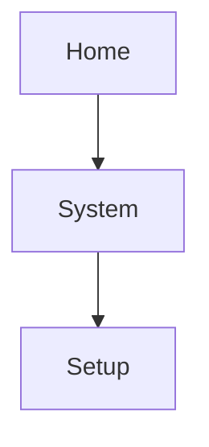

# COM Radio Setup

COM radio customization options reside in the System Setup app.

*Setup options for GNC 355A shown as typical.*

For COM radio selections, swipe to the end of the menu.

From here you can:

* Set transceiver channel spacing1

* Enable reverse frequency look-up functionality

* Adjust sidetone volume offset

1 GNC 355A only.