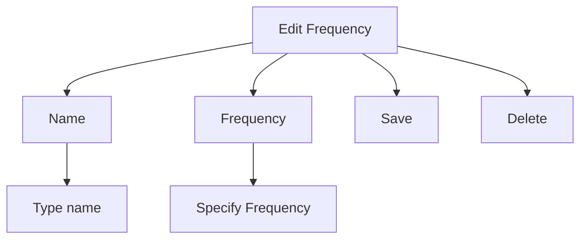

# Create User Frequencies

**FEATURE LIMITATIONS**

* Names may be up to seven characters in length
* Maximum number of 15 user frequencies

Create or edit user frequencies from the Edit Frequency pop-up menu.

<table>
  <tbody>
    <tr>
        <td>**Name**</td>
        <td>* Assign the frequency a unique identifier.</td>
    </tr>
    <tr>
        <td>**Frequency**</td>
        <td>* Specify a frequency value.</td>
    </tr>
    <tr>
        <td>**Save**</td>
        <td>* Add the frequency to the user frequency list.</td>
    </tr>
    <tr>
        <td>**Delete**</td>
        <td>* Remove the selected user frequency from the list. * Appears only for existing entries.</td>
    </tr>
  </tbody>
</table>