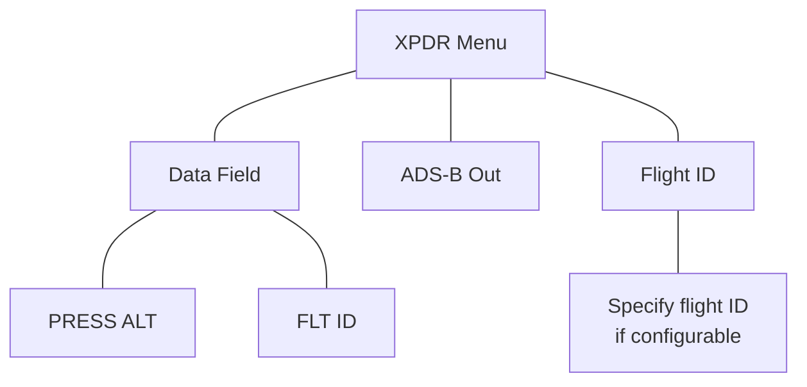

# XPDR Setup

Tap **Menu** to access the transponder setup options. From here you can:

* Change the display of data
* Enable 1090 ES ADS-B Out functionality (if configured)
* Assign a unique flight ID

## Displaying Data

Toggles the data field between pressure altitude and flight ID.

### Pressure Altitude

Displays the current pressure altitude.

### Flight ID

Displays the active Flight ID. Unless configured, the Flight ID is not editable.