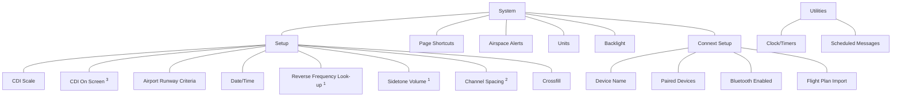

# Pilot Settings

Unit customization options allow you to:

* Set the CDI scale
* Display the CDI on-screen3
* Specify runway criteria
* Set the date and time
* Specify COM radio settings 1
* Create shortcuts
* Set the display units
* Adjust display brightness

Other setup options allow you to monitor time in flight and create custom reminder messages. These settings reside in the System Utilities.

For details about COM radio settings and Connext Setup options, refer to the respective section.

1 GNC 355/355A only.
2 GNC 355A only.
3 GPS 175 and GNX 375 only.