# Map Setup

Map setup options allow you to customize the display of aeronautical information. Tap **Menu** when you need to:

* Change map orientation settings
* Configure user fields
* Adjust the map detail level
* Enable map overlays
* Select a NEXRAD source
* Filter airspace data according to altitude
* Specify airway types and range values
* Expand the forward-looking view for improved situational awareness

## Map Menu

```mermaid
graph TD
    MapMenu[Map Menu] --- Orientation[Orientation]
    Orientation --- NorthUp[North Up]
    Orientation --- TrackUp[Track Up]
    Orientation --- HeadingUp[Heading Up]
    MapMenu --- NorthUpAbove[North Up Above]
    NorthUpAbove --- SetRange[Set range]
    MapMenu --- VisualAPPR[Visual APPR]
    VisualAPPR --- SetSelectorRange[Set selector range]
    MapMenu --- ConfigureUserFields[Configure User Fields]
    ConfigureUserFields --- SelectFieldTypes[Select field types]
    MapMenu --- RestoreUserFields[Restore User Fields]
    MapMenu --- MapDetail[Map Detail]
    MapDetail --- SelectDetailLevel[Select detail level]
    MapMenu --- TOPO1[TOPO <sup>1</sup>]
    MapMenu --- Terrain12[Terrain <sup>1, 2</sup>]
    MapMenu --- Traffic1[Traffic <sup>1</sup>]
    MapMenu --- NEXRAD2[NEXRAD <sup>2</sup>]
    NEXRAD2 --- SelectSource[Select source]
    MapMenu --- Lightning12[Lightning <sup>1, 2</sup>]
    MapMenu --- METAR1[METAR <sup>1</sup>]
    MapMenu --- TFR1[TFR <sup>1</sup>]
    MapMenu --- SmartAirspaces1[Smart Airspaces <sup>1</sup>]
    MapMenu --- ShowAirspaces[Show Airspaces]
    ShowAirspaces --- SelectFilter[Select filter]
    MapMenu --- Airways[Airways]
    Airways --- SelectFilter2[Select filter]
    MapMenu --- OBSTWires1[OBST/Wires <sup>1</sup>]
    MapMenu --- TOPOScale1[TOPO Scale <sup>1</sup>]
    MapMenu --- RangeRing1[Range Ring <sup>1</sup>]
    MapMenu --- AheadView1[Ahead View <sup>1</sup>]
    MapMenu --- TrackVector[Track Vector]
    TrackVector --- SelectFilter3[Select filter]
    MapMenu --- RestoreMapSettings[Restore Map Settings]
```

## RESTORE MAP SETTINGS

With the exception of user fields, this key restores all original factory map settings.

1 On/off functionality only.
2 NEXRAD, Lightning, and Terrain overlays are mutually exclusive.