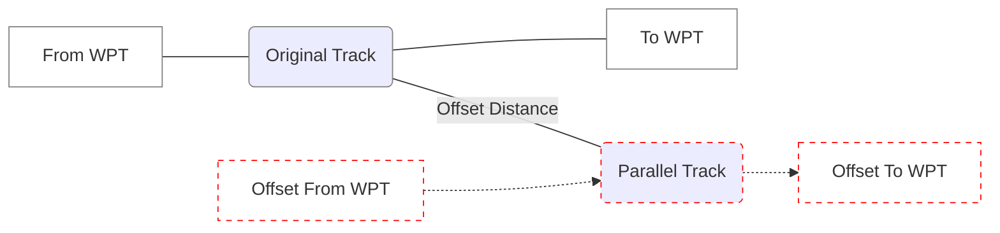

## ACTIVATE A PARALLEL TRACK

1. Tap **Menu** > **Parallel Track**.

2. Tap **Offset** and specify a distance between 1 nm and 99 nm.

3. Tap **Direction** and select left of track or right of track.

4. Tap **Activate**.

To deactivate parallel track, tap **Menu** > **Deactivate PTK**.