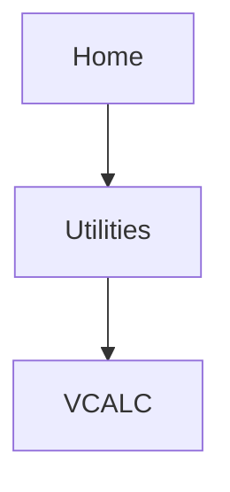

# Vertical Calculator

Calculate time to TOD and vertical speed required to reach target altitude at the specified location.

###  WARNING

**Do not rely on VCALC messages as the only means of either avoiding terrain/obstacles or following ATC guidance. VCALC provides advisory information only and must be used in concert with all other available navigation data sources.**

### FEATURE LIMITATIONS

This feature is inhibited when:

* Groundspeed is < 35 knots
* No active flight plan or direct-to destination is available
* One of the following modes is active: SUSP, Vectors-to-Final, OBS
* Navigating to a waypoint after the FAF

# VCALC Page

The Vertical Calculator (VCALC) feature is helpful when you want to descend to a certain altitude near an airport.

Create a 3-D profile to guide you from your present position and altitude to a final (target) altitude at a specified location. Once defined, you may configure message alerts and additional data on the Map page to stay informed of your progress.

