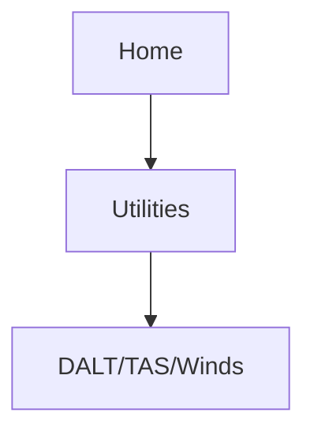
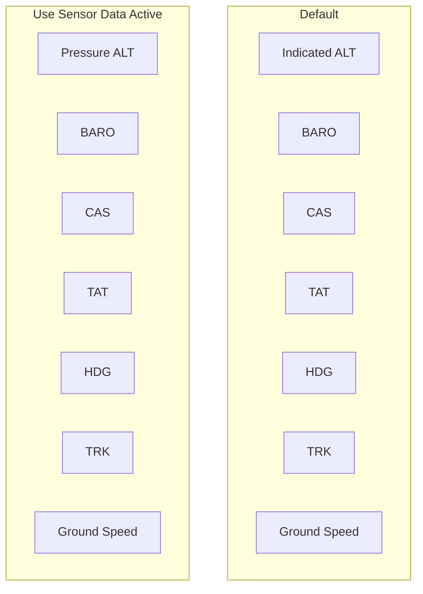

# DALT/TAS/Wind Calculator

Calculate density altitude, true airspeed, and winds.

## FEATURE REQUIREMENTS

* *Fuel/air data computer (pressure altitude)*
* *Valid sensor data*

## DALT/TAS/Wind Page

This feature indicates the theoretical altitude at which the aircraft performs based on several input variables.

## Editing Input Data

Available selections are dependent on sensor data use. TAT and HDG may also be available via an external data source.

Not Selectable 