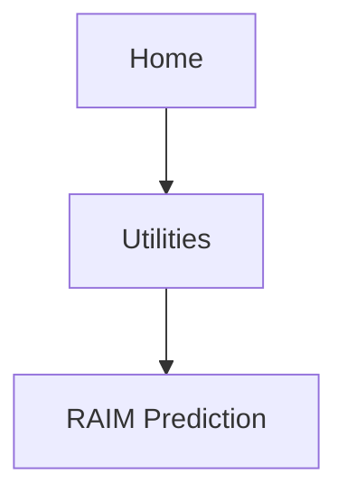

# RAIM Prediction

Determine GPS coverage availability for the current location or a specified waypoint at any time and date. RAIM performs checks to ensure the navigator has adequate satellite geometry during flight.

**NOTE**
*RAIM availability prediction is for use in areas where WAAS coverage is not available. It is not required in areas where WAAS coverage is available.*

## FEATURE REQUIREMENTS

* Active flight plan and off-route direct-to waypoint (arrival date and time)

## FEATURE LIMITATIONS

FAA’s TSO requirements for non-precision approaches specify significantly greater satellite coverage than is required during other phases of flight. As a result, RAIM may not be available for all approaches.

RAIM prediction results are valid for up to 90 days from the current date. Arrival dates beyond 90 days, or in the past, may not provide accurate results.

This feature predicts the availability of fault detection integrity. It cannot predict the availability of LPV or L/VNAV approaches.

<mark>Use a non-GPS based approach when RAIM is not available. To determine WAAS availability, including for LPV approaches, visit the FAA’s NOTAM service.</mark>

# RAIM Prediction Page

The RAIM feature can help you plan for a pending flight by confirming GPS operation before an approach.

## RAIM Features

<mark>
* Automatically monitors RAIM during approach operations and warns when RAIM is not available
* Near 100% availability in Oceanic, En route, and Terminal phases of flight
* **Waypoint Identifier**, **Arrival Date**, and **Arrival Time** setup keys
* **Compute RAIM** key
</mark>