# HAZARD AWARENESS APPS & FUNCTIONS

Menu selections vary based on features and optional equipment installed with Garmin avionics.

```mermaid
graph TD
    A[FIS-B Weather] --> A1[Orientation]
    A --> A2[Legend]
    A --> A3[FIS-B Status]
    A --> A4[NEXRAD]
    A --> A5[Cloud Tops]
    A --> A6[Lightning]
    A --> A7[Icing]
    A --> A8[Winds/Temps Aloft]
    A --> A9[PIREP]
    A --> A10[Turbulence]
    A --> A11[METAR]
    A --> A12[SIGMET]
    A --> A13[Center WX Advisory]
    A --> A14[G-AIRMETS]
    A --> A15[TFR]

    B[Traffic] --> B1[ADS-B Display]
    B --> B2[Test]
    B --> B3[Motion Vector]
    B --> B4[Vector Duration]
    B --> B5[Altitude Filter]
    B --> B6[Traffic Grouping]

    C[Terrain] --> C1[Terrain Inhibit]
    C --> C2[View]
    C --> C3[Flight Plan]
    C --> C4[Legend]

    style A fill:none,stroke:none
    style B fill:none,stroke:none
    style C fill:none,stroke:none
```

1 GPS 175/GNC 355: Feature availability dependent upon unit configuration. Requires external ADS-B In product (GDL 88, GTX 345, GNX 375) and FIS-B.