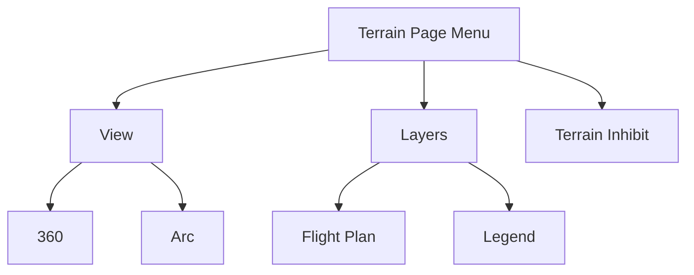

# AUTOMATIC ZOOM

In the event an alert occurs, the page automatically zooms to provide the best depiction of that alerted terrain, obstacle, or power line.

# AUTOMATIC DATA REMOVAL

Automatic removal of obstacle and power line data occurs at range scales greater than 10 nm.

# Terrain Setup

## Terrain Page Menu

Tap **Menu** to access pilot selectable settings as well as self-test and alert inhibit functions.

> **Map Terrain Overlays**
> Overlay controls reside in the Map setup menu.
> Home > **Map** > **Menu** > Select from **Terrain** and **OBST/Wires**.

<table>
  <tbody>
    <tr>
        <td>Terrain Inhibit</td>
        <td>• Inhibits visual alerts for terrain, obstacles, and power lines</td>
    </tr>
    <tr>
        <td rowspan="2">View</td>
        <td>• **360** changes view format to a 360º ring encircling the aircraft (default view)</td>
    </tr>
    <tr>
        <td>• **Arc** changes view format to a forward-looking 120º arc</td>
    </tr>
    <tr>
        <td>Flight Plan</td>
        <td>• Toggles the active flight plan overlay on or off (Terrain page only)</td>
    </tr>
    <tr>
        <td>Legend</td>
        <td>• Toggles the Terrain and Obstacle/Wire legend on or off</td>
    </tr>
  </tbody>
</table>